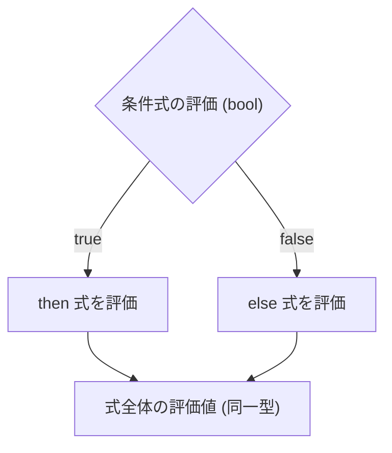

# if 式

Tsuzuri の `if` は、文ではなく値を返す式です。条件に応じて違う値を計算し、そのまま変数へ代入したり、関数の戻り値にしたりできます。選ばれない分岐も、コンパイル時には型検査されます。

## この記事のポイント

- 構文は `if 条件 then 式 else 式` です。式として評価値を返します。
- 多方向分岐には `elif` または `else if` を使います。
- 波括弧 `{ ... }` のブロックも使えます。
- `else` を省くと、選ばれなかった側の値は `()`（`unit`）です。
- 条件は `bool` だけです。数値や文字列からの暗黙の真偽値変換はありません。
- すべての分岐の結果型は同じでなければなりません。違うと `E1003` です。

## 基本の書き方

```text
if condition then then_expr else else_expr
```

条件式 `condition` が `true` のときは `then_expr` を、`false` のときは `else_expr` を評価します。三項演算子を用意している言語もありますが、Tsuzuri では `if` 式そのものが値を返します。

```tsuzuri run=42
let threshold = 50
let score = 75
let status = if score >= threshold then "Pass" else "Fail"
if status == "Pass" then 42 else 0
```

実行結果:

```text
42
```

実行時には選ばれた側の式だけが評価されます。選ばれなかった側の式は評価されません。ただし、コンパイル時には両方の分岐が静的型検査を受けます。



## 多方向分岐（elif と else if）

複数の条件を上から判定したいときは、`elif` か `else if` を使います。この 2 つは同じ意味です。

```tsuzuri run=20
def discountRate :: i64 -> i64 = \amount ->
    if amount >= 10000 then 20
    elif amount >= 5000 then 10
    elif amount >= 2000 then 5
    else 0

discountRate 12000
```

実行結果:

```text
20
```

条件は上から順に判定され、最初に `true` になった分岐の式が評価されます。どの条件も満たさなかった場合は最後の `else` 式が評価されます。

## ブロック形式とインデント

分岐の本体に複数の式を並べたいときは、波括弧 `{ ... }` による明示的なブロック形式、またはインデントによる式シーケンスを使います。

```tsuzuri run=15
let debug = true
let bonus =
    if debug {
        let base = 10;
        base + 5
    } else {
        0
    }
bonus
```

実行結果:

```text
15
```

波括弧ブロックを使う場合は、`then` キーワードを省略して `if condition { ... } else { ... }` のように C スタイル風に書くこともできます。ブロック内の最後の式が、そのブロック全体の評価値になります。

インデント構文を使う場合は、`then` や `else` の次の行からインデントを下げて複数行の式を書きます。

```tsuzuri run=100
let mode = 1
let total =
    if mode == 1 then
        let factor = 10
        factor * 10
    else
        0
total
```

実行結果:

```text
100
```

> [!NOTE]
> 条件の位置にレコードの構築を置くと、波括弧がブロックだと解釈され、`E0002` になります。`if (Point { x: 0, y: 0 }).x == 0 then ...` のように丸括弧で囲んでください。構築の区切りはコロン（`x: 0`）です。パターンの `x = 0` とは書き方が違います。

## else の省略と unit 型

副作用（変数の更新や画面への出力など）を目的とする場合、`else` 節を省略できます。

```text
if condition then expression
```

`else` 節を省略すると、条件が `false` だった場合の未選択側の値は自動的に `()`（`unit` 型）になります。そのため、`then` 側の式も必ず `unit` 型でなければなりません。

```tsuzuri run=42
let mut counter = 40
let should_increment = true

if should_increment then
    counter = counter + 2

counter
```

実行結果:

```text
42
```

`then` 側が数値なのに `else` を省くと、`unit` と数値が一致せず `E1003` になります。

```text
// コンパイルエラー E1003: expected i64, found unit
let value: i64 = if true then 42
```

## 型の規則

条件の型と、分岐が返す型には、次の規則があります。

### 条件式は bool のみ

条件は `bool` でなければなりません。`0` や空文字列を真偽値として扱う変換はありません。`bool` 以外を置くと `E1003` です。

```text
// コンパイルエラー E1003: expected bool, found i64
let count: i64 = 0
if count then "empty" else "exist"
```

`count == 0` のように、比較で `bool` にしてから渡します。注釈のない `0` を条件に置くと、診断はリテラル側に出ることがあります。型を先に書いておくと、条件が `bool` でないことが読み取りやすくなります。

### 分岐結果の型一致

`then`、`elif`、`else` が返す型は同じでなければなりません。文字列と数値を混ぜると、静的検査で拒否されます。

```text
// コンパイルエラー E1003: expected string, found i64
let flag = true
let result = if flag then "ok" else 0i64
```

異なる種類の値を返したい場合は、[共用体（union）](../built-in-types-and-modules/union.md) や [Maybe](../built-in-types-and-modules/maybe.md) を使って 1 つの型にまとめます。

## 他の言語との比較

| 機能 | Tsuzuri | F# | Rust | C / C++ |
| --- | --- | --- | --- | --- |
| 式としての評価 | 値を返す | 値を返す | 値を返す | 文（式には `?:` を使う） |
| `then` キーワード | 必須（波括弧時は省略可） | 必須 | なし（波括弧必須） | なし |
| 多方向分岐 | `elif` または `else if` | `elif` | `else if` | `else if` |
| `else` 省略 | 可能（結果は `unit`） | 可能（結果は `unit`） | 可能（結果は `()`） | 可能 |
| 暗黙の真偽値変換 | なし（`bool` のみ） | なし（`bool` のみ） | なし（`bool` のみ） | あり（0 以外は真など） |

## まとめ

- Tsuzuri の `if` は式なので、結果を値として使えます。
- 基本構文は `if 条件 then 式 else 式` です。`elif` と `else if` は同じ意味です。
- 波括弧やインデントで、複数行の分岐を書けます。
- `else` を省くと結果は `unit` です。`then` 側も `unit` でなければなりません。
- 条件は `bool` だけです。分岐の型が違うと `E1003` になります。

## 関連項目

- [演算子と式](../values-and-functions/op-and-expressions.md)
- [Unit 型](../types-and-type-inference/unit-type.md)
- [for...in 式](for-in.md)
- [while 式](while.md)
- [match 式](../pattern-matching/match.md)
- [言語仕様の制御構文](../../../docs/language.md#制御構文)
- [言語リファレンスの目次](../index.md)

