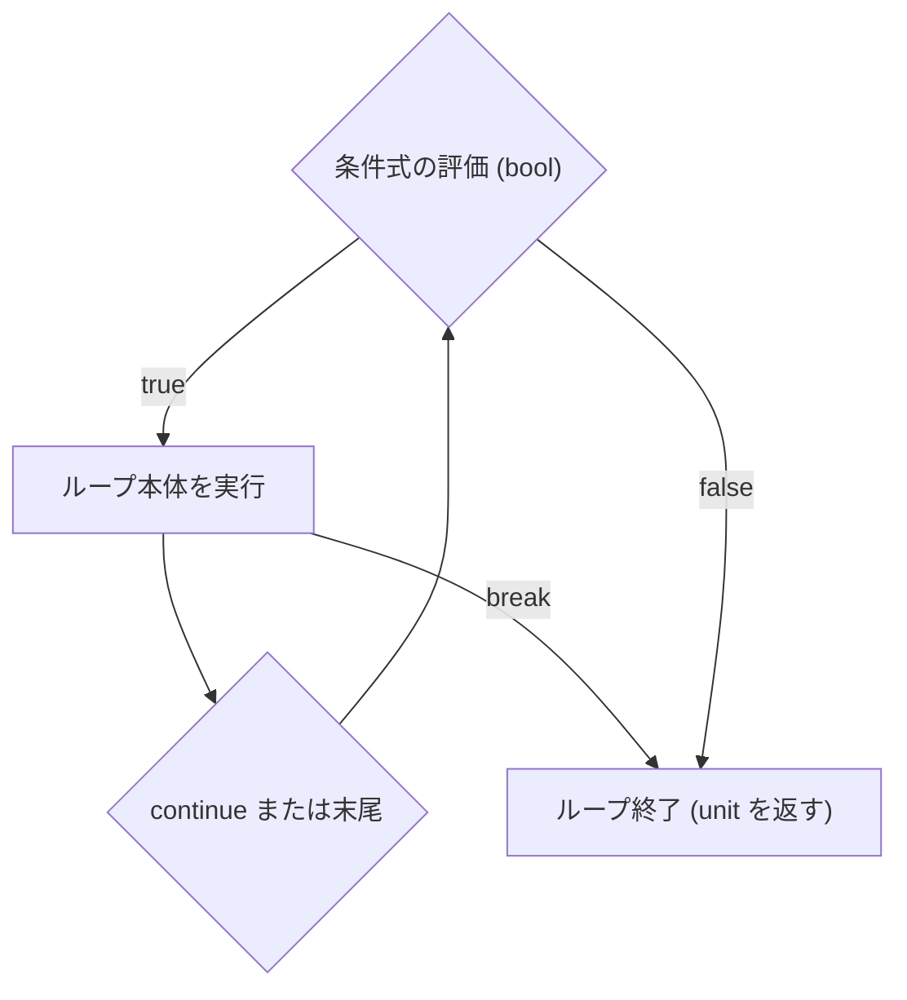

# while 式

`while` 式は、指定された条件が `true` である間、本体の処理を繰り返し実行するループ構文です。反復ごとに条件判定を行い、評価値として `()`（`unit` 型）を返します。

## この記事のポイント

- 構文は `while 条件 do 本体` です。
- 条件式は `bool` 型でなければなりません（暗黙の真偽値変換はありません）。
- 反復の開始前に条件式が評価されます。初回が `false` の場合、本体は 1 回も実行されません。
- 状態の更新には `let mut` で宣言した可変変数と組み合わせます。
- `break` でループから脱出し、`continue` で次の反復の条件判定へ進みます。
- 式全体の評価値、およびループ本体の型は `unit` です。
- 毎反復で生成された所有値は安全に解放されます。

## 基本の書き方

```text
while condition do
    body
```

条件式 `condition` が `true` の間、`body` が繰り返し実行されます。`body` が 1 回終了するたびに先頭に戻り、条件式を再評価します。

```tsuzuri run=16
let mut value = 1

while value < 10 do
    value = value * 2

value
```

実行結果:

```text
16
```

初回に `value` が `1` なので、`1 -> 2 -> 4 -> 8 -> 16` と更新され、`16 < 10` が `false` となってループを抜けます。



## let mut との組み合わせ

Tsuzuri の変数は既定で不変（immutable）です。ループカウンタやアキュムレータを `while` ループで更新するには、`let mut` を使って可変変数を宣言します。

```tsuzuri run=55
let mut sum = 0
let mut i = 1

while i <= 10 do
    sum = sum + i
    i = i + 1

sum
```

実行結果:

```text
55
```

ループの内側で新しく宣言された不変ローカル変数は、その反復ブロック内でのみ有効であり、反復ごとに新しく作成されます。

## break と continue

途中で流れを変えるには、`break` と `continue` を使います。

```tsuzuri run=16
let mut n = 0
let mut total = 0

while n < 10 do
    n = n + 1
    if n % 2 == 0 then
        continue
    if n > 7 then
        break
    total = total + n

total
```

実行結果:

```text
16
```

上記の例では、奇数のみが加算され（`1 + 3 + 5 + 7 = 16`）、`n = 9` の時点で `n > 7` により `break` してループを終了します。

> [!WARNING]
> `while` ループ内で `continue` を使うときは、カウンタの更新式（例: `n = n + 1`）を `continue` より前に配置するか、更新がスキップされて無限ループに陥らないように注意してください。

`break` と `continue` はどちらも `unit` です。ループの外や、ラムダ式、タスク、コンピュテーション式、`finally` つき `try` の境界を越えると `E1023` になります。値付きやラベル付きの脱出はありません。

## 無限ループと停止性

`while true do` を使うことで、意図的な無限ループ（または内部の `break` による脱出ループ）を記述できます。

```tsuzuri run=42
let mut result = 1

while true do
    result = result + 1
    if result >= 42 then
        break

result
```

実行結果:

```text
42
```

`while` ループは、条件式が `false` になるか、本体内で `break` が実行されない限り停止しません。終了条件の更新漏れや境界条件の誤りによって意図しない無限ループにならないよう、停止性の確認が重要です。

## 所有権とメモリ管理

`while` ループ内でのメモリと所有権の管理には以下の特徴があります。

1. **反復ごとの解放**: 本体で新しく作った所有値は、各反復の終わりと、`break` / `continue` の直前に解放されます。
2. **外側の所有変数**: ループの外で宣言した非 Copy の変数を本体内でムーブしたあと、次の反復までに新しい値を入れないと `E1012` です。消費した値は、次の反復には残っていないためです。

```text
// コンパイルエラー E1012: use of moved or partially moved value 'resource'
def consume :: string -> unit
fn consume text = ()
let mut resource = "owned"
while true do
    consume resource
```

次の反復の前に新しい値を代入すれば、ムーブしても通ります。`break` でその反復を抜ける場合も、次の反復はないので再代入は不要です。

## 他の言語との比較

| 機能 | Tsuzuri | F# | Rust | C / C++ |
| --- | --- | --- | --- | --- |
| 構文 | `while cond do ...` | `while cond do ...` | `while cond { ... }` | `while (cond) { ... }` |
| 評価値の型 | `unit` | `unit` | `()` | 文（値なし） |
| 条件式の型 | `bool` のみ | `bool` のみ | `bool` のみ | 整数やポインタも許容 |
| `break` / `continue` | 対応 | 標準構文としては非対応 | 対応 | 対応 |
| ラベル付き break | 非対応 | 非対応 | 対応（`'label`） | `goto` |

## まとめ

- `while` 式は条件が `true` の間反復し、評価値として `unit`（`()`）を返します。
- 条件式は `bool` 型のみで、暗黙の型変換はありません。
- 状態の更新には `let mut` による可変変数を使用します。
- `break` によるループ脱出、`continue` による次の反復判定へのジャンプが可能です。
- 反復ごとに一時的な所有値は安全に解放されます。

## 関連項目

- [for...in 式](for-in.md)
- [for...to 式](for-to.md)
- [if 式](if.md)
- [値](../values-and-functions/values.md)
- [所有権とムーブ](../ownership-and-memory/ownership.md)
- [言語仕様の制御構文](../../../docs/language.md#for--while)
- [言語リファレンスの目次](../index.md)

