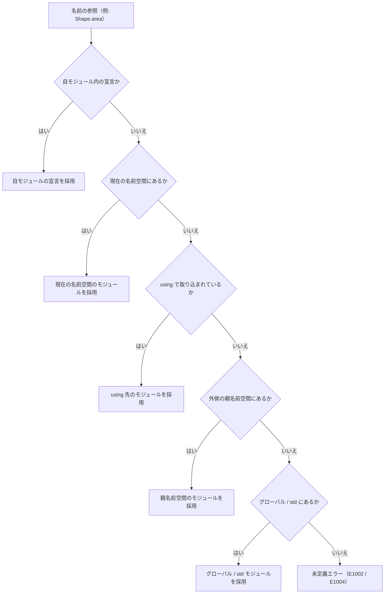

# 名前空間

Tsuzuri における名前空間（namespace）は、関連する複数のモジュールを論理的なグループとしてまとめるための機構です。関数やレコードなどの具象宣言は常にいずれかのファイル（モジュール）の内部に属し、名前空間はそのモジュール群を階層的に束ねる役割を担います。

モジュール名やメンバーアクセスの区切り記号の規則、ディレクトリ構造との連動、名前解決の順序を理解することで、大規模なプロジェクトでも名前の衝突を防ぎ、見通しの良いコードベースを構築できます。

## この記事のポイント

- `namespace` 宣言はファイル先頭の最初の宣言として行い、そのモジュールが属する論理グループを指定します。
- 名前の結合には `::` と `.` を使い分けます。名前空間やモジュールの結合には `::`、モジュール内部のメンバー参照には `.` を使います。
- `namespace` 宣言を省略したファイルの名前空間は、`Tsuzuri.toml` の既定名前空間とルートからの相対ディレクトリパスから自動決定されます。
- 標準ライブラリの各モジュールは `std` 名前空間に属しており、全ファイルで暗黙的に参照できます（ユーザーコードでの `std` 名前空間宣言は禁止です）。
- 名前解決は、今の名前空間から外側の親へ、足りないプレフィックスを補いながら進みます。

## 基本の書き方

```text
namespace 名前空間
namespace 親::子
```

明示的な名前空間の宣言は、ファイル内の最初の宣言として単独の行に記述します。階層構造を持つ名前空間は、空白を挟まずに `::` で結合します。

次の例では、名前空間 `Physics` に属する `Vec2` モジュールを定義し、`Main.tz` から完全修飾名で利用しています。

```tsuzuri project=ns-basic file=Physics/Vec2.tz
namespace Physics

record Vec2 { x: f64, y: f64 }

def add :: Vec2 -> Vec2 -> Vec2 = \a b -> Vec2 { x: a.x + b.x, y: a.y + b.y }
```

```tsuzuri project=ns-basic file=Main.tz run=10
let v1 = Physics::Vec2 { x: 2.0, y: 3.0 }
let v2 = Physics::Vec2 { x: 1.0, y: 4.0 }
let v3 = Physics::Vec2.add v1 v2
(v3.x + v3.y) as i64
```

実行結果:

```text
10
```

`namespace` は文脈キーワードであり、ファイル先頭の宣言位置でのみキーワードとして認識されます。そのため、ローカル変数や関数名として `namespace` という単語を使うことは可能です。

同一ファイル内に 2 つ以上の `namespace` 宣言を記述したり、関数の定義など他の宣言の後に `namespace` を配置したりすると、構文エラー `E0002` になります。

## :: と . の使い分け

Tsuzuri では、コロンの連続 `::` とドット `.` の役割が明確に分かれています。

| 記号 | 用途 | 具体例 |
| --- | --- | --- |
| `::` | 名前空間同士の階層区切り | `Acme::Features` |
| `::` | 名前空間とモジュール名の区切り | `Acme::Features::Shape` |
| `.` | モジュール名とメンバーの区切り | `Shape.area`、`Point.distance` |
| `.` | レコードやタプルのフィールドアクセス | `point.x`、`pair.0` |

名前空間とモジュールをドット `.` でつなぐと、`.` の左は値かモジュールとして読まれます。次は断片です。このコードはエラー `E1002` になります。

```text
// 誤った例: 名前空間とモジュールを . で繋いでいる
let p = Geometry.Point { x: 1.0, y: 2.0 }
```

診断は `::` を案内します。

```text
error[E1002]: 'Geometry' is a namespace; write '::' between a namespace and the names in it, as in 'Geometry::Point'
```

実際の出力には、この行の前に `ファイル:行:列:` が付きます。

## ディレクトリ構造と名前空間の関係

明示的な `namespace` 宣言を持たないファイルの名前空間は、パッケージの既定名前空間の末尾に、プロジェクトルートからの相対ディレクトリパスを連結した形式になります。

例えば、パッケージの既定名前空間が `App` の場合、ファイル配置と所属名前空間は次のようになります。

| ファイルパス | 所属する名前空間 | モジュールの完全修飾名 |
| --- | --- | --- |
| `Main.tz` | `App` | `App::Main` |
| `Geometry/Point.tz` | `App::Geometry` | `App::Geometry::Point` |
| `Features/Shapes/Circle.tz` | `App::Features::Shapes` | `App::Features::Shapes::Circle` |

パッケージの既定名前空間は、マニフェストファイル `Tsuzuri.toml` の `[package]` セクション内にある `namespace` キーで設定します。

```toml
[package]
name = "geometry-tools"
version = "0.1.0"
namespace = "Acme::Tools"
```

- **未指定時の自動変換**: `namespace` を省略すると、パッケージ名（kebab-case）を PascalCase にした名前が既定になります。`geometry-tools` なら `GeometryTools` です。
- **マニフェストが無い場合**: 入力ディレクトリ名が小文字の kebab-case なら、同じ規則で PascalCase になります。そうでなくても有効な名前空間なら、その名前をそのまま使います。どちらでもなければグローバル名前空間（プレフィックスなし）です。

ディレクトリ名は ASCII 識別子です。小文字は使えますが、`2D` や `my-tools` のように数字始まりやハイフンを含む名前は `E1011` です。`_` 単独、`Task`、予約語はパスのどの要素にも置けません。標準ライブラリの予約モジュール名は、パスの先頭要素に置けません。詳しくは [モジュール](modules.md) を見てください。

## 名前解決の順序

コード内でモジュール名や型名を参照したとき、コンパイラは内側のスコープから外側の名前空間へと順次探索します。



例えば、`namespace Sample::Codebase` に属するファイル内で単に `Shape` と記述した場合、次の順序で探索が行われます。

1. `Sample::Codebase::Shape`（今のファイルの名前空間）
2. `using` で取り込んだ名前空間直下の `Shape`
3. `Sample::Shape`（外側の親名前空間）
4. グローバル名前空間の `Shape`
5. `std::Shape`（標準ライブラリ。ここまでで見つからないとき）

自ファイルの宣言は、この探索より先に採用されます。

この規則があるため、同じ名前空間内のモジュール同士であれば、長い名前空間プレフィックスを書かずに短いモジュール名だけで呼び出せます。

```tsuzuri project=ns-resolve file=Geometry/Point.tz
namespace Geometry

record Point { x: f64, y: f64 }

def origin :: unit -> Point = \() -> Point { x: 0.0, y: 0.0 }
```

```tsuzuri project=ns-resolve file=Geometry/Line.tz
namespace Geometry

record Line { start: Point, stop: Point }

def length_is_zero :: Line -> bool = \line ->
    line.start.x == line.stop.x && line.start.y == line.stop.y
```

```tsuzuri project=ns-resolve file=Main.tz run=1
namespace Geometry

let p = Point.origin ()
let line = Line { start: p, stop: p }
if Line.length_is_zero line then 1 else 0
```

実行結果:

```text
1
```

`Geometry/Line.tz` や `Main.tz` では、同一の `Geometry` 名前空間に属しているため、`Geometry::Point` と書かずに単に `Point` として参照できます。

## std 名前空間

標準ライブラリが提供する全モジュールは、名前空間 `std` に属しています。完全修飾名は `std::Maybe`、`std::Result`、`std::Array`、`std::Math` などになります。

名前空間 `std` はすべてのファイルにおいて暗黙的にスコープへ取り込まれているため、普段は `Maybe.map` や `Result.Ok` のように `std::` を省いて簡潔に記述できます。

ただし、名前解決ではファイル自身のローカル宣言が最優先されます。そのため、自モジュール内で標準ライブラリと同名の型を宣言した場合は、標準ライブラリ側を明示的に修飾する必要があります。

```tsuzuri run=42
// 自モジュール内で独自の Result 型を宣言
record Result { value: i64 }

def unwrap_or_zero :: std::Result<i64, string> -> i64 = \res ->
    match res with
    | std::Result.Ok v -> v
    | std::Result.Error _ -> 0

let custom = Result { value: 2 }
let standard = std::Result.Ok 40
unwrap_or_zero standard + custom.value
```

実行結果:

```text
42
```

このファイル内では単に `Result` と書くとローカルの `record Result` を指します。標準ライブラリの共用体型を参照したいときは、`std::Result<i64, string>` や `std::Result.Ok` と完全修飾します。

> [!WARNING]
> ユーザー定義コードで `namespace std` や `namespace std::Tools` のように `std` で始まる名前空間を宣言することはできません。これらは標準ライブラリ専用として保護されており、宣言するとエラー `E1011` になります。

## 注意点とエラー

- **最初の宣言（`E0002`）**: `namespace` はファイルの最初の宣言として、1 行に書きます。前に空行や `//` コメントは置けます。`///` は付けられません。キーワードの後やパスの途中で改行する、`::` の前後に空白を入れる、`namespace Acme.Tools` のようにドットを使う、と構文エラー `E0002` です。診断は `::` を案内します。
- **予約名（`E1011`）**: `std` で始まる名前空間は宣言できません。予約モジュール名（`Maybe`、`Array` など）と `Task` は、名前空間の先頭要素に使えません。`namespace App::Maybe` のように先頭以外なら使えます。
- **完全名の衝突（`E1011`）**: 別ファイルでも、名前空間とモジュール名が同じ完全名になるとエラーです。
- **上限（`E1017`）**: 名前空間は最大 16 要素、255 バイトまでです。

## まとめ

- 名前空間は複数のモジュールを論理グループとして束ねる機構であり、関数などの具象宣言はモジュール内に置きます。
- 名前空間やモジュールの区切りには `::` を用い、モジュール内のメンバーアクセスには `.` を用います。
- `namespace` 宣言のないファイルは、`Tsuzuri.toml` の設定とディレクトリ階層から名前空間が自動決定されます。
- 名前解決は現在の名前空間から外側へ順に探索されるため、同一名前空間内ではプレフィックスを省略できます。
- 標準ライブラリは `std` 名前空間に属しており、暗黙的に参照可能です（ユーザーによる `std` 名前空間の宣言は禁止です）。

## 関連項目

- [モジュール](modules.md)
- [using 宣言](using-declarations.md)
- [パッケージ](packages.md)
- [アクセス制御](access-control.md)
- [言語リファレンスの目次](../index.md)

