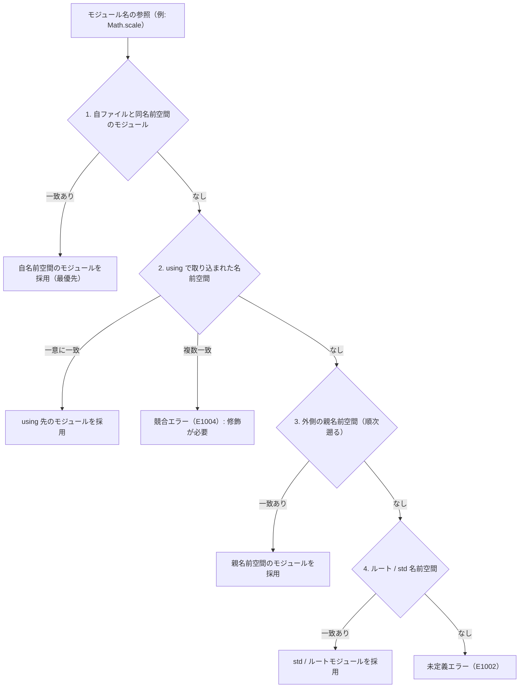

# using 宣言

`using` 宣言は、特定名前空間の直下にあるモジュール群を、名前空間修飾なしで直接モジュール名だけで参照できるようにスコープへ取り込むための宣言です。

長い名前空間を、毎回書かなくて済むようにします。

## この記事のポイント

- `using 名前空間` はファイル先頭の `namespace` 宣言の直後、他の宣言の前に記述します。
- 指定した名前空間の直下に存在するモジュール群を、名前空間を省略したモジュール名単体で参照できるようになります。
- 名前解決において、`using` で取り込まれたモジュールはファイル自身の名前空間の直後に検索されます。
- 複数の `using` 宣言によって同名のモジュールが同時に可視化された場合、名前解決時に競合エラー `E1004` になります。
- 存在しない名前空間の指定や、モジュール単体を指す `using` の記述はエラー `E1011` になります。

## 基本の書き方

```text
using 名前空間
using 親::子
```

`using` は、`namespace` の直後（無ければファイルの最初の宣言）に、他の宣言より前へ 1 行で書きます。前の空行や `//` は置けます。階層は `::` でつなぎ、空白は挟みません。

次の例では、`Geometry::Shapes` 名前空間を `using` で取り込み、`Circle` モジュールを短い名前で呼び出しています。

```tsuzuri project=using-basic file=Geometry/Shapes/Circle.tz
namespace Geometry::Shapes

record Circle { radius: f64 }

def area :: Circle -> f64 = \c -> c.radius * c.radius * 3.141592653589793
```

```tsuzuri project=using-basic file=Main.tz run=78
namespace Geometry

using Geometry::Shapes

let c = Circle { radius: 5.0 }
(Circle.area c) as i32
```

実行結果:

```text
78
```

`using Geometry::Shapes` があるため、`Geometry::Shapes::Circle` と書かずに単に `Circle` として型や関数を利用できます。

`using` は文脈キーワードであり、ファイル先頭のヘッダー位置でのみ認識されます。そのため、関数内のローカル変数名や引数名として `using` を使うことは可能です。

## using と名前解決の順序

コード内でモジュール名を参照したとき、`using` でインポートされた名前空間は、自モジュールの名前空間の直後に検索されます。



この優先順位規則には重要な性質があります。

1. **自名前空間の最優先**: ファイル自身と同じ名前空間内に同名のモジュールが存在する場合、`using` で取り込んだモジュールよりも自名前空間のモジュールが常に優先されます。
2. **相対的な解決**: `using` に指定する名前空間自体も、現在のファイルの名前空間から外側に向かって解決されます。例えば `namespace Sample` のファイル内で `using Features` と書くと、`Sample::Features` として解決されます。
3. **下位名前空間は取り込まれない**: `using` は指定した名前空間の直下にあるモジュールのみを取り込みます。入れ子になった下位の名前空間そのものを暗黙に取り込むことはありません（例えば `using Geometry` と書いても、`Geometry::Shapes::Circle` を `Shapes::Circle` のように短縮することはできません）。

## using std について

標準ライブラリの名前空間 `std` は、すべてのファイルに最初から入っています。

そのため、通常は明示的に `using std` を書く必要はありません。

```tsuzuri run=5
// using std を書かなくても、標準モジュールはそのまま使用可能
let value = Maybe.Some 5
Maybe.default_value 0 value
```

実行結果:

```text
5
```

コードの意図を明確にするために `using std` を記述することも可能ですが、動作上の違いはありません。

ただし、自モジュール内で `record Result` のように標準ライブラリと同名の型を宣言している場合、ローカル宣言が最優先されるため、`using std` を記述しても標準の `std::Result` が自動選択されることはありません。その場合は `std::Result<i64, string>` や `std::Result.Ok` のように明示的に `std::` を付与して修飾してください。

## 曖昧な名前の扱い（E1004）

複数の `using` 宣言によって同一名のモジュールが同時に取り込まれ、かつファイル自身の名前空間に同名モジュールが存在しない場合、そのモジュール名を使用すると競合エラー `E1004` になります。

次の例は断片です。

```text
namespace App

using Core::Math
using Graphics::Math

// このコードはエラー E1004 になります
let x = Math.scale 10
```

コンパイラは `Core::Math` と `Graphics::Math` のどちらを呼ぶか決められないので、次の診断を出します。行頭には `ファイル:行:列:` が付きます。

```text
error[E1004]: 'Math' is ambiguous: using declarations make the modules 'Core::Math', 'Graphics::Math' visible; qualify it with its namespace
```

この競合を解決するには、`Core::Math.scale 10` や `Graphics::Math.scale 10` のように、名前空間プレフィックスを明示的に付与して修飾します。

モジュールと同名のレコード型（無修飾の `Point` など）を参照する場合も、複数の `using` 先に同名の型が存在すれば同様に `E1004` になります。

## 注意点とエラー

- **位置（`E0002`）**: `using` は `namespace` の直後、他の宣言より前です。`namespace` が無ければファイルの最初の宣言です。途中に書いたり、`using` とパスの間で改行したりすると `E0002` です。診断は `write the using path on the same line as 'using'` です。
- **モジュール名（`E1011`）**: 書けるのは名前空間だけです。`using Geometry::Point` のようにモジュールを指すと、`is a module, not a namespace` という `E1011` になります。メンバーは `Geometry::Point.distance` のように呼びます。
- **無い名前空間（`E1011`）**: モジュールを持たない名前を書くと、`using 'NoSuch' names no namespace with modules` になります。
- **重複（`E1011`）**: 同じ名前空間を 2 回書くと `duplicate using '...'` です。表示される名前は、解決後の完全名です。

## 他の言語との比較

| 項目 | Tsuzuri | C# | Rust | F# |
| --- | --- | --- | --- | --- |
| 構文 | `using 名前空間` | `using 名前空間;` | `use パス::*;` / `use パス::要素;` | `open 名前空間` |
| 対象 | 名前空間直下の全モジュール | 名前空間内の全型 | モジュール、型、関数など個別指定 | 名前空間またはモジュール |
| 関数単体のインポート | 不可（モジュール単位） | `using static` で可能 | 可能 | 不可 |
| 競合時の挙動 | コンパイルエラー `E1004` | コンパイルエラー（CS0104） | コンパイルエラー（E0252） | 後の `open` が上書きシャドーイング |

## まとめ

- `using` 宣言は指定した名前空間の直下にあるモジュール群を、名前空間修飾なしで直接呼び出せるようにします。
- 記述位置はファイル先頭の `namespace` 宣言の直後、他の宣言の前です。
- 名前解決では自モジュールの名前空間の直後に検索され、自名前空間の同名モジュールが優先されます。
- 標準ライブラリの名前空間 `std` は全ファイルで暗黙的にインポートされています。
- 複数の `using` で同名モジュールが衝突した場合はエラー `E1004` となるため、名前空間で修飾して解決します。

## 関連項目

- [名前空間](namespaces.md)
- [モジュール](modules.md)
- [パッケージ](packages.md)
- [アクセス制御](access-control.md)
- [言語リファレンスの目次](../index.md)

