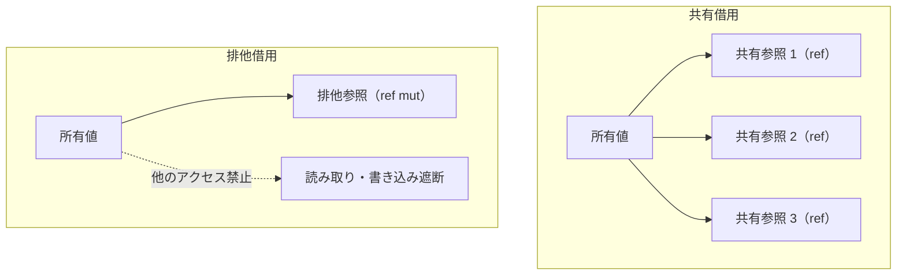

# 借用と参照

所有権をムーブすると、元の束縛からその値にアクセスできなくなります。しかし、多くの処理では値を消費することなく、一時的に読み出したり変更したりするだけで十分です。

Tsuzuri は所有権を手放さずに値を利用する仕組みとして「借用（Borrowing）」を提供します。借用によって作られるポインタを「参照」と呼びます。借用チェッカーが参照の生存期間と安全性を静的に検証するため、ダングリングポインタやデータ競合を未然に防ぎます。

## この記事のポイント

- 共有借用（`ref T` / `&T`）は読み取り専用で、同時にいくつでも作れます。
- 排他借用（`ref mut T` / `&mut T`）は書き換え可能で、有効な間は他のあらゆるアクセスを禁止します。
- キーワード形式（`ref` / `ref mut` / `deref`）と記号形式（`&` / `&mut` / `*`）があります。再借用以外は同じ意味です。
- キーワード形式の `ref` / `ref mut` は、対象が参照型なら 1 段だけ再借用します。型変数 `'a` は、あとで参照になっても新規の借用として扱います。
- 関数呼び出しの引数では、仮引数型に合わせて自動的に借用や参照外しが行われます。
- 配列の一部を借用するスライス（`ref [T]`）と可変スライス（`ref mut [T..]`）があります。
- 借用されている所有値のムーブや上書き代入はコンパイル時に禁止されます（`E1014`）。
- 再利用可能な通常の関数値（クロージャ）へ排他参照を捕捉することはできません（`E1005`）。

## 参照の構文（キーワード形式と記号形式）

参照の記法は、英語のキーワードと、Rust に近い記号の 2 通りです。同じ操作を書いたときの型と生成コードは同じで、1 つの式の中で混ぜてもかまいません。例外は再借用です。キーワードの `ref mut r` は貸し直しですが、記号の `&mut r` は参照そのものへの排他借用になります。

| 操作 | キーワード形式 | 記号形式（Rust 互換） | 説明 |
| --- | --- | --- | --- |
| 共有借用 | `ref x` | `&x` | 不変の参照を作成（Copy） |
| 排他借用 | `ref mut x` | `&mut x` | 可変の参照を作成（非 Copy） |
| 参照外し | `deref r` | `*r` | 参照先の値を読む / 書き換える |
| 共有再借用 | `ref r` | `&*r` | 既存の参照から共有参照を貸し直す |
| 排他再借用 | `ref mut r` | `&mut *r` | 既存の排他参照から排他参照を貸し直す |
| 共有参照型 | `ref T` | `&T` | 共有借用参照の型 |
| 排他参照型 | `ref mut T` | `&mut T` | 排他借用参照の型 |

> [!NOTE]
> 記号形式では空白の位置で意味が変わります。関数引数の `f &x` や `f *r` は、演算子と変数が密着しているとき前置演算です。`a * b` や `a&b` は二項演算子です。`a *b` は、関数 `a` に `*b` を渡す適用になります。

## 共有借用（ref）

共有借用は、値を読むための参照です。同じ所有値から同時にいくつでも作れます。共有参照そのものは Copy なので、代入や関数渡しで複製できます。

```tsuzuri run=17
def total_length :: ref string -> ref string -> i64 = \a b ->
    a.length + b.length

let first = "hello"
let second = "tsuzuri"
let total = total_length (ref first) (ref second)
total + first.length
```

実行結果:

```text
17
```

`ref first` で参照を渡したあとも、所有権は呼び出し元に残ります。呼び出しのあとでも `first.length` を読めます。

## 排他借用（ref mut）と排他性規則

排他借用は、参照先の値をインプレースで書き換えるための参照です。排他借用を作成するには、元の変数が `let mut` で可変宣言されている必要があります。

排他借用が生きている間は、同じ値へのほかのアクセスを許しません。

- **共有参照（`ref T`）**: 同時に複数存在できるが、参照先を変更することはできない。
- **排他参照（`ref mut T`）**: ある時点でただ 1 つしか存在できず、有効な期間中は同じ値に対する他のすべての読み取り・書き込み・再借用が遮断される。



次の例では、可変変数への排他参照を通じて値を更新しています。

```tsuzuri run=42
def increment :: ref mut i64 -> unit = \r ->
    deref r = deref r + 1

let mut count = 41
increment (ref mut count)
count
```

実行結果:

```text
42
```

参照先の置換は `deref r = value`（記号形式では `*r = value`）で行います。評価結果の型は `unit` です。

## 借用の競合と不変条件（E1014）

排他借用が有効なスコープ内で、同じ変数から共有参照を作ったり、変数自体を直接読んだり変更したりすると、借用チェッカーが競合エラー `E1014` を報告します。

```text
let mut score = 100
let r1 = ref mut score
let r2 = ref score
deref r1
```

コンパイル結果:

```text
error[E1014]: access conflicts with a live borrow; use the reference or end its last use before moving, replacing, or borrowing exclusively
```

エラーになるのは 3 行目の `ref score` です。`r1` がまだ生きているためです。

不変変数から排他借用を取ろうとしたときも `E1014` です。

```text
let score = 100
let r = ref mut score
```

コンパイル結果:

```text
error[E1014]: mutable access requires 'let mut' or an exclusive reference ('ref mut' or '&mut'); record fields, array elements, and list elements are immutable
```

共有参照を経由して中身を書き換えようとした場合も、同様に `E1014` で拒絶されます。

```text
def mutate :: ref i64 -> unit = \r ->
    deref r = 0
```

コンパイル結果:

```text
error[E1014]: cannot mutate or exclusively reborrow through a shared reference
```

借用は「その参照が二度と使われない最後の位置」で自動的に終了します。したがって、排他参照の使用が終わった後の行であれば、元の変数を再び読み取ったり、新しい借用を作ったりできます。

## 再借用（Reborrow）

既存の参照から、さらに下流へ参照を貸し出す操作を「再借用（reborrow）」と呼びます。

キーワード形式の `ref` と `ref mut` は、オペランドがすでに参照型なら 1 段だけ再借用します。型がまだ型変数 `'a` のときは、新規の借用として扱います。型が未確定の `ref` を書き、あとからそのオペランドが参照だと分かると `E1015` になります。型注釈を書くか、記号形式の `&x`（参照そのものを借りる）か `&*x`（再借用）で意図を固定します。

```tsuzuri run=10
def update :: ref mut i64 -> unit = \r ->
    let inner = ref mut r
    deref inner = 10

let mut value = 0
update (ref mut value)
value
```

実行結果:

```text
10
```

再借用で貸し出された参照（`inner`）が有効である間は、元の参照（`r`）を直接使うことはできません。`inner` の使用が終わると、再び `r` が利用可能になります。

> [!WARNING]
> 記号形式における `&mut r` は再借用ではなく、「参照変数 `r` 自体のメモリアドレスへの排他借用（多重ポインタ `ref mut ref mut T`）」を意味します。記号形式で再借用を行いたい場合は `&mut *r` または `&*r` と記述してください。

## 呼び出し引数の暗黙の借用

関数の呼び出しにおいて、実引数の型が仮引数の要求するシグネチャに自然に適合するよう、コンパイラは引数の借用や参照外しを自動で補完します。

| 呼び出し先の仮引数型 | 渡した実引数 | 自動補完される動作 |
| --- | --- | --- |
| `ref T` | 所有値 `x: T` | `ref x` による共有借用 |
| `ref mut T` | 可変な所有値 `x: T` | `ref mut x` による排他借用 |
| `ref T` | 参照 `r: ref T` または `ref mut T` | `ref r` による共有再借用 |
| `ref mut T` | 排他参照 `r: ref mut T` | `ref mut r` による排他再借用 |
| 非参照の値型 `T`（Copy のみ） | 参照 `r: ref T` または `ref mut T` | `deref r` による自動逆参照 |

次の 4 つの呼び出しはすべて有効であり、全く同一の結果になります。

```tsuzuri run=80
def twice_length :: ref string -> i64 = \s -> s.length * 2

let text = "abcdefghij"
let a = twice_length (ref text)
let b = twice_length (&text)
let c = twice_length text
let d = text |> twice_length
a + b + c + d
```

実行結果:

```text
80
```

明示的に `ref` や `&` を書く必要がなく、パイプライン演算子 `|>` とも自然に組み合わせられます。

## 配列のスライスと可変スライス

配列 `[T]` の連続した一部分をコピーせずに参照する仕組みとして「スライス」が提供されています。

### 共有スライス（ref [T]）

共有スライスは `ref values[start..end]` の構文で作成し、型は `ref [T]` です。

```tsuzuri run=50
let values = [10, 20, 30, 40]
let part = ref values[1..3]
part[0] + part[1]
```

実行結果:

```text
50
```

範囲は `start..end`（`end` は含まない半開区間）、`start..`（末尾まで）、`..end`（先頭から）が指定できます。スライス自身も `.length` の取得やインデックスアクセス `part[i]`、`for` ループによる走査が可能です。

### 可変スライス（ref mut [T..]）

配列の要素をその場で置き換えるには、可変スライスを使います。構文は `ref mut values[start..end]`（記号形式は `&mut values[start..end]`）で、型は `ref mut [T..]` です。元の配列は `let mut` で束縛した名前か、すでに持っている排他参照である必要があります。一時値への可変スライスは `E1014` です。

```tsuzuri run=99
let mut values = [1, 2, 3]
let part = ref mut values[0..2]
Array.write part 0 99
values[0]
```

実行結果:

```text
99
```

> [!NOTE]
> `[T..]` は `ref mut` の直後にだけ書けます。単独の `[T..]` や、コレクションの要素型としては使えません（`E1005`）。配列全体を可変スライスにするときは `ref mut values[0..]` と書きます。`ref mut [T..]` を受け取る関数へは、`let mut` の配列や `ref mut values` を渡すだけでも、全体の可変スライスへ変換されます。

### 可変スライスの操作 API

要素代入 `values[i] = v` と、要素 1 つの排他借用 `ref mut values[i]` はありません。書き換えは可変スライスを受け取る関数で行います。

| 関数 | シグネチャ | 動き |
| --- | --- | --- |
| `Array.write` | `ref mut ['a..] -> i64 -> 'a -> unit` | 指定位置の要素を置き換える。境界を見てから古い要素を解放する。範囲外はトラップする |
| `Array.swap_in` | `ref mut ['a..] -> i64 -> i64 -> unit` | 2 つの位置の要素を交換する。範囲外はトラップする |
| `Array.sort_in_place` | `Ord<'a> => ref mut ['a..] -> unit` | 追加のバッファを使わず、`Array.sort` と同じ順で安定ソートする |
| `Array.split_at_mut` | `ref mut ['a..] -> i64 -> (ref mut ['a..] * ref mut ['a..])` | 重ならない 2 つの可変スライスに分ける。範囲外はトラップする |

```tsuzuri run=1
let mut values = [3, 1, 2]
Array.sort_in_place (ref mut values[0..])
values[0]
```

実行結果:

```text
1
```

`Array.split_at_mut` を使うと、1 つの配列の前半と後半を分けて、それぞれ書き換えられます。関数の引数では `ref mut values` と書いても、配列全体の可変スライスになります。

```tsuzuri run=40
let mut values = [3, 1, 4, 2]
match Array.split_at_mut (ref mut values) 2 with
| (left, right) ->
    Array.write left 0 10
    Array.write right 0 30
values[0] + values[2]
```

実行結果:

```text
40
```

2 つの半分は、元のスライスからの 1 回の貸し直しとして扱われます。呼び出しが終われば両方を続けて使えます。一方をさらに `ref mut left[0..1]` のように貸し直している間は、もう一方も使えません（`E1014`）。

`Array.write part 0 (part[1] * 10)` のように、書き込みの引数の中で同じスライスを読むのも `E1014` です。先に `let` で読み出します。可変スライスを `ref mut [T]` の仮引数へ渡すことはできません。配列全体の置換を許してしまうためで、`E1005` です。`deref part = other` による全体の置換も `E1014` です。

固定長配列 `[T; N]` に可変スライスはありません（`E1005`）。要素を置き換えるときは、`let mut` の束縛へ配列全体を代入します。可変スライスは Copy ではなく、通常のクロージャへの捕捉（`E1005`）や `task` への送信（`E1013`）もできません。

## 借用中の所有者の保護

値が借用されている間は、元の所有値をムーブしたり、変数全体を上書き代入したりすることはできません。もしこれを許可すると、参照先が解放されたり破壊されたりしてダングリング参照が発生するためです。

```text
let mut values = ["a", "b", "c"]
let slice = ref values[0..2]
let moved = values
slice.length
```

コンパイル結果:

```text
error[E1014]: access conflicts with a live borrow; use the reference or end its last use before moving, replacing, or borrowing exclusively
```

`[1, 2, 3]` のような Copy な配列では、同じ書き方はムーブではなくコピーになるので、このエラーにはなりません。非 Copy の要素で確かめてください。スライスや参照を使い終えるまで、所有者のムーブと再代入は拒否されます。

## クロージャへの捕捉制限（E1005）

後から何度でも呼び出し可能な通常の関数値（クロージャ）の内部へ排他借用 `ref mut` を捕捉することは、データ競合を防ぐため `Capture` 制約違反として拒絶されます。

```text
def bad :: ref mut i64 -> unit = \r ->
    let f = \x -> { deref r = x; }
    f 10
```

コンパイル結果:

```text
error[E1005]: cannot capture ref mut i64 in a reusable function; fully apply exclusive borrows and keep single-use tasks in task blocks
```

もしこれが許されると、同一の排他参照へのアクセスがクロージャの呼び出しを通じて多重化され、排他性規則が破られてしまいます。排他参照を操作したい場合は、クロージャの内部へ捕捉するのではなく、関数の引数として直接渡します。

資源を所有する関数値を作りたい場合は、[Owned](../built-in-types-and-modules/owned.md) モジュールの `Owned.function` を使用します。

## 他の言語との比較

| 項目 | Tsuzuri | Rust | C++ |
| --- | --- | --- | --- |
| 記法 | `ref x` または `&x` | `&x` | `&x`（宣言時） |
| 可変参照 | `ref mut x` または `&mut x` | `&mut x` | `T&` |
| 参照外し | `deref r` または `*r` | `*r` | `*r` |
| 再借用 | `ref r` で自動再借用 | `&*r` | 代入でコピー |
| 引数の暗黙借用 | 対応（仮引数型に応じて自動補完） | 一部対応（Deref による型強制） | 暗黙に参照へ結合 |
| 要素の書き換え | 可変スライス経由の `Array.write` | `slice[i] = v` | `vec[i] = v` |
| 借用検査 | コンパイル時に静的検証 | コンパイル時に静的検証 | なし（未定義動作） |

## まとめ

- 借用は所有権を渡さずに値を利用するポインタです。
- 共有借用（`ref T`）は複数同時に作成可能、排他借用（`ref mut T`）は 1 つだけに制限されます。
- キーワード形式と記号形式は、再借用を除いて同じ意味です。`&mut r` は再借用ではありません。
- 関数の呼び出し引数は、仮引数型シグネチャに合わせて自動的に借用されます。
- 配列の一部分は共有スライス（`ref [T]`）と可変スライス（`ref mut [T..]`）で借ります。要素代入はありません。
- 借用中の所有者のムーブや再代入は `E1014` で防止されます。
- 排他参照を通常のクロージャへ捕捉することはできません（`E1005`）。

## 関連項目

- [所有権とムーブ](ownership.md)
- [ライフタイムと region](lifetimes.md)
- [スタックとヒープ](stack-and-heap.md)
- [Drop とリソースの解放](drop.md)
- [Array](../built-in-types-and-modules/array.md)
- [Owned](../built-in-types-and-modules/owned.md)
- [言語仕様: Ownership / Borrowing](../../../docs/language.md#ownership--borrowing)
- [言語仕様: 呼び出し引数の暗黙の借用](../../../docs/language.md#呼び出し引数の暗黙の借用)
- [言語リファレンスの目次](../index.md)

