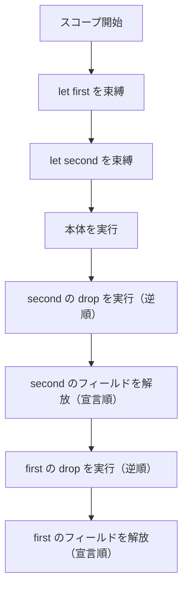

# Drop とリソースの解放

Tsuzuri は、スコープを抜けた変数のメモリを自動で解放します。ファイル記述子や、C ライブラリの不透明ハンドルのように、メモリ以外の資源を閉じたいときは、値の破棄に後始末を足します。

組み込みの型クラス `Drop` のインスタンスを書くと、値が破棄されるときにクリーンアップが 1 回走ります。トラップで止まったときは走りません。その例外は後半で説明します。

## この記事のポイント

- 文字列やコレクションなどの標準メモリは、スコープ終了時に自動解放されます。
- ユーザー定義の `record` や `union` に `instance Drop<T>` を実装して独自の解放処理を定義できます。
- `drop` メソッドのシグネチャは `drop :: ref mut 'a -> unit` です。
- 解放はスコープ終了、再代入、`return` / `break` / `continue` のときに 1 回呼ばれます。ムーブ済みの領域と、トラップで止まったあとは呼ばれません。
- 解放順序はスコープ内の束縛の逆順（LIFO）で、フィールドは宣言順に解放されます。
- `use` キーワードを使うと、`Drop` 実装型であることをコンパイル時に検証して束縛できます。
- 早期に解放したい場合は `Owned.drop` を呼び出します。
- `Rc` や `Arc` のような共有所有はありません。計画は [C10](../../../_features/C10-shared-ownership.md) です。

## メモリとリソースの自動解放

Tsuzuri では、所有権システムによってすべての値の寿命が静的に管理されています。

`string`、`utf8string`、配列 `[T]`、リスト `[|T|]`、`Vec<T>`、クロージャが捕捉した環境などのヒープメモリは、所有者がスコープを抜けたとき、コンパイラが入れた解放コード（drop glue）で解放されます。回収を待つ GC の停止はありません。

## 利用者定義の解放（Drop 型クラス）

ファイル記述子や外部ハンドルなど、メモリ以外の資源をカプセル化する場合は、型クラス `Drop` のインスタンスを定義します。

```tsuzuri run=3%0Adrop%202%0Adrop%201
record Ticket { id: i64 }

instance Drop<Ticket> {
    fn drop value = do! IO.write_line ("drop " + to_string value.id)
}

def main :: unit -> i32 = \() ->
    let first = Ticket { id: 1 }
    let second = Ticket { id: 2 }
    do! IO.write_line (to_string (first.id + second.id))
    0
```

実行結果:

```text
3
drop 2
drop 1
```

### Drop 実装のルール

- **対象型**: ソースコード上で明示宣言した `record` または `union` のみ指定できます。組み込み型（`i64` や `string` など）への実装や、一部の型引数のみを具体化した宣言は `E1016` です。また `deriving (Drop)` による自動導出は `E1025` です。
- **メソッドシグネチャ**: `drop :: ref mut 'a -> unit` です。Copy なフィールドは読めます。非 Copy なフィールドは `ref value.field` のように借ります。フィールドへの代入はできません。引数全体の置換も、別の関数へ `ref mut` で渡すことも `E1012` です。
- **直接呼び出しの禁止**: `Drop.drop` を自分で呼ぶと `E1016` です。二重解放を防ぐため、コンパイラの解放処理からだけ実行されます。

## 解放が呼ばれるタイミング

`Drop` を実装した値は、次のタイミングで **1 回だけ** 解放されます。トラップで止まったときは呼ばれません。

1. **スコープの終了時**: `let` や `use` で束縛されたブロックを抜けるとき
2. **制御構文による脱出時**: `break`、`continue`、`return` でスコープを抜けるとき
3. **上書き代入時**: 可変変数への再代入や、参照先への `deref r = new_value` で古い値が上書きされるとき
4. **一時値の破棄時**: 式の評価のために作られ、束縛されずに終わった一時値
5. **コレクションの破棄時**: 要素を含む配列やリスト、再帰 union が解放されるとき

所有権を別の変数や関数へムーブした領域には、`drop` は呼ばれません。非再帰の Drop 型は末尾に 1 バイトの生存フラグを持ち、ムーブ済みの領域では 0 になります。これで二重解放を防ぎます。

## 解放の順序（LIFO と宣言順）

解放の順序は、ソースの並びから決まります。

- **スコープ内の変数**: 宣言された順序とは **逆の順序（LIFO: 後入れ先出し）** で解放されます。後から作ったリソースが、先に作ったリソースに依存しているケースが多いためです。
- **レコードの中**: まず自分の `drop` が呼ばれ、そのあとフィールドが **宣言の左から順** に解放されます。



次の例で順序を確認できます。

```tsuzuri run=main%20done%0Aouter%20drop%0Ainner%20drop
record Inner { name: string }

instance Drop<Inner> {
    fn drop _value = do! IO.write_line "inner drop"
}

record Outer { inner: Inner }

instance Drop<Outer> {
    fn drop _value = do! IO.write_line "outer drop"
}

def main :: unit -> i32 = \() ->
    let _obj = Outer { inner: Inner { name: "test" } }
    do! IO.write_line "main done"
    0
```

実行結果:

```text
main done
outer drop
inner drop
```

`Outer` の `drop` が呼ばれた後に、フィールドである `Inner` の `drop` が呼ばれていることがわかります。

## use 束縛による解放保証

`use` キーワードは、`Drop` を実装した値を不変で束縛する専用構文です。

```text
use ticket = Ticket { id: 1 }
```

解放のタイミングは `let` と同じくスコープの終端です。右辺が `Drop` を実装していないと `E1005` になります。末尾の型が無い整数リテラルは `i32` なので、メッセージの型名も `i32` です。

```text
use n = 1
```

コンパイル結果:

```text
error[E1005]: 'use' needs a value whose type implements Drop; i32 does not, so bind it with 'let'
```

`use mut` は文法エラー `E0002` です。`use` は不変の束縛だけです。

`Drop` を実装している型だけを束縛したいときに使います。実装漏れはコンパイル時に分かります。詳細は [use キーワード](../exception-handling/use.md) を見てください。

## 早期解放（Owned.drop）

スコープの終わりを待たずに、手動でリソースを即座に解放したい場合は、標準組み込み関数 `Owned.drop` を呼び出します。

```tsuzuri run=drop%207%0Aafter
record Ticket { id: i64 }

instance Drop<Ticket> {
    fn drop value = do! IO.write_line ("drop " + to_string value.id)
}

def main :: unit -> i32 = \() ->
    let ticket = Ticket { id: 7 }
    Owned.drop ticket
    do! IO.write_line "after"
    0
```

実行結果:

```text
drop 7
after
```

`Owned.drop` は対象値の所有権を消費し、その場で `drop` デストラクタを実行します。渡した後の変数 `ticket` はムーブ済みとなり、以降はアクセスできません。

## Drop 型に課される制約

外部リソースの安全性を保つため、`Drop` を実装した型にはいくつかの重要な制約が課されます。

- **非 Copy**: `Drop` を実装した型は、フィールドの構成にかかわらず自動的に Copy 型ではなくなります。
- **通常のクロージャへの捕捉禁止（E1005）**: 通常の関数値は Copy です。Drop 型を捕捉すると、複製のたびに同じ資源を解放しかねません。そのため `E1005` になります。`task` へ所有権を渡すことはできます。
  > [!TIP]
  > Drop 型を捕捉して持ち運ぶ関数値が必要なときは、[Owned](../built-in-types-and-modules/owned.md) モジュールの `Owned.function` を使用します。
- **部分ムーブの禁止（E1012）**: Drop 型から非 Copy フィールドだけを取り出すことはできません。途中までムーブした値に `drop` が呼ばれるのを防ぐためです。メッセージは `cannot move a field or payload out of a value whose type implements Drop` です。
- **レコード更新の禁止（E1012）**: Drop 型に対して `{ value with ... }` の更新構文を適用することはできません。
- **`drop` 本体での全体置換・排他貸出の禁止（E1012）**: `deref value = ...` で引数全体を置き換えると、古い値の解放が同じ `drop` を再帰します。別の関数へ `ref mut` で渡すと、呼び出し先が中身を置換できます。どちらも `E1012` です。メッセージは `cannot replace the whole value inside Drop.drop` と `cannot pass the value on as 'ref mut' inside Drop.drop` です。
- **公開境界**: `export` や `extern` の引数・戻り値に Drop 型を置くと `E1008` です。

## 未実行の Task とトラップ時の挙動

- **未実行の Task の破棄**: `task { ... }` で作成されたタスクが `Task.run` や `Task.await` で実行されずにスコープを抜けた場合、タスクがキャプチャしていた所有リソースのみが安全に解放されて消滅します。
- **トラップ時の巻き戻し**: `assert` の失敗やゼロ除算でトラップしたときは、スタックを巻き戻しません。まだ実行していない `drop` は呼ばれません。後始末の完了をトラップに頼らないでください。`drop` の中でトラップしたときは、通常のトラップとして処理されます。

## 外部リソースと File.Handle の注意点

Tsuzuri の標準ライブラリにおけるファイル操作型 `File.Handle` は、意図的に `Drop` を実装していません。

書き込みのフラッシュやクローズは、ディスク満杯などの I/O エラーを返すことがあります。戻り値のない `drop` では、そのエラーを呼び出し元へ返せません。

ファイルは `File.close` で明示的に閉じるか、スコープの終わりに閉じてエラーも返す `File.with_open` を使います。

## 共有所有（Rc / Arc）の現状

Tsuzuri 0.1.0 には、Rust の `Rc<T>` や `Arc<T>` に相当する参照カウントの共有所有はありません。[C10](../../../_features/C10-shared-ownership.md) は計画中で、先に入るのは arena とハンドルです。`Rc` / `Arc` は後続の段階で、まだ承認前です。0.1.0 のコードでは使えません。

同じデータを複数の場所から読みたいときは、所有者を親のスコープに残し、共有借用（`ref T`）を渡します。循環が必要なら、所有関係を木や有向非巡回グラフに直します。

## 他の言語との比較

| 項目 | Tsuzuri | Rust | C# | C++ |
| --- | --- | --- | --- | --- |
| リソース解放 | `Drop` 型クラス | `Drop` トレイト | `IDisposable` | デストラクタ（RAII） |
| メソッドの引数 | `ref mut 'a` | `&mut self` | なし（`Dispose()`） | 暗黙の `this` |
| 解放順序 | LIFO（逆順） | LIFO（逆順） | GC 依存（`using` はスコープ末尾） | LIFO（逆順） |
| 静的検査構文 | `use` 束縛 | 通常の `let` | `using` 宣言 / ステートメント | なし |
| 早期解放 | `Owned.drop` | `drop(x)` | `x.Dispose()` | スコープブロック |
| 共有所有ポインタ | 未実装（[C10](../../../_features/C10-shared-ownership.md) で計画） | `Rc` / `Arc` | 参照型（GC） | `shared_ptr` |

## まとめ

- `Drop` 型クラスを実装すると、スコープ終了時にリソースを 1 回解放できます。トラップ時は例外です。
- 解放順序はスコープ内の束縛の逆順（LIFO）で、フィールドは宣言順に解放されます。
- `use` 束縛は、対象の型が `Drop` を実装していることを静的に検査します。
- 早期解放には組み込み関数 `Owned.drop` を使用します。
- Drop 型は非 Copy であり、通常のクロージャへの捕捉や部分ムーブは禁止されます。
- トラップ時にはスタック巻き戻しによる解放は行われません。
- `File.Handle` は自分で閉じます。`Rc` / `Arc` は 0.1.0 にはありません。

## 関連項目

- [所有権とムーブ](ownership.md)
- [借用と参照](borrowing.md)
- [ライフタイムと region](lifetimes.md)
- [スタックとヒープ](stack-and-heap.md)
- [use キーワード](../exception-handling/use.md)
- [Owned](../built-in-types-and-modules/owned.md)
- [言語仕様: 利用者定義の解放（Drop）](../../../docs/language.md#利用者定義の解放drop)
- [言語リファレンスの目次](../index.md)

