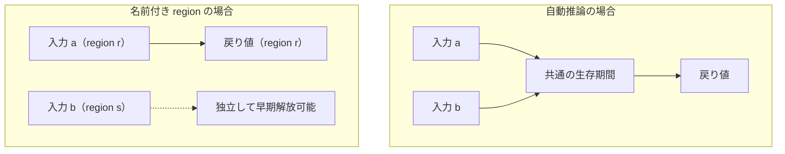

# ライフタイムと region

借用（参照）を使用する際、最も重要な安全規則は「参照は、参照先の所有者よりも長生きしてはならない」ということです。所有者がスコープを抜けて破棄されたあとに参照が残ると、不正なメモリアドレスを指すダングリングポインタになってしまいます。

関数の内部では、ライフタイムをコンパイラが推論します。関数の境界をまたいで複数の借用を扱うときや、レコードに借用を持たせるときは「名前付き region」を書きます。戻り値がどの入力の借用なのかを、コンパイル時に検査するためです。

## この記事のポイント

- 参照は常に所有者の生存期間（ライフタイム）の範囲内でのみ有効です。
- ローカルスコープで破棄される値への参照を外へ返そうとするとコンパイルエラー `E1013` になります。
- 名前付き region は `def f {r s} :: ref {r} T -> ref {s} U -> ref {r} T` のように波括弧で宣言します。
- 複数の region を使い分けることで、不要な借用の拘束を防ぎ、無関係な変数を早期に変更・解放できます。
- レコードのフィールドに借用を格納でき、排他借用フィールドには `ref mut {r} T` と明記します。
- 参照経由で借用レコードを置換する場合、参照先の region（`ref mut {r} Note {s}`）で追跡します。
- グローバルな静的ライフタイム（static lifetime）は言語仕様として存在しません。

## ライフタイムの基本原則

Tsuzuri では、スコープを抜けると値が破棄されます。ローカルで生成した値への参照を関数の外やブロック式の外へ返却することはできません。

```text
def invalid_ref :: unit -> ref string = \() ->
    let local = "temporary"
    ref local
```

コンパイル結果:

```text
error[E1013]: borrowed value does not live long enough to leave this block
```

`local` のメモリは関数が終了した瞬間に解放されるため、その参照を返すことはコンパイラによって拒絶されます。参照を返却できるのは、呼び出し元から受け取った引数の参照に由来する場合だけです。

## なぜ名前付き region が必要なのか

1 つの参照を受け取って 1 つの参照を返す関数では、コンパイラが自動的に入力と出力の生存期間を関連付けます。

しかし、2 つ以上の参照を受け取ってそのうちの 1 つを返す場合、何も指定しないと「両方の入力の共通の生存期間」に出力が拘束されてしまいます。その結果、返却されなかった無関係な入力変数まで借用中とみなされ、早期の変更や破棄ができなくなってしまいます。



名前付き region を使うことで、戻り値が具体的にどの入力のライフタイムに紐づいているかを型シグネチャ上で明示できます。

## 名前付き region の構文

region 名は、互いに違う小文字の ASCII 識別子です（`r`、`s`、`a` など）。大文字は `E1013` になります。型変数とは別の名前空間で、`def` の関数名の直後に `{r s}` と書きます。カンマ区切りの `{r, s}` も同じです。宣言したのに使わない region も `E1013` です。

```text
def 関数名 {region1 region2} :: 引数型 -> 戻り値型
```

参照型に region を付与するときは `ref {r} T`（または記号形式 `&{r} T`）、排他参照では `ref mut {r} T`（`&mut {r} T`）と書きます。

## 複数の region で借用元を分離する

次の例では、`first` 関数が 2 つの文字列参照を受け取り、1 つ目の参照だけを返します。

```tsuzuri run=5
def first {r s} :: ref {r} string -> ref {s} string -> ref {r} string = \left right ->
    assert (right.length > 0)
    left

let left = "hello"
let mut right = "temporary"
let selected = first (ref left) (ref right)
right = "changed"
selected.length
```

実行結果:

```text
5
```

シグネチャで `{r s}` を宣言し、戻り値を `ref {r} string` と指定しています。これにより、`selected` が借用しているのは `left` だけであり、`right`（`s`）とは無関係であることが保証されます。

そのため、関数呼び出しの直後に `right = "changed"` と可変変数を更新しても、`selected` は安全に有効なまま利用できます。もし region を指定しなければ `right` の更新は借用競合 `E1014` と判定されます。

> [!NOTE]
> 関数本体が宣言と違う借用を返すと `E1013` です。たとえば戻り値を `ref {r}` と書いて `right` を返すと、`returned borrow does not match the declared result region` になります。region は注釈ではなく、コンパイラが検査する契約です。

## レコードの共有借用フィールド

レコードのフィールドに共有借用を保持させることができます。レコード宣言時に名前付き region を宣言し、借用を内包する集約型として定義します。

```tsuzuri run=42
record View<'a> {r} { value: ref {r} 'a }

def view {r} :: ref {r} i64 -> View<i64> {r} = \value -> View { value: value }

let owner = 42
let borrowed = view (ref owner)
deref borrowed.value
```

実行結果:

```text
42
```

`View<i64> {r}` は「region `r` に属する借用を保持するレコード」を表します。このレコード自身をコピーしたりムーブしたりしても、元の所有者 `owner` への借用関係は維持されます。`owner` より長く生き残るスコープへ `borrowed` を持ち出そうとすると `E1013` になります。

レコードに書ける region は 16 個までです。17 個目は `E1017` になります。関数の `{r s ...}` は 128 個までで、それを超えるのも `E1017` です。複数の region を持つレコードは、宣言の順に同じ個数の名前を書きます。

```tsuzuri run=7
record Pair {r s} { left: ref {r} string, right: ref {s} string }

def make_pair {r s} :: ref {r} string -> ref {s} string -> Pair {r s} = \left right ->
    Pair { left: left, right: right }

def left_of {r s} :: Pair {r s} -> ref {r} string = \pair -> pair.left

let long = "abcdefg"
let kept = {
    let short = "xy";
    left_of (make_pair (ref long) (ref short))
}
kept.length
```

実行結果:

```text
7
```

`left_of` の結果は `long`（`r`）の借用のみを引き継ぐため、短命な `short`（`s`）が破棄される内側のブロックを抜けて安全に外側へ返却できます。

## 排他借用フィールド（ref mut {r} T）

レコードのフィールドに排他借用を持たせることも可能です。作業バッファへの排他参照を状態と一緒に持ち運ぶ view 構造などに活用できます（Rust の `struct Counter<'a> { value: &'a mut i64 }` に相当）。

排他借用フィールドを宣言する際は、region の指定が必須です（省略すると `E1013`）。

```tsuzuri run=22
record Counter {r} { value: ref mut {r} i64, step: i64 }

def add_to :: ref mut i64 -> i64 -> unit = \target amount ->
    deref target = deref target + amount

let mut total = 1
let counter = Counter { value: ref mut total, step: 20 }
add_to counter.value counter.step
let again = ref mut counter.value
deref again = deref again + 1
total
```

実行結果:

```text
22
```

### 排他借用フィールドの規則

- **再借用**: `counter.value` を排他参照を受け取る関数へ渡す操作は一段の再借用になります。レコード変数 `counter` 自体を `let mut` で束縛する必要はありません。
- **部分ムーブ**: `let taken = counter.value` は再借用ではなく、フィールドの部分ムーブです。そのあと `counter` 全体は使えません。
- **Copy ではない**: 排他借用フィールドを含むレコードは Copy になりません。通常のクロージャへの捕捉は `E1005`、`task` への送信は `E1013` です。
- **共有参照経由の変更禁止**: `ref Counter` を通して排他フィールドの参照先を変更したり、排他再借用したりすると `E1014` です。読み出しはできます。
- **排他スライスも置ける**: `ref mut {r} [i64..]` のように、可変スライスをフィールドにできます。配列・リスト・タプル・共用体・共有参照の内側に排他借用を置くことはできません（`E1013`）。

## 参照先の region と参照経由の置換

借用を保持しているレコードへの排他参照（`ref mut`）を経由して、そのレコードを新しい値で上書き代入したい場合があります。

このとき、参照自体の region と、参照先が内包する借用の region を区別して記述します。

```text
ref mut {r} Note {s}
```

ここで `{r}` は参照自体の生存期間、`{s}` は参照先の `Note` が保持している借用の生存期間です。

```tsuzuri run=65
record Note {r} { text: ref {r} string }

def swap_text {r s} :: ref mut {r} Note {s} -> ref {s} string -> ref {s} string = \target text ->
    let old = (deref target).text
    deref target = Note { text: text }
    old

let first = "alpha"
let second = "beta!!"
let mut note = Note { text: ref first }
let old = swap_text (ref mut note) (ref second)
note.text.length * 10 + old.length
```

実行結果:

```text
65
```

`swap_text` では、参照先へ新しい `Note { text: text }` を書き込んでいます。これが安全に行えるのは、書き込む新しい借用（`text`）が、参照先の保持する借用と同じ region `{s}` を持っているためです。呼び出し側では、`second` の生存期間が `note` に関連付けられます。

## region 量化関数

高階関数の引数において、「渡された関数が特定のライフタイム契約を満たしていること」を型で要求できます。関数型の直前に波括弧で region リストを記述します。

```tsuzuri run=7
def keep {r} :: ({s t} ref {s} string -> ref {t} string -> ref {s} string) -> ref {r} string -> ref string -> ref {r} string = \f kept other -> f kept other
def first {s t} :: ref {s} string -> ref {t} string -> ref {s} string = \left _right -> left

let long = "abcdefg"
let mut other = "xy"
let kept = keep first (ref long) (ref other)
other = "changed"
kept.length
```

実行結果:

```text
7
```

`({s t} ref {s} string -> ref {t} string -> ref {s} string)` は「1 番目の引数だけを借用して返す関数」という契約です。`keep` の本体で `f` を全引数で呼んだ結果は `kept`（`r`）の借用だけを持つので、呼び出し後に `other` を変更できます。

## 典型的なエラーと解決策

### E1013: 借用が所有者より長生きしている

```text
error[E1013]: borrowed value does not live long enough to leave this block
```

- **原因**: ローカルスコープで破棄される変数への参照を外へ持ち出そうとしています。
- **対処法**: 所有値そのものを返すか、外側のスコープで変数を `let` 束縛してから参照を渡します。

### E1013: 未宣言または不整合な region

```text
error[E1013]: undeclared region 'r'; add it after the declaration name
```

- **原因**: `def` の直後で宣言されていない region 名をシグネチャ内で使用しています。
- **対処法**: `def my_func {r} :: ...` のように波括弧内で region を明示宣言します。

### E1014: 借用中の競合

```text
error[E1014]: access conflicts with a live borrow; use the reference or end its last use before moving, replacing, or borrowing exclusively
```

- **原因**: 参照がまだ生きている間に、元の所有値を変更またはムーブしようとしています。
- **対処法**: 参照の使用を先に終わらせるか、必要な値を先に読み出してから変更します。

## 現在の制限

名前付き region は、入力と戻り値の対応を関数の直接呼び出しで分けるための仕組みです。次の場合は、安全側にまとめて扱います。

| 状況 | 扱い |
| --- | --- |
| 名前付き関数の直接の完全適用、不変な束縛、`if` / `match` の合流、レコードの作成とフィールド読み出し | region ごとに分ける |
| `let mut`、ループで合流する値、関数値、部分適用、クロージャの捕捉、配列・リスト・タプル・共用体への格納 | 関係する region をすべて保持する |
| 型エイリアス、共用体、`const`、ローカルの型注釈への region | `E1013`。書けません |
| 1 つの引数や戻り値に複数 region を混ぜる | 型全体が `Pair {r s}` のような複数 region レコードの直接適用なら可。`ref Pair {r s}` や `(ref {r} T, ref {s} U)` は `E1013` |
| region 量化した関数型 | 名前付き関数の引数の型全体だけ。その関数は直接呼び出しだけができ、関数値や部分適用は `E1013` |
| 静的ライフタイム | ありません |

「直接呼ぶと `right` をすぐ書き換えられるのに、関数値として渡すと借用が残る」ときは、この制限です。呼び出しを直接にするか、所有値を返す API にします。

複数 region のレコードを `let mut` で束縛すると、region は 1 つにまとまります。共有フィールドの読み出しと排他フィールドの再借用を同じ式で行うと `E1014` になることがあるので、先に `let` で読み出します。

## 他の言語との比較

| 項目 | Tsuzuri | Rust | C# |
| --- | --- | --- | --- |
| ライフタイムの指定 | 名前付き region `{r s}` | ジェネリックライフタイム `'a, 'b` | `ref struct` / lifetime 注釈 |
| 構文 | `ref {r} T` / `&{r} T` | `&'a T` | `ref T` |
| 排他参照の指定 | `ref mut {r} T` | `&'a mut T` | `ref T` |
| static ライフタイム | なし（明示的な region のみ） | `'static` | 静的参照 |
| レコード内の借用 | `record R {r} { v: ref {r} T }` | `struct S<'a> { v: &'a T }` | `ref struct` |
| 引数の暗黙関連付け | 1 引数は自動推論 | ライフタイム省略規則 | コンパイラ推論 |

## まとめ

- 参照は常に所有者のスコープ内で安全に管理され、ダングリング参照はコンパイル時に遮断されます。
- 複数の参照を扱う関数では、名前付き region `{r s}` で戻り値の借用元を明示します。
- レコードのフィールドに共有借用（`ref {r} T`）や排他借用（`ref mut {r} T`）を格納できます。
- 参照先が借用を持つ場合は `ref mut {r} Note {s}` のように参照先 region を分離します。
- region 量化した引数で、高階関数が返す借用を入力のどれかに限定できます。関数値として渡すと、この区別は残りません。

## 関連項目

- [所有権とムーブ](ownership.md)
- [借用と参照](borrowing.md)
- [スタックとヒープ](stack-and-heap.md)
- [Drop とリソースの解放](drop.md)
- [Record](../built-in-types-and-modules/record.md)
- [言語仕様: 名前付き Region](../../../docs/language.md#名前付き-region)
- [言語仕様: 排他借用フィールド](../../../docs/language.md#排他借用フィールド)
- [言語リファレンスの目次](../index.md)

