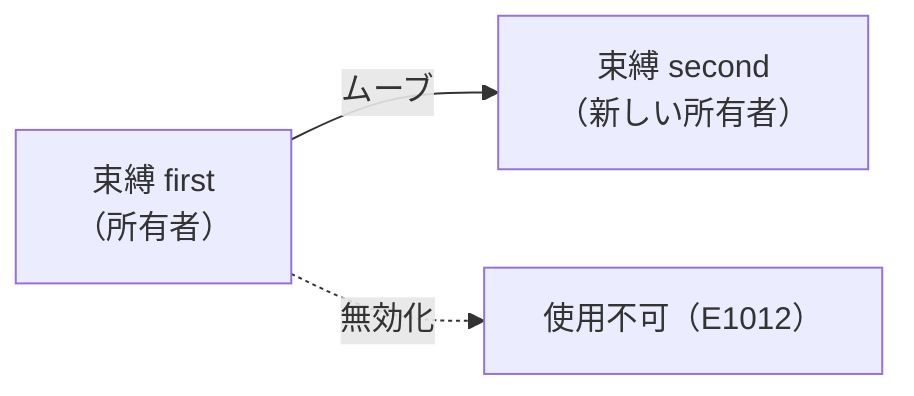

# 所有権とムーブ

Tsuzuri はガベージコレクションも参照カウントも使いません。値の所有者は束縛 1 つだけで、その束縛がスコープを抜けると、コンパイラが入れた解放処理が走ります。いつ解放されるかは、ソースのスコープから読めます。

`string` や `Vec` のようにコピーできない値を、別の変数へ代入したり関数の引数や戻り値にしたりすると、所有権が移動します。これをムーブと呼びます。ムーブしたあとの変数は空になり、もう一度使うとコンパイルエラーになります。

## この記事のポイント

- 所有値の所有者は常に 1 つです。所有者がスコープを抜けると、値は自動で解放されます。
- `string` や `Vec` などの非 Copy 値を代入・引数渡し・戻り値に使うと、所有権がムーブします。通常のラムダ式へ非 Copy 値を捕捉することはできません。
- ムーブ済みの変数を使うとコンパイルエラー `E1012` になります。
- 数値や共有借用（`ref T`）などの Copy 型は、代入してもムーブせず自動で複製されます。
- 配列やリストが Copy の場合、複製は要素全体のディープコピーを伴うためコストがかかります。
- `--warn implicit-copy`（`W1006`）を指定すると、暗黙のディープコピーをコンパイル時に検知できます。
- 非 Copy フィールドを含むレコードの更新構文 `{ r with ... }` は元の値をムーブして消費します。

## なぜ GC も参照カウントも使わないのか

ガベージコレクタは、実行時にメモリを走査し、処理を一時停止することがあります。参照カウントは、カウントの増減が実行のたびに入り、循環参照が残ると解放されません。

Tsuzuri は、値をコピーするか、所有者を 1 つだけ移すか、のどちらかでメモリを扱います。この規則をアフィン所有権と呼びます。

- ランタイムにコレクタや、カウントを更新する処理はありません。
- スコープを抜けた値は、その場で 1 回だけ解放されます。トラップしたときは巻き戻さないので、そこだけ例外です。詳しくは [Drop とリソースの解放](drop.md) を見てください。
- 同じ値を複数の所有者から同時に書き換えることはできません。読み取り専用の共有は [借用と参照](borrowing.md) の規則で検査します。
- 複数の値から同じ値を指す構造や循環する構造は、std の [Arena](../built-in-types-and-modules/arena.md) に値を入れ、Copy のハンドルで指して表します。

`free` や `delete` を自分で書く必要はありません。二重解放や、解放したあとの使用はコンパイル時に拒まれます。

## 所有者とスコープ

Tsuzuri では、変数の束縛が値の所有者になります。変数が宣言されたブロック（スコープ）を抜けると、所有していた値は自動的に破棄されます。

```tsuzuri run=hello%2C%20world
def greeting :: unit -> string = \() ->
    let message = "hello, world"
    message

greeting ()
```

実行結果:

```text
hello, world
```

上記のコードでは、`message` が文字列の所有者です。関数の末尾で `message` を返却しているため、所有権は呼び出し元へとムーブします。もし返却せずにスコープを抜けた場合、その場で文字列のメモリが解放されます。

## ムーブの仕組み

所有権を持つ値（所有値）を別の変数に代入したり、関数の引数として渡したりすると、所有権が移動（ムーブ）します。移動したあとの元の束縛は空になり、アクセスできなくなります。

次の例では、`first` の所有権を `second` に移動しています。

```tsuzuri run=4
let first = "data"
let second = first
second.length
```

実行結果:

```text
4
```

値の移動の流れを図で表すと次のようになります。



ムーブが起きる主な場面は次のとおりです。

1. **代入**: `let b = a`
2. **関数の引数**: 所有値を要求する仮引数へ渡す
3. **関数の戻り値**: `return a`、またはブロック末尾の式
4. **別の値の中へ入れる**: レコードの非 Copy フィールド、コレクションの要素、`task` への送信

通常のラムダ式は Copy なので、非 Copy 値を捕捉しようとするとエラー `E1005` になります。所有したまま持ち運ぶ関数値が欲しいときは [Owned](../built-in-types-and-modules/owned.md) の `Owned.function` を使います。

## ムーブ後の使用エラー（E1012）

ムーブによって所有権を手放した変数を後続のコードで使用しようとすると、コンパイラは `E1012` エラーを出力します。

```text
let first = "data"
let second = first
first.length
```

コンパイル結果:

```text
error[E1012]: use of moved or partially moved value 'first'
```

条件分岐の一方でのみムーブした場合でも、合流後にその変数を使うことはできません。

```text
let text = "sample"
if true then
    let moved = text
    ()
else
    ()
text.length
```

コンパイル結果:

```text
error[E1012]: use of moved or partially moved value 'text'
```

コンパイラは安全側に倒して検査するため、いずれかのパスでムーブされた変数は合流地点以降では無効と判定されます。値を消費せずに中身を参照したい場合は、所有権を渡すのではなく後述の [借用と参照](borrowing.md) を使用します。

## Copy 型と自動複製

すべての型がムーブするわけではありません。ビット単位のコピーが安全な型は `Copy` 型クラスのインスタンスになっており、代入や引数渡しで所有権を移さず、値を複製します。元の変数もそのまま使えます。

```tsuzuri run=20
let x = 10
let y = x
x + y
```

実行結果:

```text
20
```

### Copy になる型・ならない型

| 分類 | 型 | 複製の挙動 |
| --- | --- | --- |
| 基本型 | `bool`、`unit`、各整数型（`i64` など）、各浮動小数点型（`f64` など） | Copy |
| 文字型 | `char`（UTF-16 コード単位）、`utf8char`（Unicode スカラー値） | Copy |
| 参照型 | 共有借用 `ref T`（`&T`） | Copy（参照先ではなく参照ポインタ自身を複製） |
| 関数値 | 関数ポインタ・クロージャ（`'a -> 'b`） | Copy（捕捉環境のディープコピーを伴う場合あり） |
| 複合型 | レコード、タプル、固定長配列 `[T; N]`、非再帰の共用体 | 全フィールド・全要素が Copy のときだけ Copy。`[T; N]` の複製はタプルと同じインラインコピーです |
| 可変長の列 | 配列 `[T]`、リスト `[\|T\|]` | 要素がすべて Copy のときだけ Copy。複製は要素全体のディープコピーです |
| 文字列型 | `string`（UTF-16）、`utf8string`（UTF-8） | 非 Copy（所有権がムーブ） |
| コレクション | `Vec<T>`、`Map<K, V>`、`Set<T>`、`HashMap<K, V>`、`HashSet<T>`、`Seq<T>` | 常に非 Copy。中身が Copy でも所有バッファごとムーブします |
| 排他参照 | `ref mut T`（`&mut T`）、排他スライス `ref mut [T..]` | 非 Copy。一意性を保つため複製できません |
| 特殊型 | `Task<T>`、再帰の共用体、`Drop` を実装した型、`Owned.Function` | 常に非 Copy |

`derive(Copy)` を書く必要はありません。コンパイラがフィールドと要素から判定します。再帰的な共用体は、ペイロードが Copy でも Copy にはなりません。子ノードをヒープで所有しているためです。

ジェネリックな関数で値を複製するときは、制約 `Copy<'a>` を書きます。所有権検査がこの制約を推論することもあります。

```tsuzuri run=6
def pair :: Copy<'a> => 'a -> ('a * 'a) = \value -> (value, value)

match pair 3 with
| (left, right) -> left + right
```

実行結果:

```text
6
```

## コレクションの Copy とそのコスト

注意が必要なのは、Copy 型の要素のみで構成された配列 `[T]` や連結リスト `[|T|]` です。これらも「全要素が Copy なのでコレクション自体も Copy」と判定されます。

ただし、配列やリストの Copy はポインタのコピーではありません。新しいバッファやノードを確保し、要素をすべて複製するディープコピーです。コストは要素数に比例します。固定長配列 `[T; N]` はここに含まれません。

```tsuzuri run=6
let first = [1, 2, 3]
let second = first
first.length + second.length
```

実行結果:

```text
6
```

`second` へ代入したあとも `first` を使っているので、要素全体が新しいバッファへコピーされます。代入のあと `first` を使わなければムーブになり、このコピーは起きません。

不要なコピーを避けるためには、所有権を渡す代わりに共有借用（`ref [T]`）を受け取るように関数を設計します。

## 暗黙のコピーの検出と明示コピー

意図しないパフォーマンス低下を防ぐため、Tsuzuri コンパイラには暗黙のコレクションコピーを警告する機能が用意されています。

```sh
tsuzuri check --warn implicit-copy Main.tz
```

このオプションを付けると、暗黙のディープコピーに警告 `W1006` が出ます。配列、リスト、それらを含むレコードで文言が違います。`dyn` 値の複製も同じ警告です。フラグが無いときの終了コードは 0 のままで、生成コードも変わりません。

```text
warning[W1006]: implicit copy of an array allocates and copies every element; borrow it with 'ref', or call 'Array.copy' to make the copy explicit
warning[W1006]: implicit copy of a list allocates a new node for every element; borrow it with 'ref', or call 'List.copy' to make the copy explicit
```

意図して複製を行いたい場合は、標準ライブラリの関数を明示的に呼び出します。

```tsuzuri run=6
let original = [1, 2, 3]
let cloned = Array.copy (ref original)
original.length + cloned.length
```

実行結果:

```text
6
```

`Array.copy` や `List.copy` を明示的に呼んだ場合、`W1006` の警告は発生しません。

## レコードの消費する更新（consuming update）

Tsuzuri のレコード更新構文 `{ record with field = expression }` は、既存のレコードを変更するのではなく、新しいレコードを構築します。

このとき、レコードが非 Copy フィールド（`string` など）を含んでいる場合、更新構文は元のレコードの所有権を **消費（ムーブ）** します。

```tsuzuri run=2
record Location { name: string, floor: i64 }

let current = Location { name: "Tokyo", floor: 1 }
let updated = { current with floor = 2 }
updated.floor
```

実行結果:

```text
2
```

更新式のあと続いたコードで元の `current` を参照しようとすると、`E1012` になります。

```text
let next = { current with floor = 2 }
current.name
```

コンパイル結果:

```text
error[E1012]: use of moved or partially moved value 'current'
```

また、更新式の途中で元の束縛を複数回読むこともできません。全フィールドが Copy なレコードであれば、元の値も引き続き使用できます。

## 部分ムーブ

レコードの非 Copy フィールドを個別に変数へ取り出すと、そのフィールドだけがムーブします。これを「部分ムーブ（partial move）」と呼びます。

```tsuzuri run=order%3A%202
record Package { title: string, count: i64 }

let pkg = Package { title: "order", count: 2 }
let title = pkg.title
title + ": " + to_string pkg.count
```

実行結果:

```text
order: 2
```

`title` を取り出したあとでも、残った Copy フィールド `pkg.count` は読めます。一部でもムーブしたあとに `pkg` 全体を関数へ渡したり、別の変数へ代入したりすると `E1012` になります。

```text
let pkg = Package { title: "order", count: 2 }
let title = pkg.title
let other = pkg
```

コンパイル結果:

```text
error[E1012]: use of moved or partially moved value 'pkg'
```

配列やリストの非 Copy 要素を、インデックスで取り出してムーブすることはできません。参照の先から所有値を奪うこともできません。どちらも `E1012` です。

```text
let items = ["order", "pack"]
let first = items[0]
```

コンパイル結果:

```text
error[E1012]: cannot move a non-Copy element out of an array or list; borrow the element instead
```

要素を読みたいときは `ref items[0]` のように借ります。

## 他の言語との比較

| 項目 | Tsuzuri | Rust | Go / Java / C# |
| --- | --- | --- | --- |
| メモリ管理方式 | 所有者は 1 つ（GC なし） | 所有権と借用（GC なし） | ガベージコレクタ（GC） |
| デフォルトの代入 | 非 Copy はムーブ、Copy は複製 | 同左 | 参照または浅いコピー |
| `Copy` の指定 | 型定義から自動判定 | `#[derive(Copy)]` で明示 | 言語仕様で固定 |
| コレクションの Copy | Copy 要素の配列は暗黙にディープコピー可 | `Clone` の明示呼び出しが必須 | 参照のコピーのみ |
| ムーブ後の使用 | コンパイルエラー（`E1012`） | コンパイルエラー | 常にアクセス可能 |
| 暗黙コピーの警告 | `--warn implicit-copy` | なし（明示的） | 対象外 |

## まとめ

- Tsuzuri は GC も参照カウントも使わず、所有者 1 つの規則でメモリを解放します。
- 非 Copy な値の代入や引数渡しはムーブとなり、元の束縛は使用できなくなります（違反は `E1012`）。
- 全フィールドが Copy である型は自動的に Copy 型になり、再利用時に自動複製されます。
- 配列やリストの自動複製はディープコピーを伴うため、不要なコピーは借用（`ref`）で防ぎます。
- コレクションの暗黙の複製箇所は `--warn implicit-copy`（`W1006`）で特定できます。
- 非 Copy フィールドを含むレコードの更新構文は元の値を消費します。

## 関連項目

- [借用と参照](borrowing.md)
- [ライフタイムと region](lifetimes.md)
- [スタックとヒープ](stack-and-heap.md)
- [Drop とリソースの解放](drop.md)
- [Record](../built-in-types-and-modules/record.md)
- [Array](../built-in-types-and-modules/array.md)
- [言語仕様: Ownership / Borrowing](../../../docs/language.md#ownership--borrowing)
- [言語リファレンスの目次](../index.md)

