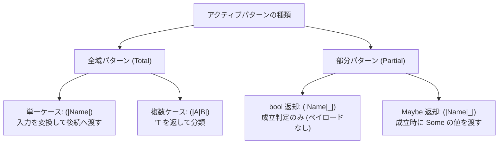

# Active パターン

アクティブパターンは、関数で入力を判定・変換してからパターン照合する仕組みです。分類や値の取り出しを、ふつうのパターンの構文に組み込めます。

## この記事のポイント

- 完全アクティブパターン `(|A|)` は入力を常に変換し、結果を後続のパターンへ渡します。
- 部分アクティブパターン `(|A|_|)` は `bool` または `Maybe<T>` を返し、条件付きでマッチします。
- 複数ケースの全域アクティブパターン `(|A|B|)` は、`'T`（暗黙の共用体）を返して入力を複数のケースに分類します。
- 照合対象の前に、追加の引数を渡せます。
- 専用の動的ディスパッチはなく、通常の関数呼び出しとしてコンパイルされます。
- 読み取りだけの入力には `ref string` のような共有借用を使います。

## アクティブパターンの分類

Tsuzuri のアクティブパターンには、用途に応じて以下の種類があります。



## 部分アクティブパターン（(|Name|_|)）

入力値が条件を満たすかどうかを判定し、成立した場合にのみマッチさせたい場合は部分アクティブパターンを使います。末尾にワイルドカード `_` を含む `(|名前|_|)` の記法で宣言します。

### bool を返す形式

真偽値のみで判定し、追加のペイロードを渡さないシンプルな形式です。

```tsuzuri run=42
def (|Even|_|) :: i64 -> bool = \value -> value % 2 == 0

match 42 with
| Even -> 42
| _ -> 0
```

実行結果:

```text
42
```

`true` が返ればマッチ成立となり、`false` の場合は不一致として直ちに次のマッチ節へと進みます。

### Maybe を返す形式

判定と同時に、抽出したデータを後続のパターンへ渡したい場合は `Maybe<T>` を返します。

```tsuzuri run=42
def (|Parsed|_|) :: ref string -> Maybe<i64> = \text -> Parse.parse text

match "42" with
| Parsed value -> value
| _ -> 0
```

実行結果:

```text
42
```

- `Maybe.Some payload` が返された場合: マッチ成立となり、`payload` が後続のパターン（上記の例では変数 `value`）へ渡されます。
- `Maybe.None` が返された場合: マッチ不成立となり、次の節へ進みます。

> [!NOTE]
> `Maybe<unit>` を返す認識器に限り、マッチ節でのペイロードパターン（`()`）を省略できます。

## 単一ケースの全域アクティブパターン（(|Name|)）

入力値を別の表現へ常に変換したい場合は、単一ケースの全域アクティブパターン `(|Name|)` を使います。

```tsuzuri run=42
def (|Length|) :: ref string -> i64 = \text -> text.length

match "answer" with
| Length size -> size * 7
```

実行結果:

```text
42
```

`Length` は常に文字列の長さを計算し、後続のパターン `size` へ渡します。後続が `size` や `_` のように必ず一致するパターンなら、この 1 節で入力全体を覆えます。`Length 6` のように定数で受けると、ほかの長さは覆いません。

結果側のパターンを節ごとに分けても、それを合わせて網羅とはみなしません。たとえば `Parity true` と `Parity false` を両方書いても `E1021`（`missing: _`）です。

## 複数ケースの全域アクティブパターン（(|A|B|)）

入力を有限個の排他的なケースに分類したい場合は、複数ケースのアクティブパターンを使います。

```tsuzuri run=42
def (|Even|Odd|) :: i64 -> 'T = \value ->
    if value % 2 == 0 then Even else Odd

match 42 with
| Even -> 42
| Odd -> 0
| _ -> -1
```

実行結果:

```text
42
```

- 戻り値の `'T` は、この認識器専用の暗黙の共用体を表す印です。ふつうの型変数ではないので、入力型には使えません。明示的な共用体を自分で定義して返す古い形式は使えません。
- 宣言したケース名（`Even` や `Odd`）は、認識器の本体の中だけで、結果を作る構築子として使えます。外ではパターンとして使います。

### ペイロード付きの複数ケース

ケースごとに違う値（ペイロード）を持たせられます。本体で `Case value`、または `value |> Case` と直接適用したケースはペイロードを持ち、その型は推論されます。高階関数へ渡しただけでは、ペイロードの有無は推論されません。

```tsuzuri run=42
def (|Small|Large|) :: i64 -> 'T = \value ->
    if value < 10 then Small value else Large value

match 42 with
| Small value -> value
| Large value -> value
| _ -> 0
```

実行結果:

```text
42
```

> [!WARNING]
> 認識器は節ごとに改めて呼び出され、結果はキャッシュされません。複数ケースをすべて書いても、いまの実装では末尾の `_` が必要です。省くと `E1021`（`missing: _`）になります。複数ケースと部分パターンを組み合わせた `(|A|B|_|)` は未対応で、`E1020`（`partial active patterns have exactly one case`）です。小文字で始まるケース名も `E1020` です。

## 追加の引数を取るパラメータ付きパターン

照合対象の値の前に、追加の引数を渡せます。

```tsuzuri run=42
def (|Divisible|_|) :: i64 -> i64 -> bool = \divisor -> \value ->
    value % divisor == 0

match 42 with
| Divisible 3 -> 42
| _ -> 0
```

実行結果:

```text
42
```

マッチ節では `Divisible 3` のように追加引数を渡します。引数は照合対象の値よりも前に評価されます。

## 可視性と名前解決

ケース名は大文字で始めます。

- 同じモジュールの定義が最優先です。それ以外は、ユーザーモジュールを標準ライブラリより先に探します。標準ライブラリがユーザーモジュールを逆に探すことはありません。
- 同じ段階に候補が複数あると `E1004` です。診断は `ambiguous active pattern` で始まります。`Module.Even` のように修飾してください。
- 既存の型名やケース名と衝突すると `E1001` です。
- `private def (|Even|_|) ...` は、モジュールの外から使うと `E1022` です。

## 所有権と評価

- **参照の借用**: 文字列やコレクションなど非 Copy の入力は、`ref string` のような共有借用で受けます。消費してから次の節を試すことはできません。
- **呼び出し**: 通常の静的な関数呼び出しとしてコンパイルされ、専用の動的ディスパッチはありません。インライン化されるとは限りません。
- **再評価**: 結果はキャッシュされません。節ごとに呼び出されるので、副作用の順序は書いたとおりです。
- **ほかの位置**: `match` だけでなく、ラムダ引数や `for...in` のパターンにも書けます。そちらは網羅性検査をせず、不一致は実行時トラップです。

## 他の言語との比較

| 機能 | Tsuzuri | F# | Rust |
| --- | --- | --- | --- |
| 単一全域パターン | `(\|Name\|)` | `(\|Name\|)` | なし（関数または関連定数） |
| 部分パターン | `(\|Name\|_\|)`（`bool` / `Maybe`） | `(\|Name\|_\|)`（`Option`） | なし |
| 複数ケース全域 | `(\|A\|B\|)`（`'T` を返却） | `(\|A\|B\|)`（Choice 型） | なし |
| 追加引数 | 対応（`(\|Name\|_\|) arg`） | 対応 | なし |
| 実装 | 通常の関数呼び出し | 関数呼び出し | – |

## まとめ

- アクティブパターンは関数による判定・変換をパターン照合に組み込む仕組みです。
- 単一全域 `(|Name|)`、部分パターン `(|Name|_|)`、複数ケース `(|A|B|)` の 3 形態があります。
- 部分パターンは `bool` または `Maybe<T>` を返して成否を伝えます。
- 複数ケースでは `'T` マーカーにより暗黙の共用体を簡潔に返せます。
- 追加引数を取ると、同じ判定を別の定数でも使えます。

## 関連項目

- [パターンマッチング](pattern-matching.md)
- [match 式](match.md)
- [関数 / 高階関数 / 再帰関数](../values-and-functions/functions.md)
- [Maybe](../built-in-types-and-modules/maybe.md)
- [言語仕様のアクティブパターン](../../../docs/language.md#アクティブパターン)
- [言語リファレンスの目次](../index.md)

