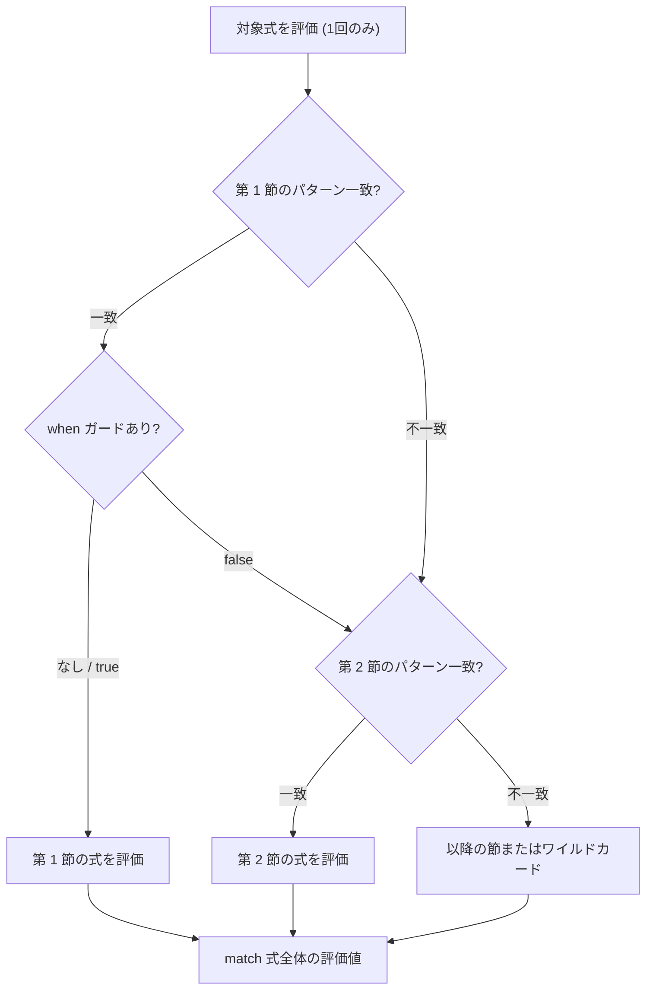

# match 式

`match` 式は、対象の値を 1 回だけ評価し、上から順に並べられたパターンと照合して一致した節の式を評価する制御構文です。すべての分岐が同一の型を返し、コンパイル時にすべてのケースが網羅されているかが静的に検証されます。

## この記事のポイント

- 構文は `match 対象式 with | パターン [when 条件] -> 結果式` です。
- 対象式は最初に 1 回だけ評価されます。
- `when` ガードで、追加の `bool` 条件を書けます。
- 網羅性を検査し、漏れは `E1021` と不足例で報告されます。
- `when` 付きの節は、条件が偽になり得るので網羅性に数えません。
- 先行する節だけですべて覆われた節には、警告 `W1003` が出ます。
- コンピュテーション式の中では、`let!` と同様に中身を取り出してから照合する `match!` も使えます。

## 基本の書き方

```text
match target with
| pattern1 -> expr1
| pattern2 -> expr2
| _ -> default_expr
```

対象式 `target` を評価したあと、先頭の節から照合します。最初に一致した節の `->` の右辺が、`match` 全体の値になります。

```tsuzuri run=200
union Status = Success of i64 | NotFound | Error of string

def handle :: Status -> i64 = \status ->
    match status with
    | Success code -> code
    | NotFound -> 404
    | Error _ -> 500

handle (Success 200)
```

実行結果:

```text
200
```

すべての節の戻り値式は同一の型でなければなりません。異なる型を返そうとするとコンパイルエラー `E1003`（型不一致）になります。



## when ガード

各マッチ節には、追加の真偽値判定を行う `when` ガードを付与できます。

```tsuzuri run=大人
def checkAge :: i64 -> string = \age ->
    match age with
    | n when n < 0 -> "無効な年齢"
    | n when n < 20 -> "未成年"
    | _ -> "大人"

checkAge 25
```

実行結果:

```text
大人
```

`when` ガードの条件式は、その節のパターンが一致した後にのみ評価されます。条件式が `false` だった場合はその節は不成立となり、直ちに次の節へ進みます。

### ガード評価中の安全性と所有権

`when` ガードの評価中において、束縛された変数は一時的な **読み取り専用ビュー** として機能します。

- ガード条件式の中で非 Copy な値を消費（ムーブ）したり、対象データを変更したりすることは禁止されています。
- ガードが不成立（`false`）となった場合でも、元のデータが破壊されずに後続の節で安全に照合を続けられるようにするためです。
- ガード条件が `true` となってマッチが確定した後に初めて、正規の変数束縛として所有権が移動されます。

> [!NOTE]
> `p1 | p2 when cond -> expr` では、左の `p1` が一致したあとにガードが `false` でも、右の `p2` ではガードを試し直しません。次の節へ進みます。同じ行の `|` は節や OR の区切りでもあるので、ガードや結果でビット OR を書くときは `(n | mask)` のように括弧で囲みます。囲まないと `E0002` です。

## 網羅性検査（E1021）

`match` では、入力しうる値がどれかの節で捕捉されるかをコンパイル時に検査します。

漏れていると `E1021` になり、不足している値の例が診断に出ます。

```text
// コンパイルエラー E1021
// match is not exhaustive; missing: false
match true with
| true -> 1
```

### 網羅性チェッカーの判定ルール

1. **有限な型の完全列挙**: `bool`（`true` と `false`）、`unit`（`()`）、共用体（`union`）の全ケース、およびリストの空リスト `[||]` と先頭・末尾パターン `head :: tail` は、すべて列挙することで網羅できます。
2. **直積の組み合わせ**: タプルやレコードは、各要素・フィールドの組み合わせとして網羅性が検証されます。

```text
// コンパイルエラー E1021: (false, false) が不足
match (true, false) with
| (true, _) -> 1
| (_, true) -> 2
// 診断メッセージ: match is not exhaustive; missing: (false, false)
```

3. **広い領域**: 整数（`i8` や `i64`）、浮動小数点数、文字列、配列の長さは、有限個をすべて書き並べても網羅になりません。`_` や変数の節が必要です。`i8` の 256 個を全部書いても `E1021`（`missing: _`）です。

### ガード付き節は網羅性に数えない

`when` ガードが付いた節は、実行時の値によって条件が `false` になる可能性があるため、網羅性のカウントには含まれません。

```text
// コンパイルエラー E1021: Some _ が不足
// ガード付き節は網羅性に数えられないため、Some のフォールバックが必要です
match Maybe.Some 42 with
| Maybe.Some n when n > 0 -> n
| Maybe.None -> 0
// 診断メッセージ: match is not exhaustive; missing: Some _
```

そのため、ガード付き節を使った場合は、無条件の `| Some _ -> ...` や `| _ -> ...` を末尾に用意して残りのケースを回収する必要があります。

## 到達不能節の警告（W1003）

先行するガードなしの節だけで後続がすべて覆われ、絶対に実行されない場合、到達不能として警告 `W1003` が出ます。

```text
// 警告 W1003: unreachable match arm; previous patterns already cover this arm
// コンパイルは成功します
match Some 42 with
| _ -> 0
| Some n -> n
```

コンパイルは成功します。不要な節や、意図しない順序を知らせる警告です。

なお、先行する節に `when` ガードが付いている場合は、ガードが `false` になった際に後続の節へ進む可能性があるため、警告 `W1003` は発行されません。

## match! 式（コンピュテーション式内）

タスク、`Maybe`、`Result` などの [コンピュテーション式](../computation-expressions/computation-expressions.md) の中では、`match!` が使えます。`let!` と同じようにビルダーで中身を取り出してから、その値を照合します。

```tsuzuri run=42
def fetch :: unit -> Maybe<i64> = \() -> Some 40

Maybe.get (Maybe {
    match! fetch () with
    | n -> return n + 2
})
```

実行結果:

```text
42
```

`Result` の `Ok` / `Error` や `task { ... }` でも、同じ形で書けます。

詳しくは [コンピュテーション式](../computation-expressions/computation-expressions.md) を参照してください。

## 他の言語との比較

| 機能 | Tsuzuri | F# | Rust | C# |
| --- | --- | --- | --- | --- |
| 構文 | `match x with \| ...` | `match x with \| ...` | `match x { ... }` | `switch (x) { ... }` |
| ガード構文 | `when` | `when` | `if` | `when` |
| 網羅性不足 | エラー `E1021`（具体例つき） | 警告またはエラー | エラー（具体例つき） | 警告（式 switch 時） |
| 到達不能節 | 警告 `W1003` | 警告 | 警告 | 警告 / エラー |
| ガードの網羅性扱い | カウントしない | カウントしない | カウントしない | カウントしない |

## まとめ

- `match` 式は対象式を 1 回評価し、最初に一致した節の式を実行して値を返します。
- すべてのマッチ節の戻り値型は一致していなければなりません。
- `when` ガードで追加の条件判定を行えます。ガード評価中の変数は読み取り専用です。
- 全ケースの網羅性が静的に検査され、漏れがあると具体例付きのエラー `E1021` になります。
- `when` ガード付き節は網羅性に算入されないため、フォールバック節が必要です。
- 絶対に到達しない重複節には警告 `W1003` が発行されます。

## 関連項目

- [パターンマッチング](pattern-matching.md)
- [Active パターン](active-pattern.md)
- [Union](../built-in-types-and-modules/union.md)
- [Maybe](../built-in-types-and-modules/maybe.md)
- [Result](../built-in-types-and-modules/result.md)
- [コンピュテーション式](../computation-expressions/computation-expressions.md)
- [言語仕様のパターンマッチと分解](../../../docs/language.md#match-と分解)
- [言語リファレンスの目次](../index.md)

