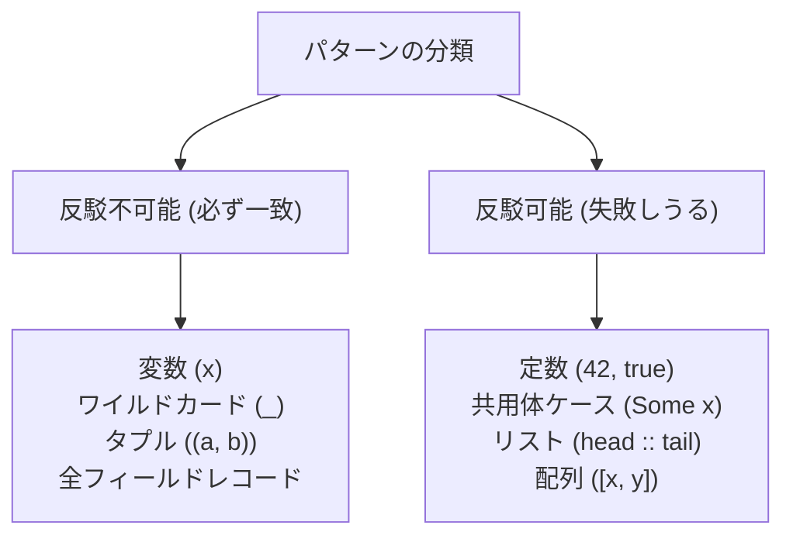

# パターンマッチング

パターンマッチは、データの形や値に応じて分岐し、同時に中身を取り出す仕組みです。タプル、レコード、共用体、リストを分解でき、所有権と借用の規則にも従います。

## この記事のポイント

- 定数、変数、ワイルドカード、タプル、レコード、共用体、リスト、OR / AND が使えます。
- 使える場所は `match`、ラムダ式の引数、`for...in`、関数ガードです。通常の `let` では分解できません（`E0002`）。
- 必ず一致するパターンと、失敗しうるパターンがあります。
- `match` と関数ガードは網羅性を検査します。不足は `E1021` です。
- ラムダ引数と `for...in` は網羅性検査をせず、不一致は実行時トラップです。
- 所有値からは非 Copy の要素をムーブできます。借用先は読み取り専用ビューです。

## パターンの一覧表

Tsuzuri で利用可能なパターンの全種類は以下の通りです。

| パターン構文 | 記法例 | 意味とマッチ規則 |
| --- | --- | --- |
| 定数リテラル | `42`, `"text"`, `true`, `()` | 値の等価性で比較（符号付きゼロや NaN も通常比較に従う） |
| 変数束縛 | `x`, `name` | 任意の値に一致し、その値を新しいローカル変数名に束縛 |
| ワイルドカード | `_`, `otherwise` | 任意の値に一致し、値を破棄（束縛しない） |
| タプル | `(x, y)`, `(a, 0)` | 指定された要素数と各パターンの直積に一致 |
| レコード | `Point { x = a; y = b }`, `{ x: a }` | 指定したフィールドを照合。一部だけの部分照合も可。構築の `x: 0` とは別に、パターンは `=` でも `:` でも書ける |
| 共用体ケース | `Some x`, `None`, `Shapes.Circle r` | 共用体（union）のタグを比較し、ペイロードを内部パターンへ渡す |
| 配列 | `[x, y]`, `[x; y]` | 要素数がちょうど一致する配列。長さをすべて書き並べても、整数と同じく網羅にはならない |
| リスト | `[\|x, y\|]`, `[\|\|]` | 固定長の連結リスト、または空リストに一致 |
| コンス（先頭分割） | `head :: tail` | 空でない連結リストの先頭要素 `head` と残りのリスト `tail` に一致 |
| OR パターン | `p1 \| p2` | `p1` または `p2` のいずれかに一致（左辺優先） |
| AND パターン | `p1 & p2` | `p1` と `p2` の両方に一致 |
| 全体別名束縛 | `pattern as whole` | パターンに合致した値全体を同時に変数 `whole` に束縛 |
| 型注釈付き | `(pattern: Type)` | パターンに明示的な型注釈を付与 |



## パターンが使える場所

`match` 以外でも、パターンを書ける場所があります。

### match 式

いちばんよく使う場所です。入力を上から照合し、最初に成立した節を評価します。

```tsuzuri run=42
union Status = Pending | Active of i64 | Done

let status = Active 42
match status with
| Pending -> 0
| Active n -> n
| Done -> 100
```

実行結果:

```text
42
```

### ラムダ式の引数

引数の位置で、直接分解できます。

```tsuzuri run=50
let add_pair = \(x, y) -> x + y
add_pair (20, 30)
```

実行結果:

```text
50
```

> [!NOTE]
> `let (x, y) = pair` のような分解はできません。`let` が受け取るのは識別子だけです。上の書き方は `E0002`（`expected an identifier`）になります。分解は `match`、ラムダ式の引数、`for...in` で行います。

### for...in ループ

各要素をパターンで受け取れます。

```tsuzuri run=14
let points = [(1, 2), (3, 4)]
let mut sum = 0

for (x, y) in points do
    sum = sum + x * y

sum
```

実行結果:

```text
14
```

### 関数ガード

ラムダ式の `->` の直後に、マッチ節を並べられます。`fn name` の形式で `=` を省き、節を直接並べる書き方も同じ意味です。

```tsuzuri run=正
def classify :: i64 -> string = \n ->
    | 0 -> "零"
    | v when v > 0 -> "正"
    | otherwise -> "負"

classify 10
```

実行結果:

```text
正
```

パターンは、引数が 1 つならその値へ、`\left right ->` のように複数なら引数のタプルへ照合します。`\left -> \right ->` の直後なら、最後の引数 `right` が対象です。`bool` だけの節は網羅性に数えられないので、末尾に `otherwise` のような無条件の節が要ります。不足は `E1021` です。

### where による共通の計算

節のあいだで使う値は、後置の `where` に書けます。`let` は付けません。

```tsuzuri run=%E5%9C%A7%E5%8B%9D
def judgeScore :: i32 -> i32 -> string = \left -> \right ->
    | diff > 10 -> "圧勝"
    | diff > 5 -> "接戦"
    | otherwise -> "互角"
    where
        diff = Int.abs (left - right)

judgeScore 30 10
```

実行結果:

```text
圧勝
```

`where` は `|` と同じインデントの独立した行に置き、その下へ `名前 = 式` を深く揃えます。`名前: 型 = 式` も書けます。評価は、最初のガードを見る前に上から 1 回ずつです。選ばれなかった節が使う値も評価します。引数、外側の値、先行する `where` の束縛は参照できます。後ろの束縛や、節の中のパターン変数は参照できません。整数の絶対値は `Int.abs` です。無修飾の `abs` は `f64` 用です。

## 反駁可能性

パターンには、**反駁不可能（Irrefutable）** なものと **反駁可能（Refutable）** なものがあります。

- **反駁不可能パターン**: 照合対象の型が持つ任意の値に必ず一致するパターンです。変数名 `x`、ワイルドカード `_`、全要素が反駁不可能なタプル `(a, b)` などが該当します。
- **反駁可能パターン**: 値によっては一致しない可能性があるパターンです。定数リテラル `0`、共用体ケース `Some x`、空でないリスト `head :: tail` などが該当します。

### 文脈による検査規則の違い

| 構文 | 許容されるパターン | 一致しない場合の挙動 | 網羅性検査 |
| --- | --- | --- | --- |
| `match` 式 | 反駁可能・不可能の両方 | 次の節へ進む | 必須（不足は `E1021`） |
| 関数ガード | 反駁可能・不可能の両方 | 次の節へ進む | 必須（不足は `E1021`） |
| ラムダ式の引数 | 反駁不可能（推奨） | 実行時言語トラップ | なし |
| `for...in` 式 | 反駁不可能（推奨） | 実行時言語トラップ | なし |

> [!WARNING]
> ラムダ式の引数と `for...in` は、網羅性を検査しません。合わない値が来ても要素を飛ばしたり、既定値を返したりはせず、実行時の言語トラップになります。このトラップは `try` では捕捉できません。失敗しうる値には `match` を使ってください。

## 所有権とパターンマッチング

パターンマッチングにおける変数の束縛は、Tsuzuri のアフィン所有権システムに従います。

### 所有値の分解とムーブ

所有しているレコードやタプルから非 Copy なフィールドを束縛すると、そのフィールドの所有権が新しい変数へムーブされます。

```tsuzuri run=5
record Person { name: string, age: i64 }

let person = Person { name: "Alice", age: 30 }
// name は非 Copy ですが、パターンマッチで所有権がムーブされます
match person with
| Person { name = n, age = _ } -> n.length
```

実行結果:

```text
5
```

所有権がムーブされた後、元の値 `person` は消費済みとなり再利用できなくなります。

### 借用先からの分解

共有借用参照（`ref`）の先にある値や、コレクション内部の要素を照合する場合、非 Copy なフィールドを外へムーブすることは禁止されています。

このような場合、束縛された変数はそのマッチ節の内部でのみ有効な **読み取り専用ビュー** として機能します。

- 節の内部でフィールドの読み取りやメソッド呼び出しは自由に行えます。
- 節の外部へ値をムーブしたり、借用参照を返却したりすることはできません。
- 元のメモリ領域全体は、マッチ節が終了するまで共有借用状態として維持されます。

### OR パターンの束縛規則

OR パターン `p1 | p2` の両辺は、同じ変数名と同じ型を束縛しなければなりません。片方だけ名前を増やすと `E1020`（`both sides of an OR pattern must bind the same names`）です。

```tsuzuri run=42
union NumberOrPair = Single of i64 | Pair of i64 * i64

def extract :: NumberOrPair -> i64 = \val ->
    match val with
    | Single n | Pair (n, _) -> n

extract (Pair (42, 10))
```

実行結果:

```text
42
```

OR パターンの左側が一致した後に `when` ガードが `false` となった場合、同一 OR パターンの右側を再試行することはなく、直ちに次のマッチ節へと進みます。

### as パターンによる全体束縛

`pattern as name` を使うと、内部構造を照合・分解しながら、合致した値全体を同時に `name` に束縛できます。

```tsuzuri run=42
let opt = Maybe.Some 40
match opt with
| Maybe.Some n as whole ->
    if Maybe.is_some (ref whole) then n + 2 else 0
| Maybe.None -> 0
```

実行結果:

```text
42
```

ただし、非 Copy な値について、`as` で全体をムーブしながら内部もムーブする二重消費は拒否されます。

連結リストの `head :: tail` でも、非 Copy な `tail` を所有値として持ち出すと `E1012` です。`tail.length` のような読み取りはできます。要素が Copy なら `tail` を所有値として受け取れますが、残りのノード列は複製されます。長いリストを集計するときは、`tail` を再帰で複製するより `for...in` の方が無駄がありません。

## 他の言語との比較

| 機能 | Tsuzuri | F# | Rust |
| --- | --- | --- | --- |
| パターン一覧 | 定数, 変数, タプル, レコード, 共用体, リスト, OR/AND | 同左 | 定数, 変数, タプル, 構造体, enum, スライス, OR |
| ワイルドカード | `_` および `otherwise` | `_` | `_` |
| リストのコンス | `head :: tail` | `head :: tail` | スライスパターン `[head, tail @ ..]` |
| 反駁不能の強制 | ラムダ引数等での失敗はトラップ | 失敗時はコンパイル警告/エラー | `let` は反駁不可能のみ（`let else` で対応） |
| OR の再試行 | ガード失敗時は次の節へ | 次の節へ | 次の節へ |

## まとめ

- パターンマッチは、形の判定と分解を同時に行う構文です。
- 定数、タプル、レコード、共用体、リスト（`head :: tail`）、OR / AND が使えます。
- 場所は `match`、ラムダ引数、`for...in`、関数ガードです。`let` では分解できません。
- `match` と関数ガードは網羅性を検査します。関数ガードの共通計算は `where` に書けます。
- 所有値からはフィールドをムーブできます。参照先は読み取り専用ビューです。

## 関連項目

- [match 式](match.md)
- [Active パターン](active-pattern.md)
- [Record](../built-in-types-and-modules/record.md)
- [Union](../built-in-types-and-modules/union.md)
- [Tuple](../built-in-types-and-modules/tuple.md)
- [List](../built-in-types-and-modules/list.md)
- [所有権とムーブ](../ownership-and-memory/ownership.md)
- [言語仕様のパターンマッチと分解](../../../docs/language.md#match-と分解)
- [言語リファレンスの目次](../index.md)

