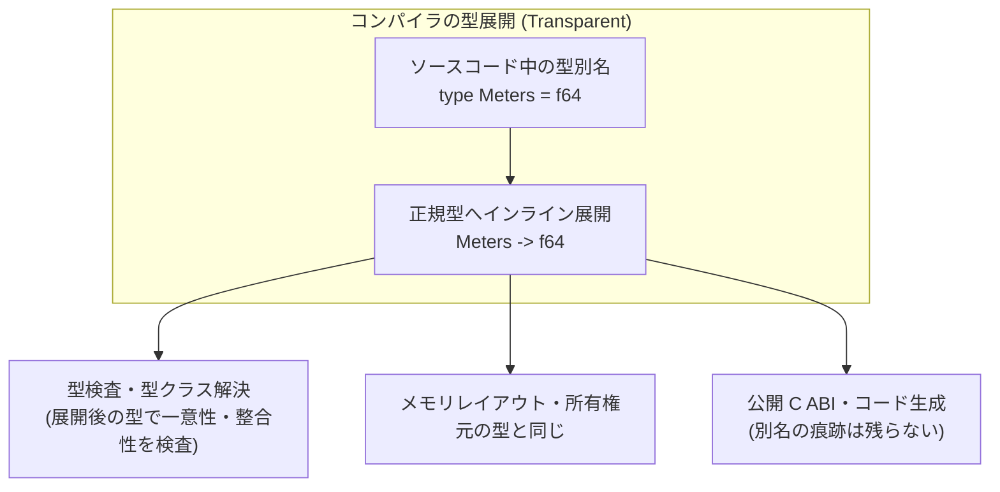

# 型エイリアス

型エイリアスは、既存の型に別名を付ける仕組みです。`type Name = ...` で定義します。

別名は透過です。コンパイル後は右辺の型そのもので、新しい型は作りません。長いタプルや関数型、ジェネリック型の注釈を短くするときに使います。実行時のレイアウトも ABI も、元の型と同じです。

## この記事のポイント

- **別名は元の型と同じ**: 代入や関数渡しで、別名と元の型を区別しません。
- **ジェネリックな別名**: `type Pair<'a> = ('a * 'a)` のように型パラメーターを受け取ることができます。
- **レコード構築・パターンの制限**: レコード型のエイリアス名をレコード構築リテラル（`Alias { ... }`）やパターンマッチで使用することはできません。元のレコード名を使用します。
- **インスタンスの一意性**: 型エイリアスに対して型クラスのインスタンスを定義すると、展開後の具象型に対するインスタンスとして重複検査されます。
- **取り違えを型で防ぐとき**: 別名では防げません。ケースが 1 つの共用体を使います。

## 型エイリアスの基本構文

型エイリアスは、トップレベルで `type` キーワードを使って宣言します。

```text
type 別名 = 元の型
type 別名<'a, 'b, ...> = 元の型
```

型名は ASCII 英大文字で始めます。`type meters = f64` は `E1024`（`a type alias name must start with an uppercase ASCII letter`）です。

```tsuzuri run=42
type UserId = i64
type Meters = f64

def calculate_fee :: UserId -> Meters -> i64 = \user_id distance ->
    if distance > 10.0 then user_id + 2 else user_id

let id: UserId = 40
let dist: Meters = 15.0
calculate_fee id dist
```

実行結果:

```text
42
```

上の `UserId` は `i64`、`Meters` は `f64` と同じ型です。別名のための余分な実行時コストはありません。



## ジェネリックな型エイリアス

型エイリアスは、1 つ以上の型パラメーター（`'a`、`'b` など）を取ることができます。型引数は `<...>` にカンマ区切りで記述します。

```tsuzuri run=30
type Pair<'a> = ('a * 'a)
type Handler<'a, 'b> = ('a -> 'b)

def apply_pair :: Handler<'a, 'a> -> Pair<'a> -> Pair<'a> = \handler pair ->
    match pair with
    | (left, right) -> (handler left, handler right)

def double :: i64 -> i64 = \x -> x * 2

let result = apply_pair double (10, 15)
match result with
| (_, second) -> second
```

実行結果:

```text
30
```

### パラメーター規則と制約

- 宣言した型パラメーターは、右辺で全部使います。未使用、重複、個数の不一致、循環は `E1024` です。
- 型引数のない型に型引数を渡した場合も `E1024` です。

```text
error[E1024]: type parameter 'a is not used by the alias target; remove it or use it in the target
```

## 可視性と `private type`

型エイリアスは既定で公開（public）されます。他のモジュールからの利用を禁止し、同一モジュール（ファイル）内でのみ使用したい場合は `private` を付与します。

```text
private type InternalBuffer = [ubyte]
```

公開された別名の右辺に、`private` なレコードや共用体は書けません。非公開の型が外に漏れないようにするためです。

```text
private record Secret { code: i64 }
type Leak = Secret
```

```text
error[E1022]: private type 'Main.Secret' leaks from public type alias 'Main.Leak'; make the type alias private or expose a public type
```

名前にはモジュール修飾が付きます。上は `Main.tz` に書いたときの形です。

## 型エイリアスの制限事項

別名には、注釈を短くする以外の役割はありません。

### レコードの構築とパターンには使えない

レコード型のエイリアスを定義した場合でも、リテラルによるインスタンス構築やパターンマッチの分解では、**必ず宣言時の正規のレコード名**を記述する必要があります。

```text
record Point { x: i64, y: i64 }
type Pt = Point

let p = Pt { x: 1, y: 2 }
```

この構築は `E1004` です。パターンの `Pt { x: x, y: y }` も同じコードです。

```text
error[E1004]: 'Main.Pt' is a type alias; use the original record name to construct or match a value
```

注釈には別名を使えます。値を作るときと分解するときは、宣言したレコード名を書きます。

```tsuzuri run=3
record Point { x: i64, y: i64 }
type Pt = Point

let p: Pt = Point { x: 1, y: 2 }
p.x + p.y
```

実行結果:

```text
3
```

### 循環エイリアスは禁止

別名が自分自身を、直接または間接に指すことはできません。

```text
error[E1024]: cyclic type alias 'Main.A'; remove the recursive alias reference
```

展開の深さ 128、または走査ノード数 4096 を超えると `E1017` です。

### 型クラスインスタンスは展開後の型で見る

別名に対する `instance` は、別名ではなく展開後の型で重複を見ます。`type Meters = i64` に対するインスタンスと、`i64` に対するインスタンスは重なり、`E1016`（`overlapping instance for ...`）です。

右辺が型クラス制約なら、別名もその制約として使えます。

```tsuzuri run=42
type Addable<'a> = Add<'a>

def twice :: Addable<'a> -> 'a
fn twice value = value + value

twice 21
```

実行結果:

```text
42
```

`Addable<'a> -> 'a` は、`Add<'a>` 制約のついた `'a -> 'a` です。この制約をレコードのフィールド型に置くことはできず、`E1016` です。

## 使いどころと Newtype パターン

### 型エイリアスが適している場面

- **タプル型や関数型の名前付け**: `(f64 * f64)` に `Coordinates`、`('a -> bool)` に `Predicate<'a>` などの名前を与えて意図を明確にする。
- **長大なジェネリック型の短縮**: `Result<Map<string, [i64]>, string>` などの深くネストした型シグネチャを簡潔に書く。
- **ドメイン語彙の統一**: 通貨単位や ID など、コードを読む開発者に意味を伝える。

### 取り違えを防ぐときは共用体

別名は透過なので、`type Kilometers = f64` と `type Miles = f64` はどちらも `f64` です。混ぜて計算してもコンパイラは止められません。

値の取り違えを型で止めたいときは、ケースが 1 つの共用体を使います。

```tsuzuri run=100
// 型エイリアス（透過的: f64 と自由にやり取りできる）
type Kilometers = f64

// 共用体: パターンで取り出さないと f64 として使えない
union Distance = Miles of f64

def to_m :: Kilometers -> f64 = \km -> km * 1000.0
def miles_to_km :: Distance -> Kilometers = \d ->
    match d with
    | Miles v -> v * 1.60934

let raw: f64 = 0.1
let km: Kilometers = raw
(to_m km) as i64
```

実行結果:

```text
100
```

`Miles 10.0` は `f64` とそのまま足せません。パターンで中身を取り出してから計算します。

## まとめ

- `type Name = ...` で、既存の型と同じ別名を定義できます。
- 別名に実行時の追加コストはありません。型名は大文字で始めます。
- 型パラメーターは右辺で全部使います。循環や深すぎる展開はエラーです。
- レコードの構築とパターンには、別名ではなく元のレコード名を使います。
- 単位の取り違えを型で止めるなら、ケースが 1 つの共用体を使います。

## 関連項目

- [型](types.md)
- [ジェネリック](generics.md)
- [型推論](type-inference.md)
- [Record](../built-in-types-and-modules/record.md)
- [Union](../built-in-types-and-modules/union.md)
- [言語リファレンスの目次](../index.md)

