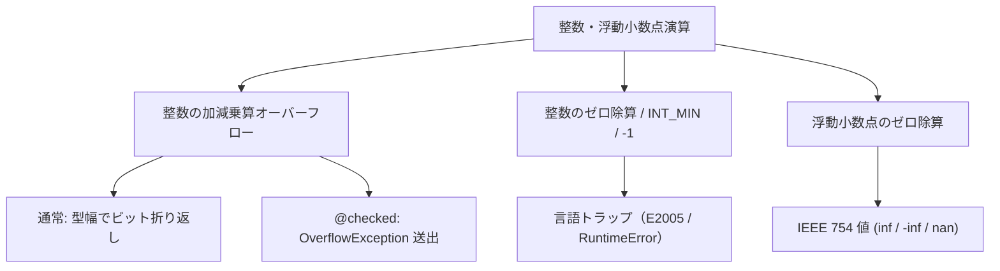

# 基本型

基本型は、Tsuzuri が言語組み込みで提供する最も基礎的なデータ型です。整数、浮動小数点数、十進浮動小数点数、真偽値、文字、文字列、および空型が含まれます。

ビット幅の違う数値を暗黙に広げたり、混ぜたりはしません。整数の折り返し、ゼロ除算のトラップ、浮動小数点の丸めは、native と WASM で意味を変えない契約です。

## この記事のポイント

- **数値型**: 8 bit から 128 bit の整数、IEEE 754 の 2 進浮動小数点（`f16`〜`f128`）、10 進浮動小数点（`d32`〜`d128`）、多倍長整数 `bigint` があります。
- **整数の折り返しとトラップ**: 加減乗算はビット幅で折り返します。ゼロ除算と `INT_MIN / -1` はトラップします。
- **IEEE 754 の浮動小数点**: `0.0 / 0.0` は `nan`、`1.0 / 0.0` は `inf` です。トラップしません。
- **2 種類の文字と文字列**: 16 bit UTF-16 コード単位（`char` / `string`）と、32 bit Unicode スカラー値 / UTF-8 バイト列（`utf8char` / `utf8string`）を明確に区別します。
- **`bigint` のシグネチャ**: ローカル変数では `let x: bigint` と書けますが、関数シグネチャの境界では標準ライブラリの型名 `BigInt` を指定する必要があります。

## 基本型の一覧表

サイズは値としての記憶域です。変数を書いただけではゼロになりません。`let` には初期化が必要です。

| 型名 | ビット幅 / サイズ | 表現範囲 | ゼロ値のリテラル | Copy | 概要 |
| --- | --- | --- | --- | --- | --- |
| `i8`（`sbyte`） | 8 bit (1 B) | -128 〜 127 | `0i8` | ○ | 符号付き 8 bit 整数 |
| `i16` | 16 bit (2 B) | -32,768 〜 32,767 | `0i16` | ○ | 符号付き 16 bit 整数 |
| `i32` | 32 bit (4 B) | -2,147,483,648 〜 2,147,483,647 | `0` | ○ | 符号付き 32 bit 整数（整数リテラルの既定型） |
| `i64` | 64 bit (8 B) | -9,223,372,036,854,775,808 〜 9,223,372,036,854,775,807 | `0l` | ○ | 符号付き 64 bit 整数 |
| `i128` | 128 bit (16 B) | $-2^{127}$ 〜 $2^{127} - 1$ | `0L` | ○ | 符号付き 128 bit 整数 |
| `i8u`（`byte`, `ubyte`） | 8 bit (1 B) | 0 〜 255 | `0uy` | ○ | 符号なし 8 bit 整数 |
| `i16u` | 16 bit (2 B) | 0 〜 65,535 | `0us` | ○ | 符号なし 16 bit 整数 |
| `i32u` | 32 bit (4 B) | 0 〜 4,294,967,295 | `0u` | ○ | 符号なし 32 bit 整数 |
| `i64u` | 64 bit (8 B) | 0 〜 18,446,744,073,709,551,615 | `0ul` | ○ | 符号なし 64 bit 整数 |
| `i128u` | 128 bit (16 B) | 0 〜 $2^{128} - 1$ | `0UL` | ○ | 符号なし 128 bit 整数 |
| `bigint` | 可変長（ヒープ） | メモリの許す限り無制限の整数 | `0I` | ○ | 任意精度の多倍長整数（不変レコード `BigInt`） |
| `f16` | 16 bit (2 B) | binary16（半精度浮動小数点） | `0.0hf` | ○ | IEEE 754 準拠の 16 bit 浮動小数点数 |
| `f32` | 32 bit (4 B) | binary32（単精度浮動小数点） | `0.0f` | ○ | IEEE 754 準拠の 32 bit 浮動小数点数 |
| `f64` | 64 bit (8 B) | binary64（倍精度浮動小数点） | `0.0` | ○ | IEEE 754 準拠の 64 bit 浮動小数点数（既定型） |
| `f128` | 128 bit (16 B) | binary128（四倍精度浮動小数点） | `0.0F` | ○ | IEEE 754 準拠の 128 bit 浮動小数点数 |
| `d32` | 32 bit (4 B) | decimal32（有効桁数 7 桁） | `0.0hm` | ○ | IEEE 754 準拠の 10 進浮動小数点数（BID 表現） |
| `d64` | 64 bit (8 B) | decimal64（有効桁数 16 桁） | `0.0m` | ○ | IEEE 754 準拠の 10 進浮動小数点数（BID 表現） |
| `d128` | 128 bit (16 B) | decimal128（有効桁数 34 桁） | `0.0M` | ○ | IEEE 754 準拠の 10 進浮動小数点数（BID 表現） |
| `bool` | 8 bit (1 B) | `true` または `false` | `false` | ○ | 真偽値 |
| `char` | 16 bit (2 B) | 0 〜 65,535（UTF-16 コード単位） | `'\0'` | ○ | UTF-16 文字（サロゲートコード単位も保持） |
| `utf8char` | 32 bit (4 B) | U+0000 〜 U+10FFFF の Unicode スカラー値 | `u8'\0'` | ○ | 検証済みの Unicode スカラー値（サロゲート除外） |
| `string` | 16 B 記述子 | 長さ最大 $2^{53} - 1$ コード単位 | `""` | × | 不変の UTF-16 コード単位シーケンス |
| `utf8string` | 16 B 記述子 | 長さは `i64`。上限はメモリ | `u8""` | × | 不変の UTF-8 バイトシーケンス |
| `unit` | 1 B | 値は `()` だけ | `()` | ○ | 情報を持たない値。記憶域は 1 バイト |

> [!NOTE]
> `byte` と `ubyte` は `i8u`、`sbyte` は `i8` の型別名です。
> 大文字の `Int`、`Float`、`Bool`、`Unit` は型名ではなく、型クラスやモジュールの名前です。
> `string` の論理的な最大長は $2^{53} - 1$ コード単位です。それを超えるとトラップします。

## 整数の演算

### ビット幅の折り返し（モジュロ算術）

整数の `+`、`-`、`*`、`**`、単項の `-`、ビット演算は、型のビット幅で折り返します。未定義動作にはなりません。

```tsuzuri run=-128:0:255
let wrapped_i8: i8 = 127i8 + 1i8
let wrapped_u8: i8u = 255i8u + 1i8u
let underflow_u8: i8u = 0i8u - 1i8u
$"{wrapped_i8 as i64}:{wrapped_u8 as i64}:{underflow_u8 as i64}"
```

実行結果:

```text
-128:0:255
```

- 符号付き 8 bit 整数の最大値 `127i8` に 1 を足すと、最小値 `-128i8` へ折り返します。
- 符号なし 8 bit 整数の最大値 `255i8u` に 1 を足すと、`0i8u` へ折り返します。
- `0i8u` から 1 を引くと、アンダーフローして `255i8u` になります。
符号なし整数に単項 `-` は使えません。変数に書くと `E1005`（`no instance for Neg<i8u>`）です。`-1i8u` のような負のリテラルは、別のエラー `E1009`（その型の範囲外）になります。

溢れたことを知りたいときは、式に `@checked` を付けるか、[`Int.checked_add`](../built-in-types-and-modules/int.md) で `Maybe` を受け取ります。`@checked` は `+`、`-`、`*`、`**` と単項 `-` が対象で、溢れると `OverflowException` を送出します。`/` と `%` は対象外です。



### ゼロ除算とトラップ

整数の `/` と `%` では、次の操作は未定義動作にせず、言語トラップにします。

1. **ゼロ除算**: `x / 0` または `x % 0`。診断は `trap: integer division by zero` です。
2. **符号付き最小値を `-1` で割る・剰余を取る**: たとえば `i32` の `-2147483648 / -1` です。結果の `2147483648` は `i32` の最大値 2,147,483,647 を超えるので、`trap: integer division overflow` になります。`i8` の `-128 / -1` や `i128` の最小値でも同じです。

`tsuzuri run` はこの異常終了を `E2005` として報告します。macOS では signal 5（SIGTRAP）です。WASM では `WebAssembly.RuntimeError` です。トラップしたあとに例外として捕まえることはできません。`Maybe` で受けたいときは [`Int.checked_div`](../built-in-types-and-modules/int.md) を使います。

## 浮動小数点型と十進浮動小数点型

### binary 浮動小数点（`f16`〜`f128`）

2 進浮動小数点は IEEE 754 の最近接・偶数丸め（round to nearest, ties to even）です。

- **`nan`（非数）**: `0.0 / 0.0` の結果です。`nan == nan` は `false`、`nan != nan` は `true` です。判定には `Math.is_nan` を使います。表示は `nan` です。
- **無限大（`inf` / `-inf`）**: `1.0 / 0.0` は `inf`、`-1.0 / 0.0` は `-inf` です。整数と違い、ゼロ除算ではトラップしません。
- **符号付きゼロ**: `+0.0 == -0.0` は `true` ですが、符号は残ります。`-0.0` の表示は `-0` で、`1.0 / -0.0` は `-inf` です。

```tsuzuri run=true:true:true
let nan = 0.0 / 0.0
let inf = 1.0 / 0.0
let d_sum = 0.1d128 + 0.2d128

let d_ok = d_sum == 0.3d128
let nan_ok = !(nan == nan)
let inf_ok = Math.is_infinite inf

$"{d_ok}:{nan_ok}:{inf_ok}"
```

実行結果:

```text
true:true:true
```

### decimal 浮動小数点（`d32`〜`d128`）

decimal 型は、IEEE 754-2008 の 10 進浮動小数点形式（BID エンコーディング）を採用しています。2 進浮動小数点特有の丸め誤差（`0.1 + 0.2 != 0.3`）が発生しないため、金融計算や正確な十進表現が必要な用途に適しています。

```tsuzuri run=42
let price: d64 = 0.1m
let total = price + 0.2m
assert (total == 0.3m)
42
```

実行結果:

```text
42
```

> [!NOTE]
> decimal 型は無制限精度の数値型や任意の丸め規則を設定できる通貨型ではありません。固定の十進仮数部ビット長（`d32`: 7 桁、`d64`: 16 桁、`d128`: 34 桁）を持ちます。

### 実装状況（`f16` のハードウェア経路は計画中）

Tsuzuri 0.1.0 では、`f32` と `f64` の四則演算は LLVM の浮動小数点命令になります。`f16`、`f128`、`d32`〜`d128` の演算は、コンパイラ同梱のソフトウェア実装です。`f64` に落として計算し直すことはしません。

AArch64 の FP16 命令（FEAT_FP16）で `f16` を速くする経路は、計画中の [D10](../../../_features/D10-f16-hardware.md) です。0.1.0 ではまだ使えません。意味（丸め、`nan`、符号付きゼロ）は、今のソフトウェア実装のままにする予定です。

`Math.sin` や `Math.exp` などの超越関数は、`f32` と `f64` だけです（`Elementary<'a>`）。`f16`、`f128`、`d*` に渡すと `E1005`（`no instance for Elementary<f16>` など）です。これらの超越関数は、ホストの libm ではなく同梱の musl を使います。`f16` の四則演算が musl なわけではありません。

## 多倍長整数 `bigint`

`bigint` は、メモリが許す限り桁を伸ばせる符号付き整数です。標準ライブラリの不透明レコード `BigInt` と同じ型です。リテラルには `I` を付けます（`123I`、`0xFFI`）。

```tsuzuri run=1267650600228229401496703205376
// 関数シグネチャでは標準ライブラリの型名 BigInt を指定します
def double_bigint :: BigInt -> BigInt = \n -> n * 2I

// ローカル変数の注釈では小文字の bigint も使用できます
let initial: bigint = 2I
let huge = initial ** 99
double_bigint huge
```

実行結果:

```text
1267650600228229401496703205376
```

### シグネチャ記述時の注意点（`bigint` と `BigInt`）

`let` の注釈では小文字の `bigint` も書けます。関数シグネチャの `def f :: bigint -> bigint` は、公開型の名前として解決できず `E1004` です。

```text
error[E1004]: unknown record, union, or type alias 'bigint'
```

そのため、関数の引数や戻り値の型シグネチャを宣言する際は、標準ライブラリのレコード名である **`BigInt`** を使用してください。

## 文字型と文字列型

Tsuzuri はテキスト処理において、コード単位指向とスカラー値指向の 2 系統の型を提供しています。

```tsuzuri run=A:2:4
let c: char = 'A'
let s: string = "😀"
let u8s: utf8string = u8"😀"

let len_s = s.length
let len_u8s = u8s.length

$"{c}:{len_s}:{len_u8s}"
```

実行結果:

```text
A:2:4
```

- **`char` と `string`（UTF-16 系統）**:
  - `char` は 16 bit の UTF-16 コード単位（0〜65,535）を表現します。
  - `string` は UTF-16 コード単位のシーケンスです。サロゲートペアで表現される絵文字 `"😀"` は、`string` では 2 コード単位（`.length == 2`）としてカウントされます。
- **`utf8char` と `utf8string`（UTF-8 系統）**:
  - `utf8char` は 32 bit で検証済みの Unicode スカラー値を表現します（リテラルは `u8'A'`）。
  - `utf8string` は UTF-8 バイト列です（リテラルは `u8"..."`）。絵文字 `u8"😀"` は 4 バイト（`.length == 4`）としてカウントされます。
- 文字型（`char`, `utf8char`）は Copy 型ですが、文字列型（`string`, `utf8string`）は所有権を持つ非 Copy 型です。

文字型からコード値への数値変換には、`as` によるキャストではなく、[`Char.to_u16`](../built-in-types-and-modules/char.md) や [`Utf8Char.to_u32`](../built-in-types-and-modules/utf8char.md) などの専用関数を使用します。

## まとめ

- 基本型は固定幅整数、`BigInt`、2 進と 10 進の浮動小数点、`bool`、文字、文字列、`unit` です。
- スカラーと `bigint` は Copy です。`string` と `utf8string` は Copy ではなく、渡すと所有権が動きます。
- 整数の加減乗算はビット幅で折り返します。ゼロ除算と符号付き最小値 `/` `-1` はトラップします。
- 浮動小数点のゼロ除算はトラップせず、`inf` や `nan` になります。`f16` のハードウェア経路は計画中です。
- 関数シグネチャの多倍長整数は `BigInt` と書きます。`as` では `bigint` に変換できません。

## 関連項目

- [型](types.md)
- [Unit 型](unit-type.md)
- [型キャスト](cast.md)
- [Int](../built-in-types-and-modules/int.md)
- [BigInt](../built-in-types-and-modules/bigint.md)
- [Math](../built-in-types-and-modules/math.md)
- [Char](../built-in-types-and-modules/char.md)
- [Utf8Char](../built-in-types-and-modules/utf8char.md)
- [String](../built-in-types-and-modules/string.md)
- [Utf8String](../built-in-types-and-modules/utf8string.md)
- [言語リファレンスの目次](../index.md)

