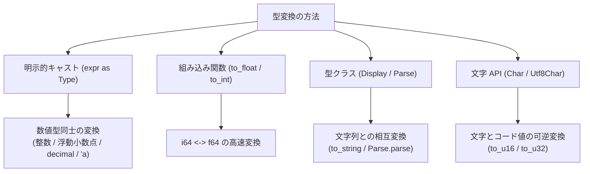

# 型キャスト

Tsuzuri は暗黙の型変換をしません。幅の違う整数、整数と浮動小数点、文字列との変換は、すべて明示します。

数値の変換には `as` を使います。文字列は `Display` と `Parse`、文字は `Char.to_u16` のような専用関数です。

## この記事のポイント

- **暗黙変換はない**: `let x: i64 = 10i32` はコンパイルエラーです。`as` などと書きます。
- **整数の変換規則**: 縮小変換は下位ビットを保持（モジュロ折り返し）し、拡大変換は符号付きなら符号拡張、符号なしならゼロ拡張します。
- **浮動小数点から整数への変換**: ゼロ方向への切り捨て、範囲外の値は型の端（最小値・最大値）へ飽和（Saturation）、`NaN` は `0` へ変換されます。未定義動作（UB）にはなりません。
- **文字と `bigint` は `as` できない**: `char` と `utf8char` は `Char.to_u16` などを使います。`bigint` は `BigInt.to_i64` です。どちらも `E1005` です。
- **型変数へのキャスト**: `x as 'a` のように型変数へキャストする場合、`'a` には `Numeric<'a>` 制約が必要です。

## 型変換の全体像

Tsuzuri における型変換は、変換元と変換先の性質に応じて適切な構文・API を使い分ける設計になっています。



## `as` による数値キャスト

`as` は優先順位 14 で、`**` より強く結合します。`2i8 ** 8 as i16` は `2i8 ** (8 as i16)` であり、指数の型が合わず `E1003` です。両側が `Numeric` のときだけ使えます。`bool`、`unit`、`string`、`char`、`bigint` は `E1005` です。

```text
式 as 目的の型
```

### 整数同士の変換規則

| 変換の種類 | 動作規則 | 例 |
| --- | --- | --- |
| 広い整数から狭い整数（縮小） | 下位ビットをそのまま保持（ビット切り捨て） | `255i64 as i8` $\rightarrow$ `-1i8` |
| 狭い整数から広い整数（符号付き拡大） | 符号ビットを上位へコピー（符号拡張: Sign Extension） | `-1i8 as i64` $\rightarrow$ `-1i64` |
| 狭い整数から広い整数（符号なし拡大） | 上位ビットを 0 で埋める（ゼロ拡張: Zero Extension） | `255i8u as i64` $\rightarrow$ `255i64` |
| 同ビット幅の符号反転 | ビットパターンをそのまま保持（ビット再解釈） | `-1i8 as i8u` $\rightarrow$ `255i8u` |

```tsuzuri run=-1:-1:255:255
// 縮小変換: 下位ビットを保持 (0xFF は i8 で -1)
let narrow = 255i64 as i8

// 拡大変換 (符号付き): 符号拡張
let wide_signed = -1i8 as i64

// 拡大変換 (符号なし): ゼロ拡張
let wide_unsigned = 255i8u as i64

// 同幅の符号変更: ビット列をそのまま保持
let sign_change = -1i8 as i8u

$"{narrow as i64}:{wide_signed}:{wide_unsigned}:{sign_change as i64}"
```

実行結果:

```text
-1:-1:255:255
```

> [!WARNING]
> 整数同士の `as` キャストは飽和演算（最大値で留まる動作）ではありません。`255i64 as i8` の結果は `127` ではなく `-1` です。

### 浮動小数点から整数への変換（切り捨て・飽和・NaN）

浮動小数点から整数への `as` は、ハードウェアの未定義動作に依存しません。native と WASM で同じ規則です。

- **ゼロ方向への切り捨て**: 正の数は小さく、負の数は大きく（ゼロに近づく方向へ）端数が切り捨てられます（`3.99 as i64` は `3`、`-3.99 as i64` は `-3`）。
- **飽和（Saturation）**: 整数の表現範囲を超える値（`1e30` や無限大 `inf` など）は、その整数の最大値または最小値にクランプされます。
- **`NaN` の扱い**: 非数 `NaN` を整数へキャストした場合は、必ず **`0`** に変換されます。

```tsuzuri run=3:-3:127:-128:0
// ゼロ方向への切り捨て
let trunc_pos = 3.99 as i64
let trunc_neg = -3.99 as i64

// 表現範囲外の飽和 (Saturating)
let sat_pos = 1e30 as i8
let sat_neg = -1e30 as i8

// NaN は 0 へ変換
let nan_val = (0.0 / 0.0) as i64

$"{trunc_pos}:{trunc_neg}:{sat_pos as i64}:{sat_neg as i64}:{nan_val}"
```

実行結果:

```text
3:-3:127:-128:0
```

### 整数から浮動小数点への変換

整数から浮動小数点への `as` は、IEEE 754 の最近接・偶数丸めです。`f64` が正確に表せる整数は $2^{53}$ までです。その先は、近い偶数へ丸めます。`i64` の最大値は `f64` では $2^{63}$ になります。無限大は変換先の端へ飽和し、`nan` は `0` です。

```tsuzuri run=true:9223372036854775807:0
let tie = 9007199254740993l as f64
let even = 9007199254740992l as f64
let inf_i = (1.0 / 0.0) as i64
let nan_i = (0.0 / 0.0) as i64
$"{tie == even}:{inf_i}:{nan_i}"
```

実行結果:

```text
true:9223372036854775807:0
```

$2^{53} + 1$ は $2^{53}$ と $2^{53} + 2$ のちょうど中間なので、偶数の $2^{53}$ になります。`inf` は `i64` の最大値、`nan` は `0` です。`f16` や `d64` から整数へキャストしても、同じ切り捨て・飽和・`nan` → `0` です。

### binary と decimal の相互変換

2 進浮動小数点（`f16`〜`f128`）と 10 進浮動小数点（`d32`〜`d128`）の間の `as` 変換は、中間形式（例えば `f64` など）を介さずに直接目的の形式へと丸められます。

```tsuzuri run=42
let dec = 0.1d64
let bin = dec as f64
assert (bin > 0.0999 && bin < 0.1001)
42
```

実行結果:

```text
42
```

`1I as i64` は使えません。`E1005`（`no instance for Numeric<BigInt>`）です。範囲を見て `i64` にするには `BigInt.to_i64`（`ref BigInt -> Maybe<i64>`）を使います。

## 組み込み関数 `to_float` と `to_int`

よく使う `i64` と `f64` の変換には、固定シグネチャの組み込み関数もあります。`as` と同じ変換です。

```text
to_float :: i64 -> f64
to_int   :: f64 -> i64
```

```tsuzuri run=42
let n: i64 = 42
let f: f64 = to_float n
let back: i64 = to_int f
back
```

実行結果:

```text
42
```

`to_float` は `x as f64`、`to_int` は `x as i64` と同じ LLVM の変換です。関数値として `|>` や高階関数に渡せます。他の型には `as` を使います。

## 文字列との相互変換

文字列と他のデータ型との変換には、`Display` 型クラスと `Parse` 型クラスを使用します。

### 文字列への変換（`to_string`）

`Display` を実装した値は、組み込み関数 `to_string` を使って所有権付きの `string`（UTF-16）に変換できます。

```text
to_string :: Display<'a> => 'a -> string
```

### 文字列からの復元（`Parse.parse`）

文字列をパースして数値やブール値に戻すには、標準ライブラリの `Parse.parse` 関数を使用します。結果は `Maybe<'a>` で返されます。

```tsuzuri run=42
let text = to_string 42
let parsed: Maybe<i64> = Parse.parse (ref text)
match parsed with
| Some value -> value
| None -> 0
```

実行結果:

```text
42
```

浮動小数点のフォーマットは最短往復表記（Shortest Round-trip Format）が採用されており、再度パースした際に元のビット列が正確に復元されます。

## 文字型とコード値の変換

`char` と `utf8char` は `Numeric` ではないので、`as` は使えません。`'A' as i16u` は `E1005`（`no instance for Numeric<char>`）です。`utf8char` も同じです。
文字と整数コード値（コード単位・コードポイント）の変換には、専用の関数を使用します。

```tsuzuri run=65:A:128512
// char (UTF-16) と 16 bit コード単位の相互変換 (完全可逆)
let code_u16 = Char.to_u16 'A'
let char_val = Char.of_u16 65i16u

// utf8char (Unicode スカラー値) と 32 bit 整数の変換
let scalar_u32 = Utf8Char.to_u32 u8'😀'

$"{code_u16 as i64}:{char_val}:{scalar_u32 as i64}"
```

実行結果:

```text
65:A:128512
```

- `Char.to_u16 : char -> i16u` と `Char.of_u16 : i16u -> char` は、すべての 65,536 個のコード単位に対して 1 対 1 の可逆変換を保証します。
- `Utf8Char.to_u32 : utf8char -> i32u` は Unicode スカラー値の整数コードを返します。
- 逆に整数から `utf8char` を構築する際は、不正なスカラー値やサロゲートを防ぐため `Utf8Char.of_u32 : i32u -> Maybe<utf8char>` を使用します。

## 型変数へのキャスト（`as 'a`）

ジェネリック関数の内部で、具体的な数値を型変数 `'a` へ変換したい場合があります。このようなときは、型パラメーターに `Numeric<'a>` 制約（またはそれを内包する `Integer<'a>` や `Float<'a>` 制約）を指定することで、`x as 'a` のキャストが許可されます。

```tsuzuri run=42:42
def from_i64 :: Numeric<'a> => i64 -> 'a = \x -> x as 'a

let f: f64 = from_i64 42
let i: i32 = from_i64 42
$"{f}:{i}"
```

実行結果:

```text
42:42
```

もし `Numeric` 制約を満たさない型（例えば `string`）に対して `from_i64` を呼び出そうとすると、コンパイル時にエラー `E1005`（インスタンスが存在しない）として安全に拒否されます。

## 変換規則の一覧まとめ

| 変換元 | 変換先 | 使用する構文 / 関数 | 動作仕様 |
| --- | --- | --- | --- |
| 整数 | 狭い整数 | `as` | 下位ビット保持（モジュロ折り返し） |
| 整数 | 広い整数 | `as` | 符号付きは符号拡張、符号なしはゼロ拡張 |
| 整数 | 浮動小数点 | `as` / `to_float` | IEEE 754 最近接・偶数丸め |
| 浮動小数点 | 整数 | `as` / `to_int` | ゼロ方向切り捨て、範囲外は飽和、`NaN` は `0` |
| 浮動小数点 | 浮動小数点 | `as` | IEEE 754 丸め（直接変換） |
| binary 浮動小数点 | decimal 浮動小数点 | `as` | 直接変換 |
| 任意型 | `string` | `to_string` / `$"..."` | `Display` 型クラスによる文字列化 |
| `ref string` | 数値 / bool 等 | `Parse.parse` | `Maybe` 型でパース結果を返却 |
| `char` | `i16u` | `Char.to_u16` / `of_u16` | 65,536 通りすべて可逆。`as` は `E1005` |
| `utf8char` | `i32u` | `Utf8Char.to_u32` / `of_u32` | スカラー値の変換。不正値は `None` |
| `bigint` | `i64` | `BigInt.to_i64` | `as` は不可。範囲外は `None` |
| 数値 | 型変数 `'a` | `as 'a` | `'a` に `Numeric`、`Integer`、または `Float` が必要 |

## まとめ

- 暗黙の型変換はありません。数値の変換は `as` と書きます。
- 整数の `as` はビットを保持します。浮動小数点から整数へはゼロ方向へ切り捨て、範囲外は飽和、`nan` は `0` です。
- `i64` と `f64` の変換には、高階関数としても使いやすい組み込み関数 `to_float` / `to_int` が利用できます。
- 文字列との相互変換には `Display` と `Parse` 型クラスを使用します。
- `char`、`utf8char`、`bigint`、`bool`、`string` は `as` できません。専用の関数を使います。
- ジェネリックな型変数へのキャストには `Numeric<'a>` 制約が必要です。

## 関連項目

- [型](types.md)
- [基本型](basic-types.md)
- [型推論](type-inference.md)
- [Int](../built-in-types-and-modules/int.md)
- [BigInt](../built-in-types-and-modules/bigint.md)
- [Math](../built-in-types-and-modules/math.md)
- [Char](../built-in-types-and-modules/char.md)
- [Utf8Char](../built-in-types-and-modules/utf8char.md)
- [Format](../built-in-types-and-modules/format.md)
- [言語リファレンスの目次](../index.md)

