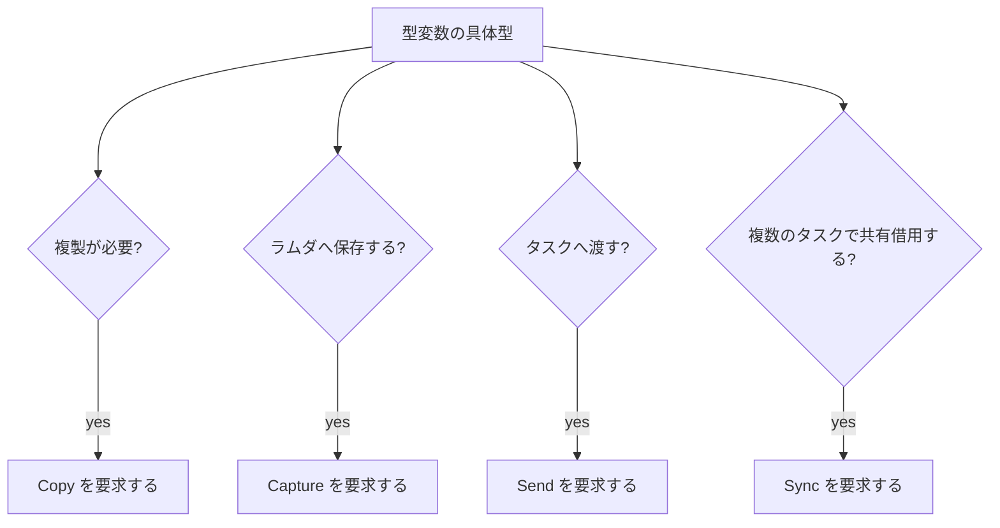

# 制約 と 属性

制約は、型変数に必要な演算や性質を静的に宣言する仕組みです。`Add` のようにメソッドを提供する型クラスも、`Copy` のようにメソッドを持たないマーカー（印）クラスも、関数から見れば「対象の型がその条件を満たすこと」を要求する制約として統一的に扱われます。

ページ名の「属性」は、`def` の次の行にインデントして書く `@'a : Add` のような行（このリファレンスでは「制約行」と呼びます）を指します。見た目は `@` で始まる属性に似ていますが、`@literal`、`@cpu`、`@checked` の属性とは別の構文です。属性そのものは[属性](../values-and-functions/attributes.md)を参照してください。型クラスの宣言や動的ディスパッチ（`dyn`）の詳細は[型クラス](./type-classes.md)、関数への型引数の指定は[ジェネリック関数と型パラメータ制約](../values-and-functions/generics-functions.md)で解説しています。

## この記事のポイント

- 制約の書き方は 3 つあり、推論された集合へ足されます。
- モジュール関数を要求する `#name` は、`@` 行にだけ書けます。
- `Copy`、`Capture`、`Send`、`Sync` は所有権と並列の印で、メソッドはありません。`AtomicValue` は `Atomic` に入れられる型の印です。
- シグネチャに無い型変数への制約は `E1015`、未知のクラスは `E1016` です。
- インスタンスが無い具体化は `E1005` です。

## どの書き方を使うか

```text
def add :: Add<'a> -> 'a -> 'a
def add :: Add<'a> => 'a -> 'a -> 'a
def add :: 'a -> 'a -> 'a
    @'a : Add, Integer
```

3 つとも `'a` に制約を足します。`Add<'a> ->` の先頭は引数ではなく制約です。実際の関数型は、その右です。

| 書き方 | 向いているとき |
| --- | --- |
| `Add<'a> -> ...` | 制約が一つで、関数型が短いとき |
| `Add<'a> => ...` | 制約と引数の境目をはっきりさせたいとき |
| `(Add<'a>, Copy<'a>) => ...` | 制約が複数で、シグネチャを 1 行に収めたいとき |
| `@'a : Add, Integer` | 制約が多く、型の行を読みやすくしたいとき |
| `@'T : #distance` | 定義元モジュールの関数を要求するとき |

`@` 行は、型シグネチャの次の行に、`def` より深くインデントします。複数行は同じ深さです。型変数、コロン、制約リストは同じ行に書きます。行をまたぐと `E0002` です。

```tsuzuri run=42
def keep :: 'a -> 'b -> 'a
    @'a : Copy
    @'b : Copy = \value _other -> value

keep 42 7
```

実行結果:

```text
42
```

`=>` やインラインの `Add<'a>` と、`@` 行は併用できます。同じ制約を二度書いても、意味は「そのクラスを要求する」のままです。対象はシグネチャに現れる型変数で、`Pair<'a, 'b>` の中の `'a` も指定できます。

モジュール関数制約は `@` 行だけです。`=>` の左にはクラス名しか書けません。

```text
def total_of :: 'value -> 'result
    @'value : Copy, #total = \value -> 'value.total value
```

`#` の直後は修飾しない関数名です。`(#total: 'value -> 'result)` と型を明示することもできます。`'value.total` を制約なしで書くと `E1016`（requires an explicit @ constraint）です。詳細と動く例は[ジェネリック関数と型パラメータ制約](../values-and-functions/generics-functions.md)にあります。

## 組み込みの印

メソッドを持たないクラスは、型の性質を表す印です。利用者のインスタンスは追加できず、組み込みの実装も上書きできません（`E1016`）。

| 制約 | 意味 | 満たさないものの例 |
| --- | --- | --- |
| `Copy` | 所有値を複製できる | `string`、`Vec`、`Task`、排他参照、`Drop` を実装した型 |
| `Capture` | 再利用できる関数環境へ保存できる | `ref mut T`、`Task`、ハンドル、`Drop` を実装した型 |
| `Send` | タスクへ所有値として渡せる | 共有借用や排他借用を含む値 |
| `Sync` | 複数のタスクが共有借用で同時に使える | `Rc`、ハンドル、`Task`、排他参照、Copy でない `dyn`、`Owned.Function` |
| `AtomicValue` | `Atomic` に入れられる | 浮動小数点、`string`、レコード（整数 8〜64 ビットと `bool` だけが満たします） |
| `Integer` | 整数である | 浮動小数点、`string` |
| `SignedInteger` | 符号付き整数である | `i64u` などの符号なし |
| `UnsignedInteger` | 符号なし整数である | `i64` などの符号付き |
| `Float` | 浮動小数点である。binary と decimal を含む | 整数 |
| `Numeric` | 数値である | `bool`、`string` |
| `Elementary` | `f32` または `f64` である。`sin` などの対象 | `f16`、decimal、整数 |

`Copy` は「ビットをコピーしてよい」ではなく、言語の複製です。配列、リスト、タプル、レコード、共用体は、中身がすべて `Copy` のときだけ `Copy` です。`string` は `Copy` ではありません。関数値自体は `Copy` で、環境ごと複製されます。詳しくは[ラムダ式](../values-and-functions/lambda-expressions.md)です。

`Capture` は `Copy` とは別です。`string` は `Copy` ではありませんが、ラムダへムーブして保存できます。`ref mut` と `Task` は保存できず、`E1005`（cannot capture）です。関数の引数型に `ref` があることと、関数値が借用を捕捉していることも別の検査です。

`Send` は、タスクへ渡す値が所有値であることを要求します。参照を含む値は `E1013` です。`dyn (C, Send)` のように印を並べた dyn 値だけが `Send` です。region 付きの `dyn C {r}` は借用を保持できる代わりに `Send` ではありません。

`Sync` は、複数のタスクが同じ値の共有借用を同時に使ってよいことを要求します。`Task.scope` が共有する値と、`Arc` の中の値がそうです。整数、`string`、配列、レコード、関数値は `Sync` で、`Atomic<T>`、`Mutex<T>`、`Channel.Sender<T>`・`Channel.Receiver<T>` も `Sync` です（共有借用から更新できるのは、`Atomic` と `Mutex` と、ランタイムのロックで守られる `Channel` の端です）。`Rc`、extern ハンドル、`Task`、排他参照、`Seq`、`Async`、GPU のハンドル、Copy でない `dyn` 値、`Owned.Function` は `Sync` ではなく、`E1013`（`tasks can share only Sync values; ... is not Sync`）です。`Arc<T>` は `T` が `Sync` のとき `Sync` で、`T` が `Send` かつ `Sync` のとき `Send` です。`dyn (C, Sync)` のように `Sync` を印として並べることはできません（`E1028`）。

`AtomicValue` は、`Atomic<T>` の `T` が `i8`・`i16`・`i32`・`i64`・`i8u`・`i16u`・`i32u`・`i64u`・`bool` のどれかであることを要求します。ほかの型は `E1005`（`atomic values must be ...; use Mutex for ...`）です（[Atomic](../built-in-types-and-modules/atomic.md)）。

`Copy`、`Capture`、`Send`、`Sync`、`AtomicValue` は、利用者の instance を持てません（`instance Sync<P> {}` は `E1016`）。



分類の印は、リテラルや演算の型を決めるためにも使います。`value + 1` の `1` を型変数の整数として受け取るには `Integer` が必要です。

```tsuzuri run=42
def increment :: 'a -> 'a
    @'a : Add, Integer = \value -> value + 1

increment 41
```

実行結果:

```text
42
```

`Add` や `Eq` のようにメソッドを持つクラスの一覧、`Drop` と `Format` の実装制限は[型クラス](./type-classes.md)にあります。演算子 `+` は `Add`、`==` は `Eq`、`**` は `Pow` です。印ではないこれらのクラスも、シグネチャでは同じ構文で要求します。

## 制約推論

本体の演算、メソッド呼び出し、所有権の検査から、必要な制約が集まります。呼び出した関数の制約も、相互再帰を含めて定義順に依存せず伝播します。明示した制約は、その集合へ追加されます。

```tsuzuri run=42
def add :: 'a -> 'a -> 'a = \left right -> left + right

add 20 22
```

実行結果:

```text
42
```

この `add` に `Add` とは書いていません。`+` から推論されます。公開 API では、呼び出し側に見せたい `Copy` や `Send` を書いておくと、エラーが「引数の型が合わない」ではなく「この制約を満たさない」として読めます。

推論は制約を黙って外しません。本体が要求するのにインスタンス文脈へ書いていない条件は `E1027`（instance method requires an undeclared constraint）です。

ローカルな `let` は単相です。多相な関数を注釈なしで束縛し、型が決まらないと `E1015` です。名前付きの `def` だけが、シグネチャの型変数を全称量化します。

## エラーの読み方

制約まわりでよく見るコードです。メッセージはコンパイラの文言に沿っています。

| コード | 起きること | 直し方の方向 |
| --- | --- | --- |
| `E1015` | シグネチャに無い型変数への制約、型が決まらない多相な使用、値型として未適用の型コンストラクタ | 制約の対象をシグネチャに現れる変数へ直す。使用箇所に具体型を書く |
| `E1016` | 未知のクラス、重なるインスタンス、欠落メソッド、印クラスの上書き、`#name` の書き忘れ | クラス名を修飾する。インスタンスを一つにする。`@'T : #name` を書く |
| `E1005` | インスタンスが無い、捕捉できない、定義元に関数が無い | インスタンスを書く。完全適用する。関数名とモジュールを確認する |
| `E1027` | スーパークラスが満たされない、文脈に head 以外の型変数がある、本体が未宣言の制約を要求する | 制約かインスタンスを足す。head に変数を含める |
| `E1028` | `dyn` にできないクラスや印の組み合わせ | ジェネリック関数にする。`Copy` と `Send` は印として並べる |
| `E1024` | 未使用の型パラメーター、循環する型エイリアス | フィールドで使うか、パラメーターを消す |

次は `E1015` です。`'b` はシグネチャに現れません。

```text
def keep :: 'a -> 'a
    @'b : Copy = \value -> value
```

次は `E1016` です。`Missing` というクラスはありません。

```text
def keep :: 'a -> 'a
    @'a : Missing = \value -> value
```

次は `E1015` です。ローカルな `f` の型が一つに決まりません。

```text
def identity :: 'a -> 'a = \value -> value
let f = identity
```

`f` を `i64` と `string` の両方に使うと、単相の束縛どうしの不一致で `E1003` になります。複数の型で使うなら `def` のまま呼んでください。

インスタンスが無い比較は `E1005`（no instance for Eq<...>）です。`deriving (Eq)` か `instance Eq<...>` を足します。捕捉できない値も `E1005` ですが、メッセージは `cannot capture` です。コードが同じでも、文面で原因が分かれます。

## @ 制約行の詳細

`@` で始まる行のうち、型変数が続くものが制約行です。パーサーはこれを属性一般とは別に読みます。

```text
def name :: 型
    @'a : クラス, クラス, #関数
    @'b : (#関数: 関数型)
    = \引数 ->
        本体
```

- `@`、型変数、`:`、制約は同じ行です。`@` の直後で改行すると `E0002` です。
- 制約どうしはカンマ区切りです。行末でカンマを残して次行へ続ける書き方ではありません。次の型変数は、同じ深さの新しい `@` 行にします。
- クラス名は `Traits.Score` のように修飾できます。
- `#関数` と `(#関数: 型)` は、この行にだけ書けます。型を書くときは括弧が必要です。
- `=` と本体は、最後の `@` 行の末尾に続けても、その次の行にインデントして書いても構いません。

`@literal` はコンパイル時定数、`@cpu` は CPU ごとの関数の版、`@checked` は検査付き算術です。制約行と同じ `@` で始まりますが、型変数は続きません。書き方と意味は[属性](../values-and-functions/attributes.md)を参照してください。制約行の位置にこれらの属性を混ぜても、制約にはなりません。

## 注意点

- `Add<'a> -> 'a -> 'a` の先頭 `Add<'a>` は制約注釈であり、引数ではありません（3 引数関数ではない点に注意してください）。
- `Copy` できない型であっても `Capture` できる場合があります。`string` のようにムーブによって環境へ取り込める型がこれに該当します。
- `Send` は借用参照を含む値を拒否します。関数のシグネチャの引数型に `ref` が含まれていること自体は、関数値自体の `Send` を妨げません。
- 制約を型推論に任せた場合でも、必要なインスタンスが不足している場合は呼び出し側で `E1005` エラーになります。
- `@` 制約行と、コンパイラ指示のための `@literal` などの属性は構文規則が異なります。

## まとめ

- 制約はインライン、`=>`、インデントした `@` 行で書き、推論結果へ足されます。
- `#関数名` は `@` 行で、定義元モジュールの関数を静的に要求します。
- `Copy`、`Capture`、`Send`、`Sync` は複製、捕捉、タスク送信、タスク間の共有借用の印です。`AtomicValue` は `Atomic` に入れられる型の印です。
- 分類の印は整数、浮動小数点、`f32` / `f64` を区別します。
- よく使う診断は `E1015`、`E1016`、`E1005`、`E1027`、`E1028` です。
- `@literal` などの属性は、制約行とは別ページです。

## 関連項目

- [ジェネリック関数と型パラメータ制約](../values-and-functions/generics-functions.md)
- [型クラス](./type-classes.md)
- [ジェネリック](./generics.md)
- [ラムダ式](../values-and-functions/lambda-expressions.md)
- [属性](../values-and-functions/attributes.md)
- [所有権とムーブ](../ownership-and-memory/ownership.md)
- [Task 式](../async-tasks-and-lazy/task.md)
- [診断メッセージとエラーコード](../compiler/diagnostics.md)
- [多相関数と型クラス](../../../docs/language.md#多相関数と型クラス)
- [モジュール関数の制約](../../../docs/language.md#モジュール関数の制約)
- [言語リファレンスの目次](../index.md)

