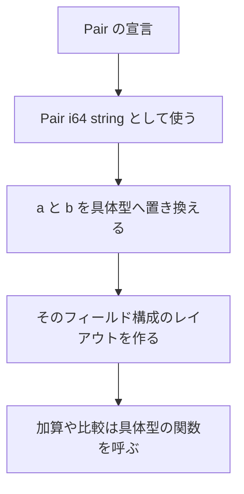

# ジェネリック

ジェネリックは、フィールドやケースの中身の型を後から決めるための仕組みです。`Pair<i64, string>` のように、同じ形を別の中身で使えます。関数の型変数と制約は[ジェネリック関数と型パラメータ制約](../values-and-functions/generics-functions.md)、インスタンスの書き方は[型クラス](./type-classes.md)を参照してください。

このページでは、ジェネリックなレコード・共用体・型エイリアス、型適用の構文、高階型、単相化を扱います。

## この記事のポイント

- 型引数は `<...>` にカンマ区切りで書きます。型名と `<` の間に空白は置けません。
- 旧来の `Pair 'a 'b` や、空の `<>` は受理されません。
- 宣言した型パラメーターは、フィールドかペイロードで少なくとも 1 回使います。
- 高階型は、`Maybe` のような型コンストラクタをパラメーターにします。カインド注釈が必要です。
- 具体化はコンパイル時に通常の型へ展開されます。実行時の型情報は残りません。

## ジェネリックなレコードと共用体

型名の直後に `<...>` を付け、型パラメーターを並べます。パラメーター名は `'a` のように型変数です。

```text
record Pair<'a, 'b> { first: 'a, second: 'b }
union Reply<'a> = Pending | Ready of 'a
```

宣言したパラメーターは、どれか 1 つのフィールドまたはペイロードで使われている必要があります。未使用、重複、未宣言の型変数は `E1024` です。`'_` は `E0001` です。

```tsuzuri run=42
record Pair<'a, 'b> { first: 'a, second: 'b }
record Box<'a> { value: 'a }

def total :: Box<Pair<i64, i64>> -> i64 = \box ->
    box.value.first + box.value.second

total (Box { value: Pair { first: 20, second: 22 } })
```

実行結果:

```text
42
```

`Box<Pair<i64, i64>>` の `>>` は、型引数の閉じ括弧です。関数合成やビットシフトには読まれません。型引数には関数型、タプル、参照、別の型適用をネストできます。括弧を足す必要はありません。

```tsuzuri run=20
record Pair<'a, 'b> { first: 'a, second: 'b }

def swap :: Pair<'a, 'b> -> Pair<'b, 'a> = \pair ->
    Pair { first: pair.second, second: pair.first }

let swapped = swap (Pair { first: 20, second: "text" })
swapped.second
```

実行結果:

```text
20
```

リテラルの型引数は、期待される型があればそれを使い、無ければフィールドの値から推論します。`Pair<i64, bool>` のようにフィールドがすべて Copy ならレコードも Copy です。`string` を含む具体化は、フィールド単位でムーブされる非 Copy です。排他参照をフィールドに格納する具体化は `E1013` です。

共用体も同じ型パラメーター規則です。ペイロードは 0 個か 1 個で、複数の値はタプルにまとめます。

```tsuzuri run=42
union Reply<'a> = Pending | Ready of 'a

def ready_or :: 'a -> Reply<'a> -> 'a = \fallback value ->
    match value with
    | Ready inner -> inner
    | Pending -> fallback

ready_or 0 (Ready 42)
```

実行結果:

```text
42
```

型名とケース名は ASCII の大文字で始めます。配列 `[T]`、リスト `[|T|]`、借用 `ref T`、タスク `Task<T>` は、それぞれの専用構文のままです。`Task<Pair<i64, i64>>` のように中へジェネリック型を置けます。

使われない巨大な具体化はエラーになりません。実際に作った具体化が 64 KiB のレイアウト上限や再帰的なレイアウトに触れると `E1010` です。

## 型エイリアス

`type Name<'a, ...> = 型` は、既存の型の透過的な別名です。所有権、借用、型クラス、公開 ABI、実行時表現は右辺と同じです。診断では、展開した型が表示されることが多いです。

```tsuzuri run=42
type Meters = f64
type Pair2<'a> = ('a * 'a)

def total :: Pair2<i64> -> i64 = \pair ->
    match pair with
    | (left, right) -> left + right

let distance: Meters = 1.5
if distance > 1.0 then total (20, 22) else 0
```

実行結果:

```text
42
```

型名は ASCII の大文字で始めます。パラメーターは重複させず、右辺で全部使います。循環する別名、未使用のパラメーター、引数の個数の不一致は `E1024` です。展開の深さ 128、または走査ノード 4096 を超えると `E1017` です。

別名は注釈を短くするためのものです。レコードを構築するときやパターンでは、元のレコード名を使います。別名は新しい型にはなりません。区別したいときは、ケースが 1 つの共用体にしてください。

`private type` も通常の可視性に従います。公開した別名から private な型を漏らすことはできません。別名に対するインスタンスは、展開後の型で重複判定されます。

## 型適用の構文

型名と `<` は空白を空けずに隣接させます。括弧の内部における空白、改行、コメント、および末尾のカンマは許容されますが、空の `<>` を記述することはできません。型引数の個数は宣言時の型パラメーター数と厳密に一致させる必要があります。

```tsuzuri run=42
record Box<'a> { value: 'a }

let box: Box<i64,> = Box { value: 42 }
box.value
```

実行結果:

```text
42
```

次はいずれも構文エラー `E0002` です。

```text
let box: Box <i64> = Box { value: 1 }
let box: Box<> = Box { value: 1 }
let pair: Pair 'a 'b = Pair { first: 1, second: 2 }
```

`Box <i64>` は比較として読まれ、`Box<>` は中の識別子が無く、`Pair 'a 'b` は型適用として受理されません。値の引数は従来どおり空白区切りです。型だけが山括弧です。

非ジェネリックな型へ型引数を付ける、個数が違う、未知の型名、は `E1004` です。値の型として `Result<string>` と書くと、`Result` は 2 引数なので `E1004` になります。コンストラクタ位置の `Result<string>` は、次の高階型で別の意味になります。

`Add<'a>` と `Pair<i64, string>` は同じ型適用の構文です。名前が型クラスなら制約、レコードや共用体なら具体化として解決されます。クラスとレコードは名前空間を共有するため、`Add` というレコードは宣言順に関係なく `E1001` です。

## 高階型

高階型（HKT）は、`Maybe<i64>` のような完成した型だけでなく、`Maybe` のような「型を受け取って型を作るもの」をパラメーターにします。Tsuzuri 0.1.0 が扱うのは、引数がすべて値型であるランク 1 の型コンストラクタです。

| カインド | 意味 |
| --- | --- |
| `*` | `i64` や `string` のような値型 |
| `* -> *` | 値型を 1 つ受け取る型コンストラクタ |
| `* -> * -> *` | 値型を 2 つ受け取る型コンストラクタ |

カインドの `->` は右結合です。注釈を省略した型変数は `*` です。`(* -> *) -> *` のように、コンストラクタ自体を引数に取るカインドは `E1015` です。標準ライブラリに `Functor` が自動で入るわけではありません。次のクラスは利用者定義です。

`Traits.tt`:

```tsuzuri project=functor file=Traits.tt
class Functor<'container: * -> *> {
    def map :: ('input -> 'output) -> 'container<'input> -> 'container<'output>
}
```

`Main.tz`:

```tsuzuri project=functor file=Main.tz run=42
instance Traits.Functor<Maybe> {
    fn map transform value = Maybe.map transform value
}

instance Traits.Functor<Result<string>> {
    fn map transform value = Result.map transform value
}

def fmap :: Traits.Functor<'container> => ('input -> 'output) -> 'container<'input> -> 'container<'output> =
    \transform value -> Traits.Functor.map transform value

let original: Result<i64, string> = Result.Ok 40
match fmap (\value -> value + 2) original with
| Result.Ok value -> value
| Result.Error _ -> 0
```

実行結果:

```text
42
```

`'container<'input>` は、カインドを持つ型変数への適用です。カインドが `*` でないクラスでは、メソッド固有の値型変数 `'input` や `'output` を使えます。通常の関数は `Functor<'container>` 制約からカインドを受け取ります。注釈も制約も無いコンストラクタ変数を推測する機能ではありません。未宣言なら `E1015` です。

コンストラクタ位置の部分適用は、末尾の引数を固定します。`Result<string>` は、完成した 1 引数の `Result` ではなく、`'a` を受け取って `Result<'a, string>` を作る `* -> *` です。値の型として同じ表記を使うと、必要な引数が足りない `E1004` です。

```text
let bad: Result<string> = Result.Ok 1
```

対応するのは、レコードと共用体の型パラメーター数に応じたコンストラクタ、および `Array`、`List`、`Vec`、`Task` です。値型の `[T]` と `[|T|]` はそのままです。高階型の型エイリアスと、カインド注釈の省略推論は未対応です。`Maybe.map` やコンピュテーション式を直接使うだけなら、高階型は不要です。

## 単相化

ジェネリックな型も関数も、使われた具体型ごとに通常の型へ展開されます。`Box<i64>` と `Box<string>` は、コンパイル後には別のレイアウトです。型クラスのメソッドも、その具体型のインスタンスへ静的に結び付きます。実行時の辞書、ボックス化、実行時型情報は追加されません。実行時に型を選ぶのは、明示した `dyn` だけです。



`Copy`、ムーブ、`Drop`、借用、`Send` は、置き換えたあとのフィールドから判定されます。条件付きインスタンス `Add<'a> => Add<Box<'a>>` も、具体化のときに制約が検査されます。同じクラスで head が重なるインスタンスは `E1016` です。具体的な方を優先する解決はありません。

追加の具体化は 1024 件、型の深さは 128、構成要素は 4096 までです。超えると `E1017` です。型が増え続ける多相再帰は、この上限に当たります。再帰のたびに `dyn` へ包めば、型は増えません。

## 他の言語との比較

| | Tsuzuri | F# | Rust |
| --- | --- | --- | --- |
| 型引数 | `Pair<'a, 'b>`、`Pair<i64, string>` | `'a * 'b` や `List<'a>` | `Pair<A, B>` |
| 型コンストラクタ | 高階型はカインド注釈付き | 通常のジェネリクスが中心 | トレイトの関連型など |
| 具体化 | 単相化 | .NET の共有と特殊化 | 単相化 |
| 別名 | 透過的。newtype にはならない | 型省略は透過的 | `type` は透過的。newtype は構造体 |

## 注意点

- 型名と `<` の間に空白を入れると型適用として認識されません。
- 型パラメーターを宣言したにもかかわらずフィールドやペイロードで使用しない定義は `E1024` エラーになります。
- 型エイリアスは透過的な別名であり、新しい型にはなりません。型クラスインスタンスの重複判定も展開後の型で行われます。
- カインド `* -> *` の高階型コンストラクタ（例: `Result<string>`）と、具象値型（例: `Result<i64, string>`）を正しく区別して記述してください。
- 単相化は使用された具象型の組み合わせごとにコードを生成します。過剰に深い多相再帰は `E1017` リソース上限エラーになります。

## まとめ

- レコード、共用体、型エイリアスは `<...>` で型パラメーターを持てます。
- 型適用は空白なしの `<...>` だけで、空の `<>` と空白区切りの旧構文はエラーです。
- 高階型は `* -> *` のようなカインドを明示し、末尾の型引数を固定して部分適用します。
- 具体化はコンパイル時の単相化で、実行時表現は通常の型と同じです。

## 関連項目

- [ジェネリック関数と型パラメータ制約](../values-and-functions/generics-functions.md)
- [型クラス](./type-classes.md)
- [制約 と 属性](./constraints.md)
- [型エイリアス](./alias.md)
- [Record](../built-in-types-and-modules/record.md)
- [Union](../built-in-types-and-modules/union.md)
- [ジェネリックなレコード](../../../docs/language.md#ジェネリックなレコード)
- [型別名](../../../docs/language.md#型別名)
- [高階型（HKT）](../../../docs/language.md#高階型hkt)
- [言語リファレンスの目次](../index.md)

