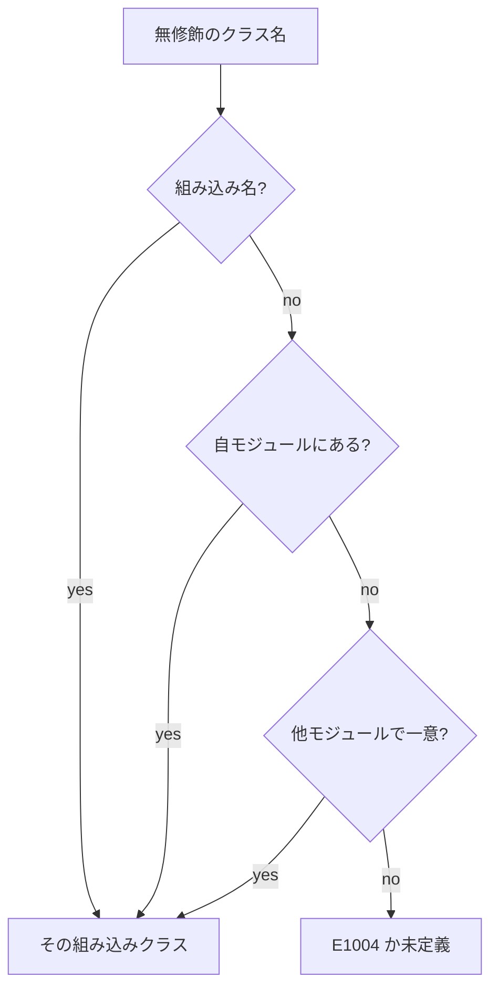

# 型クラス

型クラスは、「この型でこの演算ができる」という契約です。`+` が `i64` でも自分のレコードでも使えるのは、両方に `Add` のインスタンスがあるからです。インスタンスはコンパイル時に選ばれ、通常の関数呼び出しになります。実行時にメソッドを選ぶのは、明示した `dyn` だけです。

関数シグネチャへの書き方は[ジェネリック関数と型パラメータ制約](../values-and-functions/generics-functions.md)、制約の意味とエラーは[制約 と 属性](./constraints.md)を参照してください。

## この記事のポイント

- クラス宣言は `.tt`、インスタンスは `.tz` または `.tc` に置きます。
- メソッドの型はクラス側に書き、インスタンス側では書き直しません。
- 同じクラスと型のインスタンスは、プロジェクトに 1 つだけです。
- `deriving` は `Eq`、`Ord`、`Display`、`Hash`、`Default`、`Encode`、`Decode` を構造から作ります。
- `dyn C` は、異なる型の値を一つのコレクションへ入れ、vtable でメソッドを呼びます。

## クラスとインスタンス

クラスは通常、型変数を 1 つ持ちます。メソッドのシグネチャには、その型変数だけを含めます。高階型のクラスは[ジェネリック](./generics.md)のカインド注釈を使い、メソッド固有の値型変数を追加できます。

`Traits.tt`:

```tsuzuri project=score file=Traits.tt
class Score<'value> {
    def score :: ref 'value -> i64
}

class Eq<'value> => Comparable<'value> {
    def same :: ref 'value -> ref 'value -> bool = \left right -> Eq.eq left right
}
```

`Main.tz`:

```tsuzuri project=score file=Main.tz run=42
record Amount { value: i64 } deriving (Eq)

instance Traits.Score<Amount> {
    fn score amount = amount.value
}

instance Traits.Comparable<Amount> {}

let amount = Amount { value: 42 }
let other = Amount { value: 42 }
if Traits.Comparable.same (ref amount) (ref other) then
    Traits.Score.score ref amount
else
    0
```

実行結果:

```text
42
```

`Comparable` はスーパークラス `Eq` を要求し、`same` のデフォルト実装を持っています。デフォルト実装が提供されているメソッドは、インスタンス側で省略可能です。空の `{}` は、すべてのメソッドにデフォルト実装が提供されていることを意味します。デフォルト実装のない未実装メソッドを残した場合は `E1016`（missing method）エラーになります。

インスタンスのメソッドは `fn` または `let method = \x -> ...` で記述します。型シグネチャをインスタンス側で再宣言する必要はありません。メソッドの呼び出しは `Traits.Score.score` のように、モジュール名、クラス名、メソッド名をドットで連結して記述します。組み込み演算子のメソッドは `Add.add`、`Eq.eq` のように呼び出せます。

`Name.method` という記法がモジュール関数としても解釈できる場合は、モジュール関数が優先されます。また、同名のローカル変数がスコープ内に存在する場合は、そのローカル変数のフィールドアクセスが最優先されます。独自に定義した型クラスメソッドは、`Module.Class.method` のように完全修飾することで曖昧性を排除して安全に呼び出せます。

メソッド固有の制約の追加はサポートされておらず、指定すると `E1016` エラーになります。クラスの型変数は、メソッドの引数または戻り値のいずれかに現れる必要があります。通常のカインド（値型）のクラスでは、メソッド固有の別の型変数を導入することはできません。また、メソッドを 1 つも持たない空のクラス定義も `E1016` エラーになります。

スーパークラス間の循環参照、インスタンスヘッドに出現しない型変数を含むコンテキスト制約、あるいはメソッド本体で要求されている未宣言の制約が存在する場合は `E1027` エラーになります。デフォルトメソッドもインスタンスの有無にかかわらず抽象型のまま事前に静的型検査を受け、再帰呼び出しを含む本体には `fn rec` の明示が必要です。

## 条件付きインスタンス

「中身が比較できるなら、箱も比較できる」は、インスタンスの頭に制約を付けます。

```tsuzuri run=42
record Box<'value> { value: 'value }

instance Eq<'value> => Eq<Box<'value>> {
    fn eq left right = left.value == right.value
    fn ne left right = !(Eq.eq left right)
}

let left = Box { value: "answer" }
let right = Box { value: "answer" }
if left == right then 42 else 0
```

実行結果:

```text
42
```

`Eq<Box<T>>` を使うには `Eq<T>` が必要で、この条件は呼び出し元へ伝播します。`==` は値を共有借用するので、非 Copy の文字列も比較のあとで使えます。比較のメソッド `Eq.eq` は `ref` を受け取ります。算術の `Add.add` は値を受け取るので、所有権の契約は同じではありません。

同じクラスで head が単一化できるインスタンスは共存できません。汎用の `Eq<Box<'value>>` と具体的な `Eq<Box<i64>>` を両方書くと、具体的な方を優先せず `E1016`（overlapping instance）です。ファイルの順にも依存しません。型エイリアスは展開後の型で同一視されます。

ある型 `T` で `C<T>` が成り立つなら、宣言されたスーパークラスも成り立っていなければなりません。`Ord<T>` は `Eq<T>` を要求します。

## クラス名の解決

無修飾のクラス名は、次の順で探します。同じ段に候補が複数あると `E1004` で、修飾が必要です。クラスに可視性はありません。

1. 組み込みのクラス名。`Add` などは予約されていて、同名のレコードは `E1001` です。
2. 自モジュールのクラス。
3. 修飾名がそのまま一致するクラス。
4. 他のユーザーモジュールで一意に定まるクラス。
5. 標準ライブラリで一意に定まるクラス。

組み込み名と衝突するレコードやクラスは宣言できません。利用者のクラスは `Traits.Score` のように修飾すると、解決順を気にせず書けます。



## 組み込み型クラス

次の 31 個は言語に組み込まれています。印だけのクラスはメソッドを持たず、利用者のインスタンスで上書きできません（`E1016`）。

| クラス | 役割 |
| --- | --- |
| `Add` `Sub` `Mul` `Div` | 加算、減算、乗算、除算。`Div` までは数値。`Add` は文字列も連結できる |
| `Rem` `Bits` `Integer` | 剰余とビット演算、整数の分類。`Integer` は印 |
| `Neg` `Pow` | 符号反転、べき乗。`Pow` は整数と `f32` / `f64` |
| `Eq` `Ord` | 共有借用による等値と比較。`Ord` は `Eq` を要求する |
| `SignedInteger` `UnsignedInteger` | 符号付き、符号なし整数の印 |
| `Float` `Numeric` `Elementary` | 浮動小数点、数値、`f32` / `f64` の印。`Elementary` は `sin` などの対象 |
| `Copy` `Capture` `Send` | 複製、関数環境への保存、タスクへの送信。印 |
| `Sync` `AtomicValue` | タスク間の共有借用、`Atomic` に入れられる型。印 |
| `Display` | `display :: ref 'a -> string` |
| `Parse` | `parse :: ref string -> Maybe<'a>` |
| `Hash` | `hash :: ref 'a -> i64u` |
| `Default` | 引数なしの `default`。呼び出しは `Default.default()` |
| `Drop` | `drop :: ref mut 'a -> unit`。スコープの終わりに自動で一度だけ呼ばれる |
| `Format` | `format :: ref 'a -> ref string -> string`。補間の穴向け |
| `Err` | `msg :: ref 'a -> string`。`try` のハンドラが返すエラーの説明 |
| `Encode` `Decode` | `encode :: ref 'a -> Result<Json.Value, Json.Error>`、`decode :: ref Json.Value -> Result<'a, Json.Error>`。JSON との変換。インスタンスは [Json](../built-in-types-and-modules/json.md) と利用者のソースだけ |
| `SimdVector` `SimdNumeric` `SimdMask` | SIMD 値の印。詳細は [Simd](../built-in-types-and-modules/simd.md) |

`==`、`+`、`**` などの演算子は、対応するクラスのメソッドです。配列、リスト、タプルの `Eq`、`Ord`、`Hash`、`Display` は要素の制約から構造的に作られます。`Default` はタプルにも構造的にあります。レコードと共用体は、手書きのインスタンスか `deriving` が必要です。無い比較は `E1005`（no instance）です。

`Drop.drop` を自分で呼ぶことはできません。`E1016` で、値をスコープから出すか、消費する関数へ渡すよう案内されます。`Drop` のインスタンスは、このプログラムで宣言したレコードか共用体に限り、すべての型引数を別々の型変数で書いた head だけです。制約も `deriving (Drop)` も使えません。詳細は [Drop](../ownership-and-memory/drop.md) です。

`Format` も、このプログラムのレコードと共用体だけが実装できます。印クラスの意味は[制約 と 属性](./constraints.md)にまとめています。

## deriving

型宣言の末尾に `deriving (...)` を付けると、同じモジュールへ条件付きインスタンスが生成されます。指定できるのは `Eq`、`Ord`、`Display`、`Hash`、`Default`、`Encode`、`Decode` です。

```tsuzuri run=42
record Point { horizontal: i64, vertical: i64 } deriving (Eq, Ord, Display, Hash, Default)

let point = Point { horizontal: 20, vertical: 22 }
let other = Point { horizontal: 20, vertical: 22 }
let zero: Point = Default.default()
let shown = Display.display ref point
if point == other && zero < point && shown == "Point { horizontal: 20, vertical: 22 }" && Hash.hash (ref point) == Hash.hash (ref other) then
    point.horizontal + point.vertical
else
    0
```

実行結果:

```text
42
```

`Ord` だけを導出すると、スーパークラス `Eq` が無く `E1025` になります。`Eq` の導出か手書きインスタンスを先に用意します。

| クラス | 生成される意味 |
| --- | --- |
| `Eq` | レコードはフィールド順、共用体はタグのあとペイロード。最初の不一致で終わる |
| `Ord` | レコードは辞書順、共用体はケースの宣言順。名前の辞書順ではない |
| `Default` | レコードは全フィールドの既定値。共用体は最初のケース。空コレクションに要素の `Default` は不要 |
| `Display` | `Point { horizontal: 20, vertical: 22 }`、`Completed 42`、配列は `[a, b]`、リストは `[|a, b|]`、タプルは `(a, b)` |
| `Hash` | 64-bit FNV-1a。同じ値は同じハッシュ。逆は保証しない |
| `Encode` | レコードは宣言順の object、共用体は `"Case"` か `{"Case": payload}`。最初の Error で止まる |
| `Decode` | 同じ形だけを受理する。余分なキーは無視し、無いキーは `null` として decode する。宣言順で最初の Error を返す |

```tsuzuri run=42
union Status = Waiting | Completed of i64 deriving (Eq, Display, Default)

let initial: Status = Default.default()
let shown = Display.display ref (Completed 42)
if initial == Waiting && shown == "Completed 42" then 42 else 0
```

実行結果:

```text
42
```

`Encode` / `Decode` の導出は、フィールド数や case 数によらず深さが一定の平らなコードになるので、128 フィールドのレコードや 128 case の共用体も導出できます。JSON の形と規則は [Json](../built-in-types-and-modules/json.md) にあります。

```tsuzuri run=%7B%22label%22%3A%22a%22%2C%22status%22%3A%7B%22Finished%22%3A42%7D%7D
record Job { label: string, status: Progress } deriving (Encode, Decode)
union Progress = Queued | Finished of i64 deriving (Encode, Decode)

let job = Job { label: "a", status: Finished 42 }
String.from_utf8 (ref (Result.get (Json.serialize (ref job))))
```

実行結果:

```text
{"label":"a","status":{"Finished":42}}
```

構造体や共用体の内部に含まれる文字列や文字は、引用符付きのリテラル風にエスケープされて出力されます。UTF-8 文字列型には `u8` プレフィックスが付きます。なお、単独の文字列値を直接 `Display.display` で出力した場合は、エスケープされない生の文字列が得られます。また、`Display` の出力形式は構造の可視化を目的としており、`Parse` による構文解析と完全な対称性（逆変換）を持つとは限らない点に留意してください。

`Hash` のオフセット値は `14695981039346656037`、乗数（素数）は `1099511628211` です。各ハッシュ計算はオフセットから開始され、ポインタ値やパディング領域の不定データは混入しません。浮動小数点の `+0.0` と `-0.0` は同一のハッシュ値を生成し、NaN は各型固有の正の quiet NaN へと正規化されます。なお、このハッシュ値は暗号学的な安全性を目的としたものではなく、乱数シードも保持しないため HashDoS 耐性はありません。各データ型のバイト列形式の詳細は[言語仕様の自動導出](../../../docs/language.md#自動導出deriving)を参照してください。

再帰的な型も導出できます。比較、表示、`Hash` は通常の再帰呼び出しなので、深い木ではスタックを消費します。再帰ノードの解放が反復実装であることとは別です。生成インスタンスはプロジェクト全体で 1024 個まで、超えると `E1017` です。

導出の重複は `E1001`、手書きインスタンスとの競合は `E1016`、対応しないクラスやフィールドは `E1025` です。最初のケースが再帰して有限の既定値を作れない `Default` も拒否されます。NaN を含む順序比較は、不一致の時点で後続フィールドを見にいきません。

## 動的ディスパッチ

`dyn C` は、クラス `C` のインスタンスを持つ何らかの型の値を所有する型です。異なるレコードを一つの配列へ入れ、メソッドを実行時に vtable から選びます。

`Shapes.tt`:

```tsuzuri project=shapes file=Shapes.tt
class Shape<'value> {
    def area :: ref 'value -> i64
}
```

`Main.tz`:

```tsuzuri project=shapes file=Main.tz run=29
record Square { side: i64 }
record Rect { width: i64, height: i64 }

instance Shapes.Shape<Square> {
    fn area square = square.side * square.side
}

instance Shapes.Shape<Rect> {
    fn area rect = rect.width * rect.height
}

let shapes: [dyn Shapes.Shape] = [
    Dyn.of (Square { side: 3 }),
    Dyn.of (Rect { width: 4, height: 5 })
]
Shapes.Shape.area (ref shapes[0]) + Shapes.Shape.area (ref shapes[1])
```

実行結果:

```text
29
```

`dyn` は言語予約語です。`dyn Shapes.Shape` のようにクラス名を 1 つ記述するか、`dyn (Shapes.Shape, Copy)` のように丸括弧内に複数のクラスと印を並べて記述します。`dyn` 型は型引数を取ることはできず、指定すると `E0002` エラーになります。型クラスでない識別子を指定した場合は `E1004` エラーになります。なお、`ref dyn C` は `ref (dyn C)` と解釈されます。

`Dyn.of value` は、期待される型が `dyn` 型に確定している文脈（変数の型注釈、関数の引数・戻り値の注釈、レコードのフィールド、配列リテラルの要素など）でのみ記述可能です。期待される型が存在しない場合は `E1015` エラーになります。通常の値から `dyn` 型への暗黙の型変換は行われません。渡された値はヒープ領域へムーブされ、`(クラスの組, 型)` ごとに 1 つ生成される静的な定数 vtable とペアになります。組み込み型のインスタンスや導出インスタンスもそのまま格納できます。

```tsuzuri run=answer%3D42
let parts: [dyn Display] = [Dyn.of "answer", Dyn.of 42]
Display.display (ref parts[0]) + "=" + Display.display (ref parts[1])
```

実行結果:

```text
answer=42
```

`Shapes.Shape<'value>` を要求するジェネリック関数は、`'value = dyn Shapes.Shape` で一度だけ具体化され、格納されたすべての型で共有されます。`dyn C` が満たすのは `C` とその推移的なスーパークラスだけです。`Eq` や `Ord` は自動では付きません。

vtable のスロットは、スーパークラスを宣言順に深さ優先で辿り、各クラスのメソッドを宣言順に並べたものです。既定メソッドもスロットを持ちます。`ref` と `ref mut` のメソッドは格納した値をその場で読み書きし、値で受けるメソッドは dyn 値を消費します。

`dyn` にできるクラスは、各メソッドの第 1 引数が `'a`、`ref 'a`、`ref mut 'a` のいずれかで、ほかの引数と結果にその型変数が現れないものです。スーパークラスにも同じ規則を適用します。メソッドの無いクラス、高階型クラス、`Drop` は使えません。`Eq` は第 2 引数にクラスの型があるため `dyn` にできません。違反は理由付きの `E1028` です。メソッドの無いスーパークラスのうち `Copy` と `Send` だけは、`dyn (C, Copy)` のように印として並べれば満たせます。

| 型 | Copy | Send | 借用 |
| --- | --- | --- | --- |
| `dyn C` | なし | なし | 保持できない |
| `dyn (C, Copy)` | あり。領域を確保して複製する | なし | 保持できない |
| `dyn (C, Send)` | なし | あり | 保持できない |
| `dyn C {r}` | なし | なし。`Send` 印は `E1028` | region `r` の共有借用を保持できる |

region の無い `dyn` へ借用を含む値を入れると `E1013` です。排他借用を含む値は格納できません。スコープの終わりには、格納した値の `Drop` を実行して領域を解放します。

`Dyn.of` の入力がすでに dyn 値で、その vtable が期待型の全クラスを含むときは、領域を確保し直さず vtable だけを替えます。含まないときは、dyn 値も普通の値として、利用者のインスタンスで格納します。

dyn 値は `{ data, vtable }` の 2 ポインタです。`export` と `extern` の引数・結果には使えず `E1008` です。比較、元の型への downcast、実行時の型情報はありません。dyn を使わないプログラムの生成コードは変わりません。

## 他の言語との比較

| | Tsuzuri | Rust | C# / F# |
| --- | --- | --- | --- |
| 静的な契約 | 型クラスとインスタンス | トレイトと impl | インターフェース、または静的制約 |
| 実装の重複 | 重なる head はエラー | オーファン規則と一貫性 | 明示実装などで分かれる |
| 実行時の選択 | 明示した `dyn` と `Dyn.of` | `dyn Trait` | インターフェースの参照 |
| 既定実装 | クラス側のデフォルトメソッド | トレイトの既定メソッド | インターフェースの既定実装 |

## 注意点

- インスタンスのメソッドへ型シグネチャを書き直す必要はありません。クラスと違う型にはできません。
- `Ord` の導出には `Eq` が必要です。
- `Default.default()` は引数なしの呼び出しです。`default ()` ではありません。
- `dyn` は暗黙には変換されません。`Dyn.of` と、期待型の注釈が必要です。
- 比較や `Hash` の導出は、深い再帰データではスタックを使います。

## まとめ

- クラスは `.tt`、インスタンスは `.tz` / `.tc` に書きます。
- デフォルトメソッド、スーパークラス、条件付きインスタンスを使えます。
- 重なるインスタンスは `E1016` で、具体的な方を優先しません。
- 組み込みクラスは演算子、比較、表示、所有権の印を含みます。
- `deriving` は構造的な `Eq`、`Ord`、`Display`、`Hash`、`Default`、`Encode`、`Decode` を作ります。
- 実行時に型を選ぶときは `dyn C` と `Dyn.of` を明示します。

## 関連項目

- [制約 と 属性](./constraints.md)
- [ジェネリック](./generics.md)
- [ジェネリック関数と型パラメータ制約](../values-and-functions/generics-functions.md)
- [Drop とリソースの解放](../ownership-and-memory/drop.md)
- [例外処理](../exception-handling/exception-handling.md)
- [Simd](../built-in-types-and-modules/simd.md)
- [多相関数と型クラス](../../../docs/language.md#多相関数と型クラス)
- [動的ディスパッチ（dyn）](../../../docs/language.md#動的ディスパッチdyn)
- [自動導出（deriving）](../../../docs/language.md#自動導出deriving)
- [言語リファレンスの目次](../index.md)

