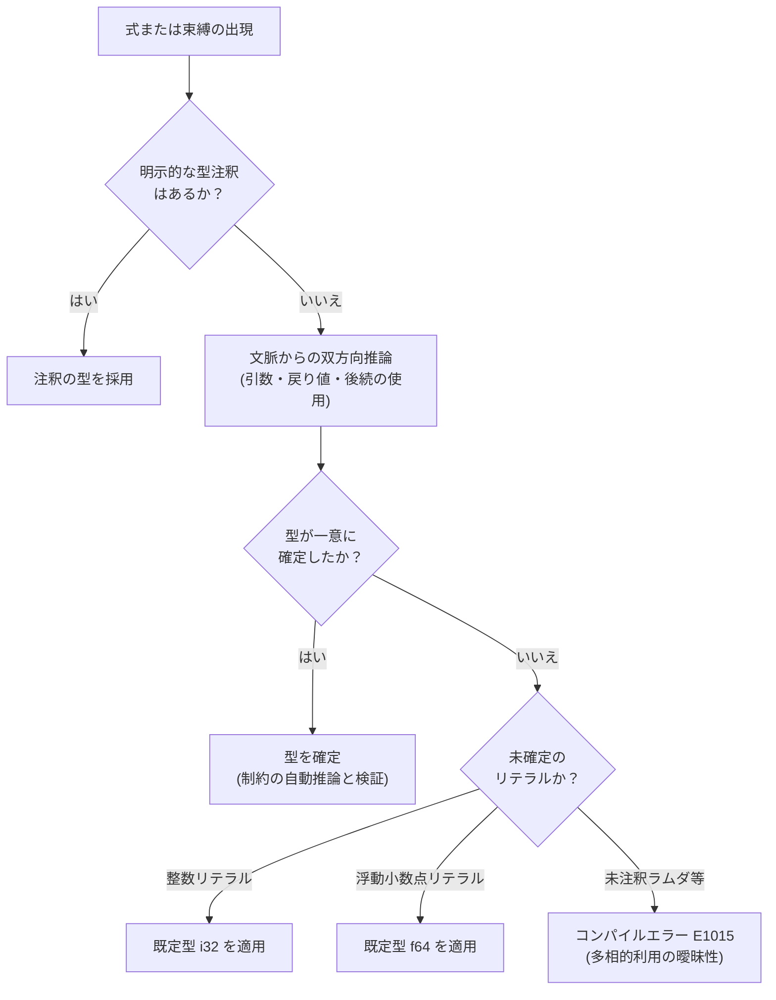

# 型推論

Tsuzuri は、式の中から期待される型と、あとでどう使われるかの両方を見て型を決めます。これを双方向の型推論と呼びます。

すべての変数に型を書く必要はありません。関数のシグネチャやレコードのフィールドのように、外から見える場所には型を書きます。関数の中の `let` や式は、コンパイラが文脈から決めます。

## この記事のポイント

- **境界は書き、中は推論**: 関数の引数・戻り値やレコードのフィールドは注釈が必要です。`let` は推論されます。
- **あとでどう使うかも見る**: 接尾辞のない数値や配列は、渡す関数の引数型からも型が決まります。
- **決まらないときの既定**: 整数リテラルは `i32`、小数リテラルは `f64` です。
- **ラムダは他の引数のあと**: 呼び出しでは、ラムダ以外の引数を先に検査し、その型でラムダの引数を決めます。
- **制約も推論される**: シグネチャに `Add<'a>` を書かなくても、本体の `+` から制約が付きます。
- **ローカル `let` は単相**: 1 つの `let` は 1 つの具象型です。決まらないと `E1015` です。

## 型推論の流れ

Tsuzuri コンパイラは、明示的な型注釈と周囲の式から得られる文脈情報（期待される型）を組み合わせて、各ノードの型を確定させていきます。



## 注釈が必要な場所と推論される場所

外から見える境界には型を書き、関数の中は短くします。

### 注釈が必須な場所

- **関数のシグネチャ**: `def` によるトップレベル関数宣言の引数と戻り値。
- **レコードのフィールド**: レコード型宣言の各フィールド型。
- **型エイリアスの右辺**: `type Name = ...` で別名を付ける対象の型。
- **共用体のペイロード**: `Circle of f64` の `f64`。
- **`const` の型**: `const Answer: i64 = 42`。コロンと型を省くと `E0002`（`expected ':' and an explicit constant type`）です。

関数のシグネチャとレコードのフィールドは、どちらも型を省略できません。

```tsuzuri run=42
record Point { x: i64, y: i64 }

def add :: i64 -> i64 -> i64 = \x y -> x + y

let origin = Point { x: 20, y: 22 }
add origin.x origin.y
```

実行結果:

```text
42
```

### 型推論される場所

1. **ローカル変数束縛（`let`）**: 関数やブロック内の変数宣言。
2. **ジェネリック型の型引数**: レコード構築やジェネリック関数の呼び出し時の型引数。
3. **無名ラムダ式の引数**: 期待される関数型が存在する場合の引数パターン。

```tsuzuri run=42
record Box<'a> { value: 'a }

// Box<i64> の型引数はフィールドの値 42 から推論されます
let boxed = Box { value: 42 }
boxed.value
```

実行結果:

```text
42
```

## 数値リテラルの双方向推論と既定型

接尾辞のない整数リテラル（例: `42`）や浮動小数点リテラル（例: `3.14`）は、代入先の型注釈だけでなく、**後続のコードでの使われ方**からも推論されます。

```tsuzuri run=42
def accept_i64 :: i64 -> i64 = \x -> x + 2

// 接尾辞のない 40 は、後で accept_i64 に渡されることから i64 と推論されます
let a = 40
accept_i64 a
```

実行結果:

```text
42
```

配列リテラル `let values = [3, 5, 8]` も同様であり、後で `[i64]` を要求する関数へ渡されれば配列全体が `[i64]` として解決されます。

### 文脈が決まらない場合の既定型

文脈から型を一意に特定できない場合、リテラルは以下の言語既定型にフォールバックします。

- **整数リテラル**: 既定型は **`i32`** です。
- **浮動小数点リテラル**: 既定型は **`f64`** です。

```tsuzuri run=2147483647:3.14
let max_i32 = 2147483647
let pi = 3.14
$"{max_i32}:{pi}"
```

実行結果:

```text
2147483647:3.14
```

> [!WARNING]
> `i32` の範囲（-2,147,483,648 〜 2,147,483,647）に収まらず、文脈からも型が決まらない整数（例: `3000000000`）は `E1009` です。`3000000000l` のように接尾辞を付けるか、`let value: i64 = 3000000000` と注釈します。

## ラムダ引数の推論順序（遅延検査）

Tsuzuri の型チェッカーは、関数呼び出しの実引数を検査する際、**無名ラムダ式以外の実引数を先に検査**します。これにより、コレクションなどの通常引数から関数の型パラメーターが確定し、その確定した型情報をもとに遅延されたラムダ式が検査されます。

```tsuzuri run=11
let words = ["apple", "banana"]

// ref words の型 ref [string] から Array.map_ref の型パラメーターが string と確定します。
// そのため、\w の型は自動的に ref string と推論され、String.length を安全に呼び出せます。
let lengths = Array.map_ref (\w -> String.length w) (ref words)
Array.sum lengths
```

実行結果:

```text
11
```

引数を左から順に型検査すると、`\w -> ...` を見た時点では `w` の型が決まりません。ラムダより後ろにラムダ以外の引数があるとき、コンパイラはそのラムダの型検査を後回しにします。これは評価を遅らせるという意味ではなく、型検査の順序だけです。後ろの引数で型パラメーターが決まってから、ラムダを検査します。

## 型クラス制約の自動推論

ジェネリック関数を定義する際、シグネチャに制約（`Add<'a> =>` など）を明示的に記述しなくても、関数本体で使用された演算子や関数からコンパイラが必要な制約を自動的に導出します。

```tsuzuri run=42:5
// シグネチャには制約を書いていませんが、x + x から Add<'a> が自動推論されます
def double :: 'a -> 'a = \x -> x + x

let i = double 21
let f = double 2.5
$"{i}:{f}"
```

実行結果:

```text
42:5
```

`Add` のない型、たとえば `unit` を渡すと `E1005`（`no instance for Add<unit>`）です。

## ローカル `let` の単相性と推論失敗エラー

### 単相性のルール

トップレベルの `def` は多相です。呼び出しごとに別の具象型へ展開できます。関数の中の `let` は単相で、スコープの中では 1 つの具象型だけです。

```text
def test :: unit -> i32 = \() ->
    let f = \x -> x
    let a = f 42
    let b = f "hello"    // コンパイルエラー E1003: expected an integer, found string
    0
```

上記のコードでは、`f 42` によって `f` の型が `i32 -> i32` に決定されたため、後から文字列 `"hello"` を渡すと型不一致エラーになります。

### 推論できない場合のエラー（`E1015`）

ラムダを `let` に入れて、注釈も呼び出しもないと、多相のまま残ります。これは `E1015` です。

```text
error[E1015]: ambiguous polymorphic use; add a concrete type annotation or supply determining arguments
```

直し方は 3 つです。

1. 注釈を付ける（`let f: i64 -> i64 = \x -> x`）。
2. 型が決まる引数で呼び出す。
3. 多相のまま使いたいなら、トップレベルの `def` にする。

関数の注釈に、その関数のシグネチャにない型変数を書くのも `E1015` です。

```text
error[E1015]: type annotation mentions a variable absent from this function's signature
```

## まとめ

- 関数の境界、レコードのフィールド、`const` には型を書きます。関数の中の `let` は推論できます。
- 数値リテラルは前後の使われ方から型が決まります。決まらなければ整数は `i32`、小数は `f64` です。
- 呼び出しのラムダは、他の引数の型検査のあとに検査されるので、引数の型を省略できます。
- 本体の演算から型クラス制約が付きます。
- ローカルな束縛は単相です。型が決まらないと `E1015` です。

## 関連項目

- [型](types.md)
- [基本型](basic-types.md)
- [型エイリアス](alias.md)
- [ジェネリック](generics.md)
- [型クラス](type-classes.md)
- [言語リファレンスの目次](../index.md)

