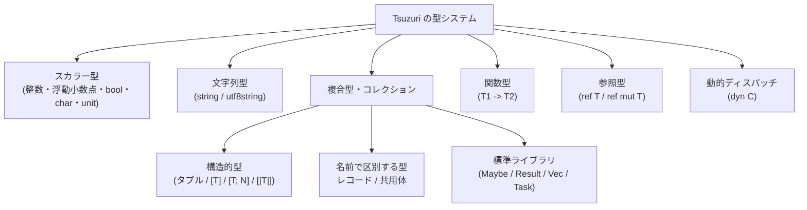

# 型

Tsuzuri は静的型付きの関数型言語です。式と変数の型はコンパイル時に検査されます。型の違う値を暗黙に変換したり、実行時の動的型へ置き換えたりしません。

関数の引数・戻り値やレコードのフィールドには型を書きます。関数の中の `let` や式は、前後の文脈から型を推論します。所有権（Copy、ムーブ、借用）と型クラスも、この検査の中で扱います。

## この記事のポイント

- **暗黙の型変換はない**: 型が違う値は、コンパイル時にエラーになります。
- **名前で区別する型**: レコードと共用体は、フィールドが同じでも宣言が違えば別の型です（名目的型付け、nominal typing）。タプルと配列は、中身の型が同じなら同じ型です。
- **型引数の書き方**: `Box<i64>` のように、型名と `<` の間に空白を置きません。
- **関数型は右結合**: `A -> B -> C` は `A -> (B -> C)` です。関数はカリー化されています。
- **境界は書き、中は推論**: 関数のシグネチャやフィールドには型を書き、関数の中の `let` は推論に任せます。

## 型システムの全体像

組み込みの数値や文字列から、自分で宣言するレコード、参照、並行タスクまで、型は次のように分かれます。



### 型の分類一覧

Copy の列は、値を複製して元の変数も使えるかを示します。「条件付き」は、中身がすべて Copy のときだけ Copy になる、という意味です。`Map`、`Set`、`Seq`、SIMD ベクトルはこの表に入れていません。[Map](../built-in-types-and-modules/map.md)、[Seq](../built-in-types-and-modules/seq.md)、[Simd](../built-in-types-and-modules/simd.md) を見てください。

| 分類 | 型の表記例 | Copy | 概要と主な用途 | 詳細リンク |
| --- | --- | --- | --- | --- |
| 整数 | `i8`〜`i128`, `i8u`〜`i128u` | ○ | 固定幅の符号付き・符号なし整数。ビット演算・モジュロ算術 | [基本型](basic-types.md) |
| 多倍長整数 | `bigint` | ○ | 任意精度の多倍長整数（標準ライブラリの `BigInt` レコード） | [BigInt](../built-in-types-and-modules/bigint.md) |
| 浮動小数点 | `f16`, `f32`, `f64`, `f128` | ○ | IEEE 754 準拠の 2 進浮動小数点数 | [基本型](basic-types.md) |
| 十進浮動小数点 | `d32`, `d64`, `d128` | ○ | IEEE 754 の 10 進浮動小数点（BID 表現） | [基本型](basic-types.md) |
| 真偽値 | `bool` | ○ | `true` または `false` | [基本型](basic-types.md) |
| 文字 | `char`, `utf8char` | ○ | UTF-16 コード単位（16 bit）/ Unicode スカラー値（32 bit） | [Char](../built-in-types-and-modules/char.md)、[Utf8Char](../built-in-types-and-modules/utf8char.md) |
| 空型 | `unit` | ○ | 値は `()` のみ。意味のある結果を返さない操作を表す | [Unit 型](unit-type.md) |
| 文字列 | `string`, `utf8string` | × | 不変の UTF-16 コード単位列（ECMA-262 準拠）/ UTF-8 バイト列 | [String](../built-in-types-and-modules/string.md) |
| タプル | `i64 * string` | 条件付き | 複数の型の値を名前なしでまとめる不変の直積（要素がすべて Copy なら Copy） | [Tuple](../built-in-types-and-modules/tuple.md) |
| 固定長配列 | `[f64; 3]` | 条件付き | 長さ N を型に含み、値の中に要素を置く配列（要素が Copy なら Copy） | [Array](../built-in-types-and-modules/array.md) |
| 配列 | `[i32]` | 条件付き | 長さは実行時に決まり、生成後は変わらない。記述子は 16 バイト（要素が Copy なら Copy） | [Array](../built-in-types-and-modules/array.md) |
| 連結リスト | `[|i32|]` | 条件付き | 不変の単方向連結リスト（要素が Copy ならリストも Copy） | [List](../built-in-types-and-modules/list.md) |
| レコード | `record Point { ... }` | 条件付き | 名前付きフィールドを持つ積型。全フィールドが Copy ならレコードも Copy | [Record](../built-in-types-and-modules/record.md) |
| 共用体 | `union Shape = ...` | 条件付き | 直和型。いずれか 1 つのケースの値を保持 | [Union](../built-in-types-and-modules/union.md) |
| 関数型 | `i64 -> string` | ○ | カリー化された第一級の関数値。複製すると捕捉した値もコピーされる | [関数](../values-and-functions/functions.md) |
| 共有借用 | `ref T`（または `&T`） | ○ | 所有権を消費しない読み取り専用参照（存続期間は所有者以下） | [借用と参照](../ownership-and-memory/borrowing.md) |
| 排他借用 | `ref mut T`（または `&mut T`） | × | 単一の排他的な書き込み可能参照。別名付けを静的に排除 | [借用と参照](../ownership-and-memory/borrowing.md) |
| オプショナル | `Maybe<T>` | 条件付き | 値がある（`Some`）かない（`None`）かを表す標準の共用体 | [Maybe](../built-in-types-and-modules/maybe.md) |
| 結果型 | `Result<T, E>` | 条件付き | 成功（`Ok`）または失敗（`Error`）を表す標準の共用体 | [Result](../built-in-types-and-modules/result.md) |
| 可変長バッファ | `Vec<T>` | × | 伸長可能なヒープ確保の所有バッファ（常に非 Copy） | [Vec](../built-in-types-and-modules/vec.md) |
| 並行タスク | `Task<T>` | × | 一回限りの実行を担う遅延並行タスク（所有権を持つ非 Copy 値） | [Task 式](../async-tasks-and-lazy/task.md) |
| 入出力操作 | `IO<T>` | ○ | 副作用を包んだアクション。中身は `unit -> T` の関数値で、Copy | [IO](../built-in-types-and-modules/io.md) |
| 動的オブジェクト | `dyn C` | 条件付き | 型クラス `C` を実装する値へのファットポインタ。Copy になるかは `C` による | [型クラス](type-classes.md) |

## 型の記法

型引数、関数型、タプル、配列は、次の書き方で表します。

### 型引数（`<...>`）

ジェネリック型の型引数は、型名の直後に `<` を書き、カンマで区切ります。

```text
Pair<i64, string>
Maybe<[f64; 3]>
Task<Result<i32, string>>
```

- 型名と `<` の間に空白は置けません。`Pair <i64>` は構文エラー `E0002` です。
- 空の `<>` は書けません。これも `E0002` です。型引数の個数は宣言と一致させます。
- `Maybe<Maybe<i64>>` の `>>` は、シフト演算子ではなく型引数の閉じ括弧です。末尾カンマ（`Box<i64,>`）も書けます。

### 関数型の右結合（`->`）

関数型の矢印 `->` は右結合です。関数はすべてカリー化されているので、複数の引数を受け取る関数は「1 つの引数を受け取り、残りの関数を返す」形になります。

```tsuzuri run=30
def apply_twice :: (i64 -> i64) -> i64 -> i64 = \f x -> f (f x)
def add5 :: i64 -> i64 = \x -> x + 5

let result = apply_twice add5 20
result
```

実行結果:

```text
30
```

上記の `(i64 -> i64) -> i64 -> i64` は、`(i64 -> i64) -> (i64 -> i64)` と等価です。第 1 引数に関数 `(i64 -> i64)` を受け取り、第 2 引数に `i64` を受け取って、最終的に `i64` を返します。

### タプル型と配列型

タプル型は要素の型をアスタリスク `*` で結合して表します。角括弧 `[...]` は要素の持ち方に応じて使い分けられます。

```text
i64 * string          // 2 要素のタプル型
[f64]                 // 長さを型に持たない通常の配列
[f64; 3]              // 長さ 3 を型に含み、値を直接保持する固定長配列
[|string|]            // 不変の単方向連結リスト
```

タプルの中身は `match pair with | (a, b) -> ...` で取り出します。`pair.0` のような添字アクセスはなく、書くと構文エラー `E0002` です。

`[T; N]` の `N` は 0 以上 1024 以下です。1025 以上は `E1010`（`fixed array length 1025 exceeds 1024 elements`）になります。大きな列には `[T]` を使います。値としてインラインに置ける大きさの上限は 64 KiB で、これも `E1010` です。配列や文字列のバッファ本体は、この上限に含みません。

```tsuzuri run=10
def sum_pair :: (i64 * i64) -> i64 = \pair ->
    match pair with
    | (a, b) -> a + b

let pair = (4, 6)
sum_pair pair
```

実行結果:

```text
10
```

## レコードと共用体は名前で区別される

レコードと共用体は、宣言した名前で型を区別します。これを名目的型付け（nominal typing）と呼びます。フィールドの名前と型が同じでも、別の宣言なら別の型です。座標と速度を、どちらも整数 2 つの組として混同しないために使います。

```tsuzuri run=42
record Point { x: i64, y: i64 }
record Vector2 { x: i64, y: i64 }

def get_x :: Point -> i64 = \p -> p.x

let p = Point { x: 42, y: 10 }
get_x p
```

実行結果:

```text
42
```

`let v: Vector2 = p` のように別のレコードへ代入すると、`E1003` になります。診断の型名にはモジュール名が付きます。

```text
error[E1003]: expected Main.Vector2, found Main.Point
```

一方、タプル（`i64 * i64`）と配列（`[i64]`）は構造で区別します。要素の型が同じなら、宣言が違っても同じ型です。

## 型名の解決順序

型名（`Maybe` や `Point`）は、次の順で探します。

1. 今のファイルで宣言したレコード、共用体、型エイリアス。
2. `using` で取り込んだ名前、または同じプロジェクトの公開型。
3. 標準ライブラリの型（`std::Maybe`、`std::Result`）。

同じファイルに `union Maybe = Some of i64 | None` があると、修飾なしの `Maybe` はそちらの型です。標準ライブラリの型は `std::Maybe` と書きます。

## 静的型付けとシグネチャの明示方針

境界には型を書き、関数の中は推論に任せます。

型を書く場所:

- トップレベル関数の引数と戻り値（`def add :: i64 -> i64 -> i64`）
- レコードのフィールド（`record Point { x: f64, y: f64 }`）
- 共用体のペイロード
- 型エイリアスの右辺（`type Meters = f64`）
- `const` の型（省略すると `E0002`）

推論に任せる場所:

- 関数の中の `let`（`let count = 42`）
- 呼び出し時の型引数（`Pair { first: 1, second: "hello" }`）
- 呼び出しの引数に書いたラムダ式のパラメータ

`i32` から `i64` への拡大も、整数から浮動小数点への変換も、自動では行われません。変換するときは `as` か `to_float` を書きます。

## 他の言語との比較

| 項目 | Tsuzuri | Rust | F# | TypeScript |
| --- | --- | --- | --- | --- |
| 型の区別 | 静的。レコードは名前、タプルは構造 | 静的。レコードは名前、タプルは構造 | 静的。レコードは名前、タプルは構造 | 静的。構造が同じなら同じ型 |
| 型推論の範囲 | 式・ローカル束縛（境界は明示） | 式・ローカル束縛（境界は明示） | 式・境界を含め広域推論 | 式・境界を含め広域推論 |
| 多相の方式 | 型クラス（単相化） | トレイト（単相化 / `dyn`） | インターフェース / 静的制約 | 構造的インターフェース |
| メモリ管理 | 所有権・借用（GC なし） | 所有権・借用（GC なし） | .NET ランタイム GC | JavaScript ランタイム GC |
| 暗黙の数値変換 | なし（すべて明示） | なし（すべて明示） | なし（すべて明示） | あり（暗黙変換あり） |

## まとめ

- 型の不一致はコンパイル時に分かります。暗黙の数値変換はありません。
- レコードと共用体は宣言の名前で区別します。タプルと配列は中身の型で区別します。
- 関数のシグネチャとレコードのフィールドには型を書きます。関数の中の `let` は推論できます。
- 関数値と `IO` は Copy です。`string`、`Vec`、`Task`、`ref mut` は Copy ではありません。
- 固定長配列の長さは 1024 まで、インラインの値は 64 KiB までです。どちらも `E1010` です。

## 関連項目

- [基本型](basic-types.md)
- [Unit 型](unit-type.md)
- [型エイリアス](alias.md)
- [型推論](type-inference.md)
- [型キャスト](cast.md)
- [ジェネリック](generics.md)
- [型クラス](type-classes.md)
- [制約 と 属性](constraints.md)
- [Record](../built-in-types-and-modules/record.md)
- [Union](../built-in-types-and-modules/union.md)
- [Tuple](../built-in-types-and-modules/tuple.md)
- [Array](../built-in-types-and-modules/array.md)
- [List](../built-in-types-and-modules/list.md)
- [String](../built-in-types-and-modules/string.md)
- [借用と参照](../ownership-and-memory/borrowing.md)
- [言語リファレンスの目次](../index.md)

