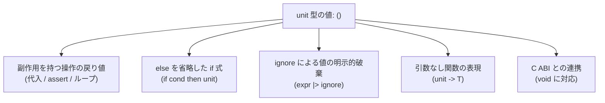

# Unit 型

`unit` は、意味のある情報を持たないことを表す組み込み型です。値は `()` だけです。

C や Java の `void` に近い役割ですが、`void` は値ではありません。`unit` は整数や文字列と同じ第一級の値で、変数に入れたり、引数や戻り値にしたりできます。記憶域は 1 バイトです。

## この記事のポイント

- **唯一の値**: `unit` 型が取り得る値は `()` のみです。空ブロック `{}` も `()` と評価されます。
- **引数なし・戻り値なしの関数**: Tsuzuri の関数は必ず 1 つの引数を受け取り 1 つの戻り値を返すため、引数を持たない関数は `unit -> T`、副作用のみを行う関数は `T -> unit` と定義します。
- **値の明示的破棄**: 戻り値を持つ関数の結果を安全に捨てたいときは、組み込み関数 `ignore`（または `|> ignore`）を使用します。
- **制御構文の評価値**: 変数への再代入、ループ式（`for`、`while`）、および `else` を省略した `if` 式はすべて `unit` 型の値を返します。
- **C ABI**: 戻り値の `unit` と、引数のない `export def name :: unit` は C の `void` になります。引数としての `unit` は export できません。

## `unit` と `()` の基本

`unit` 型のリテラルは `()` です。また、式を何も含まない空の波括弧 `{}` も `()` と等価に評価されます。

```tsuzuri run=42
let u: unit = ()
let empty_block: unit = {}
assert (u == empty_block)
42
```

実行結果:

```text
42
```

`unit` は Copy で、`Eq` と `Display` を実装しています。`()` 同士の `==` は常に `true` です。`Ord` はないので、`()` < `()` は `E1005`（`no instance for Ord<unit>`）です。

トップレベルの式が `unit` のとき、標準出力には何も出ません。数値や文字列は内容が表示されます。



## `unit -> T` の関数（引数なし関数）

Tsuzuri は純粋な関数型モデルに基づいており、すべての関数はカリー化され、数学的に「1 入力 1 出力」の契約を持ちます。そのため、「引数を取らない関数」は `unit` を入力とする関数として表現します。

```tsuzuri run=100
def get_base_port :: unit -> i64 = \() -> 8080

def compute :: unit -> i64 = \() ->
    let port = get_base_port ()
    port - 7980

compute ()
```

実行結果:

```text
100
```

ラムダ式のパラメータパターンに `\() -> ...` と書くことで、引数の `()` をパターンマッチで受け取ります。呼び出し側も `get_base_port ()` のように `()` を引数として渡します。

ログのように計算結果を返さない関数は、戻り値を `unit` にします。`IO.write_line` のシグネチャは `(Display<'a>, Capture<'a>) => 'a -> IO<unit>` です。`ref string -> IO<unit>` ではありません。

## `ignore` と `|> ignore` による値の破棄

関数呼び出しの戻り値を利用せず、副作用（計算やログ出力など）のみを目的として実行したい場合、組み込み関数 `ignore` を使います。

```text
ignore :: 'a -> unit
```

`ignore` は任意の型の値を 1 つ受け取り、その所有権を消費して `()` を返します。

```tsuzuri run=42
def log_metric :: i64 -> i64 = \x -> x * 2

let result = {
    // 戻り値を安全に破棄して unit にする
    ignore (log_metric 10)
    log_metric 20 |> ignore
    42
}
result
```

実行結果:

```text
42
```

パイプライン演算子 `|>` と組み合わせて `operation () |> ignore` のように記述するのが Tsuzuri における慣用句です。

## 制御構文と `unit`

Tsuzuri の構文は「文（statement）」ではなくすべてが「式（expression）」であり、何らかの値を返します。副作用を主目的とする制御構文は、結果値として `unit` を返す規約になっています。

### ループ式（`for`、`while`）の評価値

反復処理を行う `for` 式や `while` 式は、ループ全体としての評価値が常に `unit`（`()`）になります。

```tsuzuri run=15
let mut total = 0
for x in [1, 2, 3, 4, 5] do
    total = total + x

total
```

実行結果:

```text
15
```

### `else` を省略した `if` 式

`else` を省略した `if` は、省略した側を `()` として型検査します。両側の型は同じでなければならないので、`then` も `unit` でなければなりません。

```tsuzuri run=15
let mut total = 10

// then 節が unit 型なので else を省略できます
if total == 10 then
    total = total + 5

total
```

実行結果:

```text
15
```

もし `then` 節が `42` のような整数値を返しているのに `else` を省略すると、型チェッカーは `then`（`i32`）と省略された `else`（`unit`）の型の不一致を検出し、コンパイルエラー `E1003` を報告します。

```text
error[E1003]: expected an integer, found unit
```

条件が偽のときに、型の決まらない値が返ることはありません。

## C ABI との連携（`void` 対応）

`export def` で C から呼べるようにすると、戻り値の `unit` は C の `void` になります。引数のない関数（シグネチャが `unit` だけ）も、C では引数のない `void` 関数です。

```tsuzuri run=0
export def reset_system :: unit
fn reset_system = ()

export def perform_action :: i64 -> unit
fn perform_action _code = ()

0
```

実行結果:

```text
0
```

`tsuzuri build --emit header` によって生成される C 言語ヘッダーファイルでは、上記の関数は以下のように宣言されます。

```c
void tz_reset_system(void);
void tz_perform_action(int64_t arg0);
```

- 戻り値の `unit` は C の `void` です。LLVM IR でも `ret void` になります。
- `export def name :: unit` は引数のない関数で、C では `void tz_name(void)` です。実装側の引数名はヘッダーに出ません。上の `_code` は `arg0` です。
- `export def take :: unit -> i32` のように、引数として `unit` を export することはできません。`E1008` です。言語の中の `unit -> T` と、C に出す関数は別です。
- エントリーポイント `def main :: unit -> i32 = \() -> 0` の生成ヘッダーは `int32_t tsuzuri_main(void);` です。`unit` 引数はランタイムが渡し、C の引数にはなりません。引数付きのもう一方の形は `def main :: [string] -> i32` です。

## 他の言語との比較

| 言語 | 空型の名前 | リテラル値 | 扱い |
| --- | --- | --- | --- |
| Tsuzuri | `unit` | `()` | 第一級の値（変数格納や引数渡しが可能） |
| Rust | `()`（unit 型） | `()` | 第一級の値（Tsuzuri と同様） |
| F# | `unit` | `()` | 第一級の値（Tsuzuri と同様） |
| C / C++ | `void` | なし（値ではない） | 特殊な型キーワード（変数や引数にできない） |
| TypeScript | `void` / `undefined` | `undefined` | 値として `undefined` が存在する |

## まとめ

- `unit` 型は値が 1 つ（`()`）しか存在しない型であり、情報を持たないことを型システム上で明示します。
- 引数のない関数は `unit -> T`、戻り値のない関数は `T -> unit` と定義します。
- 不要になった計算結果を明示的に捨てる際は `ignore` または `|> ignore` を使用します。
- 変数への代入、ループ構文、および `else` なしの `if` 式はすべて `unit` 型として評価されます。
- 戻り値の `unit` と、引数のない `export def name :: unit` は C の `void` です。引数の `unit` は export できません。

## 関連項目

- [型](types.md)
- [基本型](basic-types.md)
- [関数 / 高階関数 / 再帰関数](../values-and-functions/functions.md)
- [if 式](../loops-and-conditionals/if.md)
- [for...in 式](../loops-and-conditionals/for-in.md)
- [while 式](../loops-and-conditionals/while.md)
- [ネイティブ連携 (C ABI)](../compiler/native-interop.md)
- [言語リファレンスの目次](../index.md)

