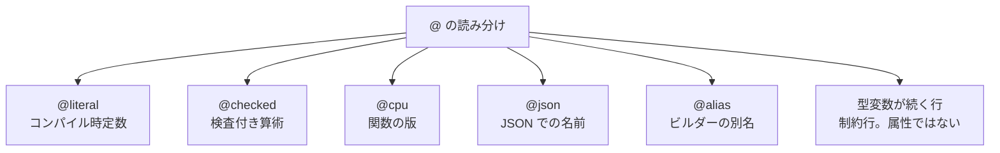

# 属性

`@` で始まる属性は、コンパイル時定数、検査付き算術、CPU ごとの関数の版、JSON での名前、コンピュテーション式ビルダーの別名をコンパイラへ伝えます。型変数の `@'a : 制約` は同じ記号で始まりますが、属性ではなく制約行です。

このページでは、5 つの属性の位置と効果、未知の属性がエラーになること、制約行との違いを説明します。

## この記事のポイント

- 属性は `@literal`、`@checked`、`@cpu`、`@json`、`@alias` の 5 つです。ユーザー定義の属性はありません。
- `@literal` は `def` の前に付け、`const` と同じコンパイル時定数にします。
- `@checked` は直後の式や文の整数演算を検査し、溢れると `OverflowException` になります。
- `@cpu` はトップレベル関数の `def` の前に付け、命令セットごとの版を作ります。ビルド先で選べない名前は無視されます。
- `@json "名前"` はレコードのフィールドや共用体の case の前に付け、導出した `Encode` / `Decode` が使う JSON の名前を変えます。
- `@alias 名前` は `.tc` のトップレベルに書き、`名前 { ... }` でそのビルダーを呼べるようにします。標準の `Async` は `@alias async` を宣言済みです。
- `@'a : 制約` は制約行です。属性の一覧には入りません。

## 属性の一覧と適用対象



| 属性 | 書ける位置 | 主な効果 | 関連ページ |
| --- | --- | --- | --- |
| `@literal` | `def` の直前。`private` はその前後 | `const` と同じコンパイル時定数 | [値](./values.md) |
| `@checked` | 式、または対応する文の直前 | `+` `-` `*` `**` と単項 `-` の桁あふれ検査 | [演算子と式](./op-and-expressions.md) |
| `@cpu` | `private` や `export` より前、トップレベル `def` の直前 | 命令セットごとの関数の版 | [関数 / 高階関数 / 再帰関数](./functions.md) |
| `@json` | レコードのフィールドの直前、共用体の case の直前 | 導出した `Encode` / `Decode` のキーとタグ | [Json](../built-in-types-and-modules/json.md) |
| `@alias` | `.tc` のトップレベルの 1 行 | `名前 { ... }` で呼べるビルダーの別名 | [コンピュテーション式](../computation-expressions/computation-expressions.md#ビルダーの別名) |

## @literal (コンパイル時定数)

`@literal` は、関数定義構文 `def` を使ってコンパイル時定数を宣言する属性です。

```text
@literal [private] def 名前 :: 型 = 式
```

この記法は `const 名前: 型 = 式` と同じです。名前と型の間は `::` です。`private @literal def` も `@literal private def` も非公開定数になります。

```tsuzuri run=200
@literal
def BaseLimit :: i64 = 100

BaseLimit * 2
```

実行結果:

```text
200
```

### 書ける位置とエラー

- `@literal` の直後には `def` または `private def` が続く必要があります。
- `record` や `union`、通常関数の実装 `fn` に `@literal` を付けると構文エラー `E0002` になります。
- `const` と同様に、同一ファイル内での前方参照や他モジュールからの参照（`モジュール名.定数名`）が可能です。

## @checked (検査付き算術)

整数演算は既定で型の幅に折り返します。金額や件数のように、溢れを失敗として受け取りたい式に `@checked` を付けます。

```text
@checked 式
@checked let 変数名 = 式
```

検査されるのは、注釈が付いた式や文が直接評価する整数の `+`、`-`、`*`、`**`、単項 `-` です。溢れると折り返さず `OverflowException` になります。呼び出した関数の中までは及びません。

```tsuzuri run=caught%20overflow
def safe_calc :: i32 -> i32 -> Result<i32, Exception> = \x y ->
    try
        @checked (x + y)
    with
    | e is OverflowException -> e

let status = match safe_calc 2147483647 1 with
| Ok _ -> "ok"
| Error _ -> "caught overflow"

status
```

実行結果:

```text
caught overflow
```

### 対象外となる演算と注意点

- **除算と剰余**: `/` と `%` のゼロ除算、符号付き最小値の `-1` による除算は `@checked` の対象外です。`try` でも捕捉できず、言語トラップになります。
- **式に付けられる属性**: `@checked` だけです。ほかの `@名前` を式に付けると `E0002` です。
- **波括弧ブロックと `task`**: 次の `let`、`use`、または式に付きます。`return` と `do` には付けられず、`E0002` です。
- **コンピュテーション式**: `let`、`let!`、`do!`、`return`、`yield` と式に付けられます。`if`、`for`、`while`、`match!` には直接付けられず、中の文に書きます（`E0002`）。

## @cpu (CPU 命令セットごとの関数の版)

`@cpu` は、1 つの関数から命令セットごとの版を同時に作る属性です。`private` や `export` より前、トップレベル `def` の直前に置きます。

```text
@cpu ["ターゲット名", ...]
[private | export] def 関数名 :: 型 = 実装
```

ネイティブの実行ファイルとオブジェクトは、ポータブルな基準版に加えて、指定した命令セットの版を出力します。実行時には、その関数の最初の呼び出しで対応する版を 1 回だけ選びます。WASM、`--emit llvm`、`--freestanding`、対応する命令セットのないビルド先（macOS の AArch64 など）では基準版だけを作ります。ビルド先で選べない名前はエラーにせず無視します。

```tsuzuri run=42
@cpu ["avx2", "sse4.2"]
def compute :: i64 -> i64 = \x -> x * 2

compute 21
```

実行結果:

```text
42
```

### 有効な CPU ターゲット名

`@cpu` の配列内には、以下の文字列リテラルのみを指定できます。

| ターゲット名 | アーキテクチャ | 対象の拡張命令セット |
| --- | --- | --- |
| `"sse4.2"` | x86_64 | SSE 4.2 |
| `"avx2"` | x86_64 | AVX2 / FMA |
| `"avx512"` | x86_64 | AVX-512 Foundation |
| `"sve"` | AArch64 | ARM Scalable Vector Extension |
| `"sve2"` | AArch64 | ARM Scalable Vector Extension 2 |

未知の名前（`"avx3"` など）、重複、空の並びは `E0002` です。選べないだけの名前は無視されます。

### @cpu 関数の制限事項

- **付けられる対象**: トップレベル関数の `def` だけです。レコード、共用体、型クラス、ローカル関数に付けると `E0002` です。`cpu` 自体は予約語ではありません。
- **256 bit ベクトル**: 引数と戻り値に 256 bit ベクトル（`i32x8` や `f64x4` など）を置けません。レコード、共用体、タプル、固定長配列の中に含めても `E1005` です。本体から、256 bit ベクトルを渡す関数値を呼ぶこともできません。128 bit のベクトル、スライス参照、スカラーを使います。

## @json (JSON での名前)

`@json "名前"` は、レコードのフィールドか共用体の case の前に付けます。`deriving (Encode, Decode)` で生成するコードが、宣言した名前の代わりにこの名前を JSON のキーやタグに使います。Tsuzuri のコードから見た名前は変わりません。

```tsuzuri run=%7B%22user_id%22%3A7%2C%22name%22%3A%22Ann%22%7D%20%22done%22
record User { @json "user_id" id: i64, name: string } deriving (Encode, Decode)
union State = Pending | @json "done" Finished deriving (Encode, Decode)

let user = User { id: 7, name: "Ann" }
let text = Result.get (Json.serialize (ref user))
let state = Result.get (Json.serialize (ref Finished))
$"{String.from_utf8 (ref text)} {String.from_utf8 (ref state)}"
```

実行結果:

```text
{"user_id":7,"name":"Ann"} "done"
```

### 書ける位置とエラー

- 名前は普通の文字列リテラル `"..."` です。`u8"..."`、補間文字列、数値などは `E0002` です。1 つのフィールドや case に `@json` は 1 つだけで、2 つ目も `E0002` です。
- フィールドと case の前に置けるのは `@json` だけです。`@literal` などは `E0002` です。
- その型が `deriving (Encode)` も `deriving (Decode)` も持たないと `E1025` です。
- 名前を変えた結果、2 つのフィールドや 2 つの case が同じ JSON の名前になると `E1025` です。
- `tsuzuri fmt` は `@json "名前"` の空白を整え、`tsuzuri doc` は属性を付けたまま表示します。言語サーバーでフィールドや case の名前を変えても、属性の名前は変わりません。

## @alias (ビルダーの別名)

`@alias 名前` は、ビルダーの `.tc` ファイルのトップレベルに 1 行で書きます。`名前 { ... }` が、そのビルダーの名前を書いた `Builder { ... }` と同じ計算になります。標準の `Async.tc` は `@alias async` を宣言しているので、`async { ... }` と `Async { ... }` は同じです。

```text
@alias identity

def Return :: 'a -> 'a
fn Return value = value
```

規則の全体と実行できる例は、[コンピュテーション式](../computation-expressions/computation-expressions.md#ビルダーの別名)にあります。

### 書ける位置とエラー

- `.tc` だけです。`.tz` と `.tt` に書くと `E1018` です。
- 名前は同じ行に置きます。小文字の ASCII で始まる識別子で、予約語と、`finally`、`is`、`namespace`、`of`、`try`、`using`、`where` は使えません。同じファイルで同じ名前を 2 回宣言しても、ドキュメントコメントを付けても、名前のあとに同じ行で別の語が続いても `E0002` です。
- `alias` 自体は予約語ではありません。`@` の直後に書いたときだけ属性の名前として読みます。
- `tsuzuri fmt` は `@alias 名前` の空白を整え、`tsuzuri doc` はモジュールのページに `Builder alias: ...` の行を出します。

## 制約行は属性ではない

`def` の次の行に、より深くインデントして `@'a : Eq` と書くのは制約行です。コンパイラはこれを `@literal` などの属性とは別に読みます。インデントが足りないと `E0002` です。

書き方は [制約 と 属性](../types-and-type-inference/constraints.md) と [ジェネリック関数と型パラメータ制約](./generics-functions.md) を参照してください。制約行の位置に `@literal` や `@checked` を混ぜても、制約にはなりません。

## ユーザー定義の属性はない

Tsuzuri 0.1.0 に、独自の属性やデコレータはありません。`@literal`、`@checked`、`@cpu`、`@json`、`@alias` 以外の `@名前`（`@serialize` など）は `E0002` です。動作を属性の裏側に隠さないための制限です。

## まとめ

- 属性は `@literal`、`@checked`、`@cpu`、`@json`、`@alias` の 5 つです。
- `@'a : 制約` は制約行であり、属性ではありません。
- ユーザー定義の属性はありません。
- `@literal` は `const` と同じコンパイル時定数です。
- `@checked` は直後の式や文の整数演算を検査し、溢れると `OverflowException` になります。
- `@cpu` は命令セットごとの関数の版を作ります。選べない名前は無視され、未知の名前は `E0002` です。
- `@json` は導出した `Encode` / `Decode` が使うフィールドや case の名前を変えます。
- `@alias` は `.tc` のビルダーに小文字の別名を足し、`async { ... }` のような書き方を可能にします。

## 関連項目

- [値](./values.md)
- [演算子と式](./op-and-expressions.md)
- [関数 / 高階関数 / 再帰関数](./functions.md)
- [コンピュテーション式](../computation-expressions/computation-expressions.md)
- [制約 と 属性](../types-and-type-inference/constraints.md)
- [ジェネリック関数と型パラメータ制約](./generics-functions.md)
- [例外処理](../exception-handling/exception-handling.md)
- [Json](../built-in-types-and-modules/json.md)
- [言語仕様: 検査付き算術と例外](../../../docs/language.md#検査付き算術と例外)
- [言語仕様: CPU ごとの関数の版](../../../docs/language.md#cpu-ごとの関数の版cpu)
- [言語リファレンスの目次](../index.md)

