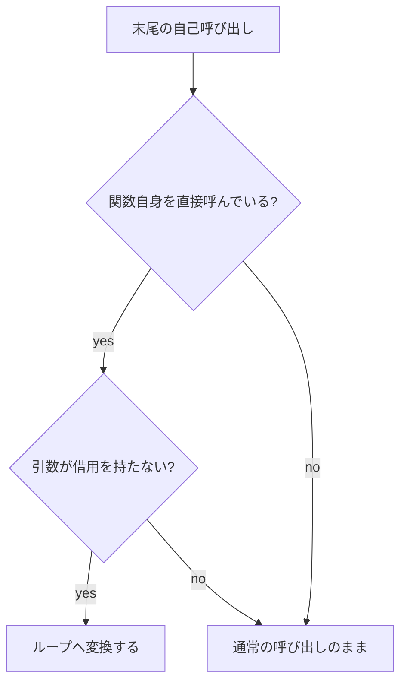

# 関数 / 高階関数 / 再帰関数

関数は Tsuzuri の基本的な値です。`def` で名前と型を書き、右辺のラムダ式で実装します。すべての関数はカリー化されているため、引数を一部だけ渡すと、残りの引数を待つ関数値が返ります。

このページでは関数の宣言、部分適用、パイプと合成、高階関数、再帰、関数ガードを扱います。ラムダ式の捕捉は[ラムダ式](./lambda-expressions.md)、型変数と制約は[ジェネリック関数と型パラメータ制約](./generics-functions.md)で詳しく解説します。

## この記事のポイント

- 宣言は `def name :: 型 = ラムダ式` が基本です。`::` を `:` にはできません。
- 引数なしの `answer()` と、`unit` を 1 つ渡す `accept ()` は別の関数です。
- `add 20 22` は `(add 20) 22` です。`20 |> add 22` のようにパイプでも渡せます。
- 標準ライブラリの高階関数は、関数を最初の引数に取ります。
- 再帰は `def rec` と、相互再帰の `and` で明示します。直接の末尾再帰は `-O0` でもループになります。
- 同じ名前のオーバーロードはありません。型で振り分けるときは型クラスを使います。

## 基本の書き方

```text
def name :: 引数型 -> ... -> 返却型 = \引数 ... ->
    本体
```

名前と型の間は `::` です。単一の `:` は `let`、`const`、レコードのフィールド用で、`def` に使うと `E0002` になります。

```tsuzuri run=42
def add :: i64 -> i64 -> i64 = \left right ->
    left + right

def answer :: i64 = add 20 22

def bonus :: unit -> i64 = \() -> 0

answer() + bonus ()
```

実行結果:

```text
42
```

`add` は 2 引数の関数です。`\left right ->` と `\left -> \right ->` は同じカリー化関数になります。型の `->` は右結合なので、`i64 -> i64 -> i64` は `i64 -> (i64 -> i64)` と同じです。関数を引数に取るときは `(i64 -> i64) -> i64` のように左を括弧で囲みます。

`answer` は引数を取りません。本体を直接書き、呼び出すときは `answer()` です。この関数値の型は `fn() -> i64` と書けます。`bonus` は `unit` を 1 つ受け取る通常の関数で、呼び出しは `bonus ()` です。空の `bonus()` は引数 0 個の適用になり、`E1006` になります。

> [!WARNING]
> `f()` と `f ()` は別です。前者は引数なし、後者は `unit` 値を 1 つ渡します。

名前は `calculate_total` のようなスネークケースを推奨します。構文上の強制ではありません。他の Tsuzuri モジュールから呼ぶために `export` は不要です。`export` はホスト向けの公開で、付けるなら `def` 側です。

式を引数にするときは括弧が必要です。適用はどの二項演算子よりも強く結合します。負のリテラルも `shift (-1)` のように括ります。

```text
add (base + 1) (step * 2)
```

## 宣言と実装を分ける

型だけを `def` で書き、実装を同じファイルの `fn` または `let` に分ける書き方も受理されます。隣接している必要はありません。`export` は `def` 側に付けます。

```tsuzuri run=42
def add :: i64 -> i64 -> i64
fn add left right = left + right

def identity :: i64 -> i64
let identity = \value -> value

identity (add 20 22)
```

実行結果:

```text
42
```

実装のない `def` は、ホスト関数を宣言する `extern def` や型クラスのメソッド宣言を除いてコンパイルエラーになります。同じ名前の宣言が重複している場合も `E1001` エラーになります。新しいコードでは、型宣言と実装を 1 つの `def` にまとめる書き方を推奨します。

`fn` 側で一部の引数だけを名前で受けると、本体はその時点までの計算を行い、残りの引数を待つ関数を返します。`\left right -> 本体` の本体は、両方の引数が揃ってから評価されます。途中に束縛を置くと、最初の引数を適用した時点でそこまでが評価されます。後続の引数を、この段階より前へ動かしてよい規則はありません。途中で束縛してから関数を返す形は、[ラムダ式](./lambda-expressions.md)の `scaled` が動く例です。

## カリー化と部分適用

```tsuzuri run=42
def add :: i64 -> i64 -> i64 = \left right -> left + right

let add_twenty = add 20
22 |> add_twenty
```

実行結果:

```text
42
```

`add 20 22` は `(add 20) 22` と同じです。`add 20` は `i64 -> i64` の関数値であり、レコードのフィールドや配列の要素にも配置できます。組み込み関数、型クラスのメソッド、部分適用そのものも同一の規則に従います。ただし、借用や捕捉の制限が消えるわけではありません。排他借用を受け取る関数はその場で完全に適用する必要があり、部分適用した関数値を後から呼び出す値として保存することはできません。

引数は左から右に評価します。空白による適用は改行をまたぎません。行頭の `|>`、`>>`、`<<`、`||`、`&&` は前の行から続く演算として読まれます。

## パイプと合成

`value |> transform` は、値を関数の次の引数として渡します。`f >> g` は `\x -> g (f x)`、`f << g` は `\x -> f (g x)` です。ビットシフトではありません。シフトは `<<<` と `>>>` です。

```tsuzuri run=32
def multiply :: i64 -> i64 -> i64 = \factor value -> factor * value

let double = multiply 2
let quantities = [3, 5, 8]
let piped = quantities |> Array.map double |> Array.sum
let composed = quantities |> (Array.map double >> Array.sum)
if piped == composed then piped else 0
```

実行結果:

```text
32
```

`double` が `i64` を受け取るので、`quantities` は `[i64]` になります。`Array.map` は変換関数を先に取るため、`quantities |> Array.map double` と書けます。合成はパイプより強く結合しますが、上のように括弧でまとめると、パイプへ渡す関数が読みやすくなります。

値を捨てて `unit` にする組み込み関数が `ignore` です。`bool` の否定を関数として渡すときは `not` を使えます。`!` も論理否定です。

## 高階関数

関数を受け取る、または返す関数が高階関数です。標準ライブラリは F# と同じく、関数を最初の引数に取ります。対象のコレクションが最後なので、パイプの右に置きやすい並びです。

| 関数 | 引数の並び |
| --- | --- |
| `Array.map` | 変換、配列 |
| `Array.map_ref` | `ref` を受け取る変換、配列 |
| `Array.fold` | 畳み込み、初期値、配列 |
| `Array.fold_back` | 畳み込み、配列、初期値 |

`Array.map` は要素の `Copy` を要求します。文字列のように複製しない要素は `Array.map_ref` を使います。

```tsuzuri run=4321
let numbers = [1, 2, 3, 4]
let total = Array.fold (\acc value -> acc + value) 0 numbers
let texts = ["a", "bcd"]
let lengths = texts |> Array.map_ref (\text -> text.length)
if total == 10 && lengths[1] == 3 then
    Array.fold_back (\value digits -> digits * 10 + value) numbers 0
else
    0
```

実行結果:

```text
4321
```

呼び出しの引数に書いたラムダ式は、ほかの引数より後に型検査されます。`texts |> Array.map_ref (\text -> text.length)` では左の `texts` が先に検査されるので、`text` の型注釈は要りません。評価順は変わりません。引数は左から右です。

ローカルな `let` に束縛した関数値は単相です。同じ値を `i64` 用と `string` 用の両方には使えません。複数の型で使う処理は、型変数を持つ `def` にします。詳しくは[ジェネリック関数と型パラメータ制約](./generics-functions.md)です。

## 再帰

自分自身を呼ぶ関数には `rec` が必要です。付け忘れると `E1019` になります。関数値、メソッド、演算子を経由する循環も検査されます。

```tsuzuri run=5050
def rec sum :: i64 -> i64 -> i64 = \remaining total ->
    if remaining <= 0 then total
    else sum (remaining - 1) (total + remaining)

sum 100 0
```

実行結果:

```text
5050
```

相互再帰は `def rec` に続けて `and` を書きます。`and` は直前の再帰グループを引き継ぐので、単独では使えません。型付きの `and` には `= 本体` が必要です。

```tsuzuri run=42
def rec even :: i64 -> bool = \value ->
    if value == 0 then true else odd (value - 1)
and odd :: i64 -> bool = \value ->
    if value == 0 then false else even (value - 1)

if even 42 then 42 else 0
```

実行結果:

```text
42
```

宣言と実装を分ける場合も、`rec` の有無を両方に揃えます。

```text
def rec sum :: i64 -> i64 -> i64
fn rec sum remaining total =
    if remaining == 0 then total
    else sum (remaining - 1) (total + remaining)
```

名前は `def rec` が束縛します。ラムダの先頭に自分の名前を引数として足す必要はありません。非再帰の前方参照に `rec` は不要です。`rec` を付けた関数が実際には自分を呼ばなくても、余分な再帰コードにはなりません。

Tsuzuri 0.1.0 のローカル束縛に `let rec` はありません。`E0002` になります。再帰する処理はモジュールの `def rec` にしてください。

自分自身への直接の末尾呼び出しは、`-O0` でもループへ変換されます。`if`、`match`、関数ガード、末尾のブロックも対象です。引数は古い環境で先に計算され、その後まとめてループ変数へ更新されます。呼び出し、副作用、トラップの順序は維持されます。

パイプライン演算子 `|>` による末尾再帰のループ化は、単項関数の `value |> self` のみサポートされています。複数引数の再帰呼び出しを `next |> self other` のようにパイプで書くとループ化されずスタックフレームを消費するため、`self other next` のように直接呼び出してください。



借用を引数に持つ関数や、借用を保持し得る関数値を引数に持つ関数は、参照先のフレームを再利用できないためループ化しません。相互再帰、関数値経由の再帰、末尾でない再帰に、スタックが一定である保証はありません。停止性も保証されません。ネイティブのスタック上限は OS の設定に依存します。詳しい上限は[言語仕様の再帰とスタック](../../../docs/language.md#再帰とスタック)を参照してください。

## 関数ガード

ラムダの `->` の直後に `|` 節を並べると、関数ガードになります。`fn` 形式では `=` を置かずに節を並べても同じです。

```tsuzuri run=%E5%9C%A7%E5%8B%9D
def judge :: i64 -> i64 -> string = \left right ->
    | diff > 10 -> "圧勝"
    | diff > 5 -> "接戦"
    | otherwise -> "互角"
    where
        diff = Int.abs (left - right)

judge 30 18
```

実行結果:

```text
圧勝
```

`diff > 10` のような比較は、引数を参照できる条件です。`otherwise` と `_` は無条件の節です。条件だけの節は網羅性に数えられないので、末尾に `otherwise` などが必要です。足りないと `E1021` になり、最初の `|` の位置に報告されます。

複数引数のパターン節は、引数のタプルに対する `match` です。条件だけの節では、このタプルは作られず、元の引数名をそのまま使えます。非 Copy の引数を分解したあとは、消費された元の名前ではなく、パターンで束縛した名前を使います。

`where` は `|` と同じインデントの独立した行に置きます。その下に `名前 = 式` を、より深く同じ深さで並べます。`let` は書きません。初期化はガードの判定より前に、書いた順で 1 回ずつ評価されます。使われなくても評価されます。遅延評価でも相互再帰でもありません。前の束縛と引数は参照できます。後ろの束縛や、節の中で束縛した名前は参照できません。スコープは、そのガード本体の中だけです。

パターン節の網羅性、所有権、借用は通常の [`match`](../pattern-matching/match.md) と同じです。

## 関数値はコピーできる

関数値自体は `Copy` です。捕捉が無い関数は環境を確保せず、既知の関数の完全適用は直接の呼び出しへ落とせる場合があります。

環境を持つ関数値を複製すると、捕捉した文字列や配列を含む独立したコピーが作られます。呼び出しのときも同じ規則で環境を取り出すので、捕捉した所有値を返す関数でも繰り返し呼べます。大きな捕捉の複製が軽いとは限りません。関数値が不要になると環境は解放され、GC や参照カウントは使いません。

```tsuzuri run=44
def add :: i64 -> i64 -> i64 = \left right -> left + right

let add_two = add 2
let also = add_two
add_two 20 + also 20
```

実行結果:

```text
44
```

捕捉の寿命、`ref mut` と `Task` を保存できない理由は[ラムダ式](./lambda-expressions.md)で説明します。

## オーバーロードはない

同じ名前を、引数の型だけ変えて複数定義することはできません。次は `E1001`（duplicate function signature）です。

```text
def add :: i64 -> i64 = \value -> value
def add :: string -> string = \text -> text
```

型に応じた演算は[型クラス](../types-and-type-inference/type-classes.md)へまとめます。`+` が数値でも文字列でも使えるのは、オーバーロードではなく `Add` のインスタンスです。

引数を関数の中で再代入するときは `\mut value ->` と書きます。これは別のオーバーロードではなく、その引数だけを可変にする印です。外側の `let mut` をラムダから代入し直すことはできません。捕捉された変数は環境の中で不変です。

## 他の言語との比較

| | Tsuzuri | F# | Rust |
| --- | --- | --- | --- |
| 宣言 | `def name :: 型 = \x ->` | `let name x =` | `fn name(x: T) -> R` |
| カリー化 | すべての関数 | すべての関数 | なし。クロージャで部分適用する |
| 再帰 | `rec` が必要 | `let rec` | 名前があれば再帰できる |
| 高階関数の引数順 | 関数が先 | 関数が先 | トレイトやクロージャが先のことが多い |
| オーバーロード | なし。型クラス | なし。静的メンバー制約など | トレイト |

互換のため、`fn name(left: i64, right: i64) -> i64 { left + right }` や `add(20, 22)` も受理されます。`fn name :: 型` は受理されず、`def name :: 型` へ移します。バックスラッシュ無しの `value -> 式` も互換構文です。新しいコードでは `\value -> 式` と空白適用を使ってください。

## 注意点

- 関数ではない値へ引数を渡すと `E1005` エラーになります。
- 改行の後へ空白適用は継続しません。複数行にわたる演算は行頭に演算子を置きます。
- 末尾再帰のループ化は、直接の自己呼び出しと単項の `value |> self` が対象です。複数引数のパイプライン呼び出しはループ化されません。
- 停止しない再帰はループ化されても終了しません。基底条件を確実に記述してください。

## まとめ

- `def name :: 型 = ラムダ式` で宣言と実装を一緒に書けます。
- `answer()` は引数なし、`accept ()` は `unit` を 1 つ渡す呼び出しです。
- 部分適用、`|>`、`>>`、`<<` は通常の関数値の操作です。
- 標準ライブラリは関数を先に取るので、コレクションをパイプで渡せます。
- 再帰は `def rec` と `and` で明示し、直接の末尾再帰はループになります。
- 同名のオーバーロードはなく、型による分岐は型クラスです。

## 関連項目

- [ラムダ式](./lambda-expressions.md)
- [ジェネリック関数と型パラメータ制約](./generics-functions.md)
- [演算子と式](./op-and-expressions.md)
- [型クラス](../types-and-type-inference/type-classes.md)
- [制約 と 属性](../types-and-type-inference/constraints.md)
- [match 式](../pattern-matching/match.md)
- [所有権とムーブ](../ownership-and-memory/ownership.md)
- [Array](../built-in-types-and-modules/array.md)
- [関数の宣言と適用](../../../docs/language.md#関数の宣言と適用)
- [関数ガード](../../../docs/language.md#関数ガード)
- [再帰とスタック](../../../docs/language.md#再帰とスタック)
- [言語リファレンスの目次](../index.md)

