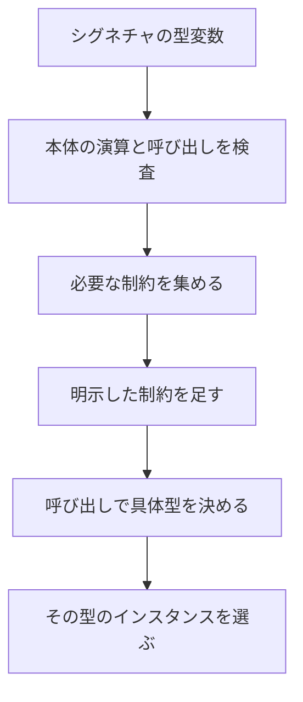

# ジェネリック関数と型パラメータ制約

同じ処理を、数値でも文字列でも、自分で定義したレコードでも使いたいときにジェネリック関数を使います。`'a` のような型変数が「あとで決まる型」を表し、制約がその型に必要な演算を宣言します。

インスタンスの書き方と `dyn` は[型クラス](../types-and-type-inference/type-classes.md)、制約の一覧とエラーの読み方は[制約 と 属性](../types-and-type-inference/constraints.md)にまとめています。ここでは関数のシグネチャに絞ります。

## この記事のポイント

- `'a` はシグネチャの中で暗黙に全称量化されます。呼び出しごとに具体的な型が入ります。
- 制約の書き方は 3 つあり、意味は同じ集合へ足されます。
- 本体で `+` を使うと `Add<'a>` が推論されます。明示した制約はそれに追加されます。
- ローカルな `let` は単相です。複数の型で使う関数は `def` にします。
- 具体化はコンパイル時の単相化です。実行時の辞書は作りません。

## 型変数

シングルクォートで始まる `'a` や `'value` が型変数です。関数のシグネチャに現れると、その関数は「その変数がどの型でもよい」という全称量化になります。呼び出しのたびに、引数と戻り値から新しい具体化が作られます。

```tsuzuri run=42
def identity :: 'a -> 'a = \value -> value

let number: i64 = identity 42
number
```

実行結果:

```text
42
```

同じ `'a` は同一の型を表します。そのため、`'a -> 'a` というシグネチャを持つ関数は、受け取った引数をそのまま返すことしかできません。別の型の値を返したり、型 `'a` のフィールドを勝手に読み取ろうとする関数本体は、たとえ呼び出し側で使われていなくてもコンパイル時に拒否されます。シグネチャを持つ関数は、呼び出しの有無にかかわらず抽象型のまま厳密に静的型検査を受けるためです。

型変数は配列、リスト、参照、関数型、タスクの内部にも自由に使用できます。なお、`'_` のような無名の型変数は字句エラー `E0001` になります。

## 制約の 3 つの書き方

制約は「この型変数に、この型クラスのインスタンスがある」という条件です。次の 3 つは、同じ制約を足すための別記法です。一つの関数に重複して宣言するものではありません。

```text
def add :: Add<'a> -> 'a -> 'a
def add :: Add<'a> => 'a -> 'a -> 'a
def add :: 'a -> 'a -> 'a
    @'a : Add
```

`Add<'a> -> 'a -> 'a` の `Add<'a>` は、引数が 1 つ増えたのではありません。`'a` に `Add` を要求する注釈です。右の `'a -> 'a` が実際の関数型です。`=>` 形式は、制約と関数型の境目が矢印の数で見えるので、引数が 2 つ以上のときに読みやすくなります。

```tsuzuri run=42
def add :: Add<'a> -> 'a -> 'a = \left right -> left + right

add 20 22
```

実行結果:

```text
42
```

複数の制約は、括弧でまとめて `=>` の左に置くか、`@` 行へ並べます。

```tsuzuri run=42
def twice :: (Add<'a>, Copy<'a>) => 'a -> 'a = \value -> value + value

twice 21
```

実行結果:

```text
42
```

`twice` は加算と複製の両方を要求します。`+` 演算子が `Add` 制約、同一の引数を二度使う操作が `Copy` 制約に対応します。文字列はこの `twice` に渡せません。文字列は `Add` を満たしますが、`Copy` ではないためです。

`@` 行は `def` より深くインデントし、複数行にわたる場合は同じ深さに揃えます。型変数、コロン、制約リストは同一行に記述します。

```tsuzuri run=42
def increment :: 'a -> 'a
    @'a : Add, Integer = \value -> value + 1

increment 41
```

実行結果:

```text
42
```

`Integer` は「整数型である」ことを示す組み込み制約です。`+ 1` の `1` をその整数型として受け取るために必要になります。型クラス名は `Traits.Score` のようにモジュール修飾して指定することも可能です。`@` 行と、`=>` やインラインの `Add<'a>` 記法は自由に併用できます。

シグネチャに存在しない型変数に対して制約を指定すると `E1015`（constraint mentions a type variable absent from the signature）エラーになります。未宣言の未知のクラス名を指定した場合は `E1016`（unknown type class）エラーになります。

## 制約は推論される

本体で `+` を使うと `Add` が、複製や配列要素の取り出しで `Copy` が、呼び出している関数の制約も順に推論されます。相互再帰でも、定義順に依存せず伝播します。明示した制約は、推論結果へ追加されます。

```tsuzuri run=42
def add :: 'a -> 'a -> 'a = \left right -> left + right

add 20 22
```

実行結果:

```text
42
```

この `add` のシグネチャには `Add` を明記していませんが、本体の `+` 演算子から自動推論されます。呼び出し側で引数が `i64` に決まると、`Add<i64>` の組み込みインスタンスが選択されます。該当するインスタンスが存在しない型を渡した場合は `E1005` エラーになります。



推論に任せるとシグネチャが短くなります。公開する関数では、必要な `Copy` や `Send` を書いておくと、呼び出し側のエラーが「この関数の制約」として読めます。

## 定義元モジュールの関数を要求する

型クラスのインスタンスを定義せずに、「その型を定義したモジュールに、指定した関数が存在する」ことを要求できます。指定する場所は `@` 行です。`#` の直後に、モジュール名で修飾しない関数名を記述します。

関数の型を省略した場合、使用箇所の呼び出し形式から関数型を自動推論します。型が確定しない場合は `E1015` エラーになるため、`(#name: 型)` のように明示的に注釈できます。

`Foo.tz`:

```tsuzuri project=priced file=Foo.tz
record Foo { num: i32 }

def value :: Foo -> i32 = \item -> item.num
```

`Main.tz`:

```tsuzuri project=priced file=Main.tz run=30
def add :: 'T -> 'T -> 'U
    @'T : (#value: 'T -> 'U) = \left right ->
        ('T.value left) + ('T.value right)

add (Foo { num: 10 }) (Foo { num: 20 })
```

実行結果:

```text
30
```

`'T.value left` は、`'T` が `Foo` に決まった時点で `Foo.value` の直接呼び出しへと展開されます。実行時にメソッドを動的探索するコストは一切発生しません。型を省略した `@'T : #value` も、使用箇所から型が一意に定まる場合は同様に解決されます。

```text
def total_of :: 'value -> 'result
    @'value : #total = \value -> 'value.total value
```

制約の対象となる型はレコードと共用体に限定されます。プリミティブ型や配列には定義元モジュールが存在しないため、これらを具体化しようとすると `E1005` エラーになります。ジェネリックなレコードであっても、型引数のモジュールではなく、そのレコード自身を定義したモジュールから解決されます。また、他モジュールに存在する同名関数へ勝手にフォールバックすることはありません。

`#distance` 制約を宣言しただけで本体から一度も呼び出さなかった場合でも、型の具体化時に関数の存在が静的に検査されます。可視性の判定はジェネリック関数を定義したモジュールを基準として行われ、他モジュールの `private` 関数を指定した場合は `E1022` エラーになります。なお、`'T.distance` を対応する `#distance` 制約なしで呼び出すと `E1016` エラーになります。

`'T.distance` は通常の第一級関数値として他の関数へ引き渡せます。部分適用、ムーブ、借用の規則も通常の関数と同一です。呼び出される対象関数自身が持つ制約条件も、通常どおり検証されます。

## ランク 1 とローカルな単相

Tsuzuri の多相はランク 1（Rank-1 polymorphism）です。型変数を全称量化できるのは名前付き関数のシグネチャに限定され、高階関数の引数は呼び出し位置ごとに単一の具体的な関数型であることが要求されます。

```tsuzuri run=42
def identity :: 'a -> 'a = \value -> value

def apply :: ('a -> 'b) -> 'a -> 'b = \transform value -> transform value

apply identity 42
```

実行結果:

```text
42
```

上記の `apply identity 42` では、`identity` はその呼び出しのために `i64 -> i64` へと具体化されます。`apply` の本体が、受け取った関数を `i64` と `string` の両方に対して呼び分けるような高ランク多相のコードは記述できません。

関数内部のローカルな `let` で束縛された関数値も単相（monomorphic）として扱われます。次の `f` は型が確定しないため、`E1015`（ambiguous polymorphic use）エラーになります。

```text
def identity :: 'a -> 'a = \value -> value
let f = identity
```

使用箇所が 1 つだけであればその具象型に固定されますが、同じ `f` を `i64` と `string` の両方に使い回そうとすると `E1003` エラーになります。複数の型に対して汎用的に適用したい関数は、ローカルな `let` ではなくトップレベルの `def` として定義してください。

```text
let number: i64 = identity 42
```

このように使用側で明示的な型注釈を与えれば、その呼び出しに対応する具象型へと安全に具体化されます。

## 単相化

制約付きの関数は、呼び出しの具体型ごとに通常の関数へ複製されます。これを単相化といいます。`twice 21` は `i64` 専用の `twice` になり、`+` は `i64` の加算そのものです。実行時に型クラスの辞書を引く処理はありません。

型が無限に増大し続ける多相再帰にはリソース上限が設けられています。追加の特殊化は最大 1024 件、型のネスト深度は最大 128、型の構成要素数は最大 4096、関数へ伝播する型クラス制約およびモジュール関数制約はそれぞれ最大 128 件までであり、これらを超過した場合は `E1017` リソース上限エラーになります。実行時に異なる型を 1 つのコレクションなどにまとめたい場合は、[型クラス](../types-and-type-inference/type-classes.md)の動的ディスパッチ（`dyn`）を使用します。

ジェネリックなレコードや高階型の具体化は[ジェネリック](../types-and-type-inference/generics.md)で説明します。

## 他の言語との比較

| | Tsuzuri | F# | Rust |
| --- | --- | --- | --- |
| 型変数 | `'a`。シグネチャで全称量化 | `'a` | `<T>` を明示 |
| 制約 | `Add<'a> =>` または `@'a : Add` | 静的メンバー制約など | `T: Add` |
| ローカルな関数 | 単相 | 制限付きで汎化されることがある | ジェネリックなクロージャは別の機能 |
| ディスパッチ | 単相化。`dyn` だけ実行時 | 通常は単相化 | 単相化。`dyn Trait` が実行時 |

## 注意点

- `Add<'a> -> 'a -> 'a` は 3 引数ではありません。先頭は制約です。
- `@` 行はシグネチャの次の行にインデントします。同じ行の末尾へは書けません。
- モジュール関数制約の `#name` は `@` 行に書きます。`=>` の左には置けません。
- 推論された制約と書いた制約が矛盾すると、呼び出し側か本体でエラーになります。黙って緩めることはありません。

## まとめ

- `'a` は関数シグネチャで全称量化される型変数です。
- 制約はインライン、`=>`、インデントした `@` 行の 3 通りで、同じ集合へ足されます。
- `+` や呼び出しから制約は推論されます。
- `#関数名` は、型の定義元モジュールにある関数を静的に要求します。
- ローカルな `let` は単相、名前付きの `def` はランク 1 の多相です。
- 具体化は単相化で、実行時辞書は作りません。

## 関連項目

- [関数 / 高階関数 / 再帰関数](./functions.md)
- [ラムダ式](./lambda-expressions.md)
- [ジェネリック](../types-and-type-inference/generics.md)
- [型クラス](../types-and-type-inference/type-classes.md)
- [制約 と 属性](../types-and-type-inference/constraints.md)
- [型推論](../types-and-type-inference/type-inference.md)
- [多相関数と型クラス](../../../docs/language.md#多相関数と型クラス)
- [モジュール関数の制約](../../../docs/language.md#モジュール関数の制約)
- [言語リファレンスの目次](../index.md)

