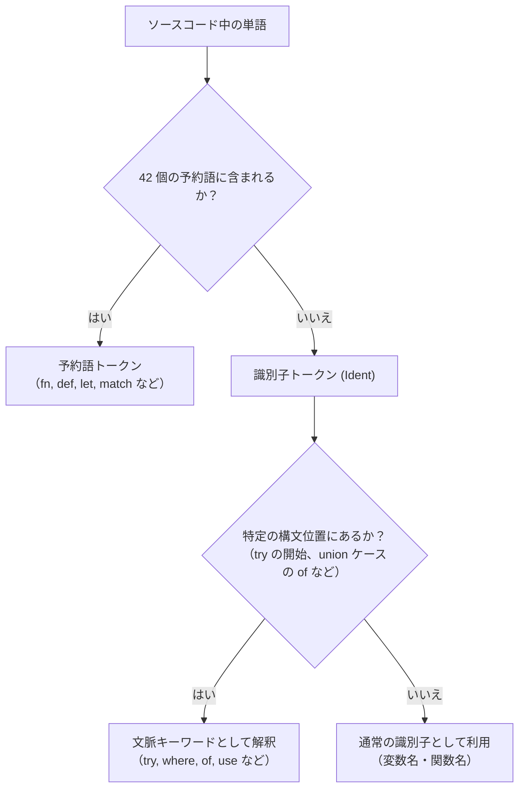

# キーワード

Tsuzuri にはプログラムの構造を決定する 42 個の「予約語（Reserved Keywords）」と、特定の構文でのみ特別な意味を持つ「文脈キーワード（Contextual Keywords）」があります。

このページでは、予約語の一覧、文脈キーワード、識別子の規則、`union` だけがドットの直後に書ける例外を説明します。

## この記事のポイント

- Tsuzuri には 42 個の予約語があり、原則として変数名や関数名などの識別子に使えません。
- `of`、`where`、`namespace`、`using`、`use`、`try`、`finally`、`is`、`otherwise` は文脈キーワードであり、所定の構文以外では通常の変数名として利用できます。
- 例外として、予約語 `union` はドット直後のメンバー名（例: `Set.union`）として利用可能です。
- `not`、`ignore`、`assert` は予約語ではなく、値として渡せる組み込み関数です。
- 小文字の `task`（予約語）と大文字始まりの `Task`（組み込みモジュール名）は区別されます。

## 予約語と文脈キーワードの違い

予約語は字句解析の段階で、いつもキーワードとして読まれます。文脈キーワードは、特定の位置に来たときだけキーワードになり、それ以外は普通の名前です。



## 予約語の一覧（分類別）

Tsuzuri の全 42 個の予約語を用途別に分けて示します。

### 宣言と定義

| キーワード | 概要 | 使用例 | 関連ページ |
| --- | --- | --- | --- |
| `def` | 関数の型シグネチャ、または型クラスのメソッド宣言 | `def add :: i64 -> i64 -> i64` | [関数 / 高階関数 / 再帰関数](./functions.md) |
| `fn` | 関数シグネチャに対応する関数の実装 | `fn add x y = x + y` | [関数 / 高階関数 / 再帰関数](./functions.md) |
| `let` | ローカル変数の不変束縛、または関数の実装 | `let count = 42` | [値](./values.md) |
| `const` | コンパイル時定数の宣言 | `const MaxSize: i64 = 1024` | [値](./values.md) |
| `rec` | 再帰関数の明示 | `def rec fib :: i64 -> i64` | [関数 / 高階関数 / 再帰関数](./functions.md) |
| `and` | 相互再帰の結合。`and!` はコンピュテーション式の束縛グループ | `def f :: ... and g :: ...` | [関数 / 高階関数 / 再帰関数](./functions.md) |
| `type` | 型エイリアス（型別名）の宣言 | `type UserId = i64` | [型エイリアス](../types-and-type-inference/alias.md) |
| `record` | レコード型（構造体）の定義 | `record Point { x: f64, y: f64 }` | [Record](../built-in-types-and-modules/record.md) |
| `union` | 共用体（直和型）の定義 | `union Shape = \| Circle of f64` | [Union](../built-in-types-and-modules/union.md) |
| `class` | 型クラス（インターフェース）の宣言 | `class Show<'a> { def show :: ... }` | [型クラス](../types-and-type-inference/type-classes.md) |
| `instance` | 型クラスのインスタンス実装 | `instance Show<i32> { fn show ... }` | [型クラス](../types-and-type-inference/type-classes.md) |
| `deriving` | 型定義での型クラスインスタンス自動導出 | `deriving (Eq, Ord)` | [制約 と 属性](../types-and-type-inference/constraints.md) |
| `test` | 言語内テストの定義 | `test "check" = assert (1 + 1 == 2)` | [テスト](../built-in-types-and-modules/test.md) |

### 可視性と外部連携

| キーワード | 概要 | 使用例 | 関連ページ |
| --- | --- | --- | --- |
| `export` | ホスト環境や他モジュール向けに関数を公開 | `export def main :: unit -> i32` | [アクセス制御](../organizing-tsuzuri/access-control.md) |
| `extern` | C ABI などのホスト関数のインポート宣言 | `extern "c" def puts :: ...` | [ネイティブ連携 (C ABI)](../compiler/native-interop.md) |
| `private` | モジュール内限定の非公開要素として宣言 | `private def helper :: i64 -> i64` | [アクセス制御](../organizing-tsuzuri/access-control.md) |

### 制御構文とループ

| キーワード | 概要 | 使用例 | 関連ページ |
| --- | --- | --- | --- |
| `if` | 条件分岐式の開始 | `if ready then 1 else 0` | [if 式](../loops-and-conditionals/if.md) |
| `then` | `if` 式の真の節 | `if x > 0 then x else -x` | [if 式](../loops-and-conditionals/if.md) |
| `elif` | `if` 式の追加条件節 | `elif x == 0 then 0` | [if 式](../loops-and-conditionals/if.md) |
| `else` | `if` 式の偽の節 | `else fallback` | [if 式](../loops-and-conditionals/if.md) |
| `for` | 範囲やコレクションのループ | `for item in items do ...` | [for...in 式](../loops-and-conditionals/for-in.md) |
| `in` | `for...in` ループの反復対象指定 | `for x in [1, 2, 3] do ...` | [for...in 式](../loops-and-conditionals/for-in.md) |
| `to` | `for...to` ループの終了値（昇順）指定 | `for i = 0 to 10 do ...` | [for...to 式](../loops-and-conditionals/for-to.md) |
| `downto` | `for...downto` ループの終了値（降順）指定 | `for i = 10 downto 0 do ...` | [for...to 式](../loops-and-conditionals/for-to.md) |
| `while` | 条件反復ループの開始 | `while is_running do ...` | [while 式](../loops-and-conditionals/while.md) |
| `do` | ループ本体や実行節の開始 | `for i in xs do total = total + i` | [ステートメント](./statements.md) |
| `break` | ループの途中脱出 | `if stop then break` | [while 式](../loops-and-conditionals/while.md) |
| `continue` | ループの次イテレーションへの移行 | `if skip then continue` | [while 式](../loops-and-conditionals/while.md) |

### パターンマッチング

| キーワード | 概要 | 使用例 | 関連ページ |
| --- | --- | --- | --- |
| `match` | パターンマッチ式の開始 | `match value with \| 0 -> "zero"` | [match 式](../pattern-matching/match.md) |
| `with` | `match` と `try` の節、レコード更新。変数名には使えない | `{ p with x = 10.0 }` | [Record](../built-in-types-and-modules/record.md) |
| `when` | パターンマッチのガード条件 | `\| n when n > 0 -> n` | [パターンマッチング](../pattern-matching/pattern-matching.md) |

### メモリ、参照、型操作

| キーワード | 概要 | 使用例 | 関連ページ |
| --- | --- | --- | --- |
| `mut` | 可変なローカル束縛の宣言 | `let mut counter = 0` | [値](./values.md) |
| `ref` | 共有借用の作成（前置構文） | `ref text` | [借用と参照](../ownership-and-memory/borrowing.md) |
| `deref` | 参照外しの実行（前置構文） | `deref pointer` | [借用と参照](../ownership-and-memory/borrowing.md) |
| `new` | 配列やヒープメモリの初期化 | `new [i64](5, \i -> i * 2)` | [スタックとヒープ](../ownership-and-memory/stack-and-heap.md) |
| `as` | 明示的な数値型のキャスト | `value as f64` | [型キャスト](../types-and-type-inference/cast.md) |
| `dyn` | 型クラスの動的ディスパッチ | `dyn Show` | [型クラス](../types-and-type-inference/type-classes.md) |

### 非同期、タスク、コンピュテーション式

| キーワード | 概要 | 使用例 | 関連ページ |
| --- | --- | --- | --- |
| `task` | 並行タスクブロックの定義 | `task { return 42 }` | [Task 式](../async-tasks-and-lazy/task.md) |
| `return` | タスクやコンピュテーション式での値返却 | `return result` | [コンピュテーション式](../computation-expressions/computation-expressions.md) |
| `yield` | シーケンスビルダーなどでの要素生成 | `yield item` | [コンピュテーション式](../computation-expressions/computation-expressions.md) |

### 真理値リテラル

| キーワード | 概要 | 使用例 | 関連ページ |
| --- | --- | --- | --- |
| `true` | 真を表す真理値リテラル | `let ok: bool = true` | [基本型](../types-and-type-inference/basic-types.md) |
| `false` | 偽を表す真理値リテラル | `let failed = false` | [基本型](../types-and-type-inference/basic-types.md) |

## 文脈キーワード

文脈キーワードは、特定の構文位置でのみ特別な意味を持ちます。それ以外の場所では通常の識別子（変数名や関数名）として自由に宣言・参照できます。

| キーワード | 解釈される文脈 | 役割 | 関連ページ |
| --- | --- | --- | --- |
| `of` | `union` のケース定義 | バリアントの保持するペイロード型の指定 | [Union](../built-in-types-and-modules/union.md) |
| `where` | 関数ガードの末尾 | ガード節で参照するローカル束縛の定義 | [関数 / 高階関数 / 再帰関数](./functions.md) |
| `namespace` | ファイル先頭 | ファイルが属する名前空間パスの宣言 | [名前空間](../organizing-tsuzuri/namespaces.md) |
| `using` | ファイル先頭の名前空間宣言直後 | 他の名前空間のインポート宣言 | [using 宣言](../organizing-tsuzuri/using-declarations.md) |
| `use` / `use!` | ブロックやコンピュテーション式内 | `Drop` 型をスコープ終了時に解放する束縛。`use!` は `use` と `!` の 2 トークン | [use キーワード](../exception-handling/use.md) |
| `try` | 同じ括弧の深さに `with` が続くとき | 例外を捕捉する式の開始。`with` がなければ変数名 | [try 式](../exception-handling/try-with-finally.md) |
| `finally` | `try ... with` の末尾 | 例外の有無にかかわらず実行される後処理節 | [try 式](../exception-handling/try-with-finally.md) |
| `is` | `try ... with` のハンドラー節 | 例外型（`OverflowException` など）の判定 | [例外処理](../exception-handling/exception-handling.md) |
| `otherwise` | パターンの位置（`match` やラムダ引数） | ワイルドカード `_` と同じ。その名前では束縛されない | [パターンマッチング](../pattern-matching/pattern-matching.md) |

### 文脈キーワードを変数名として使う例

文脈キーワードは予約語ではないため、通常のローカル変数名として定義して利用できます。

```tsuzuri run=55
def choose :: i64 -> i64 = \value ->
    | diff > 10 -> diff
    | otherwise -> 0
    where
        diff = Int.abs value

let where = 40
choose (-15) + where
```

実行結果:

```text
55
```

上の例では、関数ガードの `otherwise` と `where` は文脈キーワードです。続く `let where = 40` は、同じ綴りのローカル変数です。

`try`、`finally`、`is` も変数名にできます。`try 1` のように `with` が続かない `try` は、try 式ではなく名前です。一方 `with` は予約語なので、`let with = 1` は `E0002` になります。

`otherwise` をパターンに書くと `_` と同じワイルドカードです。ラムダ引数 `\otherwise -> otherwise` も名前を束縛せず、本体の `otherwise` は `E1002` になります。

```tsuzuri run=42
let try = 10
let finally = 20
let is = 12

try + finally + is
```

実行結果:

```text
42
```

> [!TIP]
> 構文上は変数名にできます。読みにくくなりやすいので、文脈キーワードの多用は避けた方がよいです。

## 識別子の規則と例外

### 命名規則

Tsuzuri の識別子は以下の規則に従います。

- 先頭は ASCII 英字（`a`〜`z`、`A`〜`Z`）またはアンダースコア `_` です。
- 2 文字目以降は ASCII 英数字（`a`〜`z`、`A`〜`Z`、`0`〜`9`）または `_` です。
- 大文字と小文字は区別されます（`count` と `Count` は別の名前です）。
- 日本語などの非 ASCII 文字は変数名に使えません。字句エラー `E0001` になります。文字列リテラルの中には書けます。

### 予約語は識別子に使えない

42 個の予約語を変数名、関数名、型名、レコードのフィールド名に使うと、`E0002`（expected an identifier）になります。

```text
// コンパイルエラー E0002
let fn = 10
let mut = 20
record Item { type: string }
```

### 例外: 予約語 union のメンバー名利用

予約語のうち `union` だけは、ドット `.` の直後に置くメンバー名（フィールドアクセスやモジュール関数の参照）として特別に許可されています。

```tsuzuri run=3
let s1 = Set.insert (Set.singleton 1) 2
let s2 = Set.insert (Set.singleton 2) 3
let s3 = Set.union s1 s2

Set.length ref s3
```

実行結果:

```text
3
```

標準ライブラリの `Set` は、集合の和を `def union` として定義しています。`Set.union` と書けるよう、ドットの直後の `union` だけは名前として読まれます。単独の変数名や型名には使えません。

### 予約語ではない組み込み識別子

以下の名前は予約語ではありません。

- **`not`**: 論理否定の組み込み関数（`bool -> bool`）です。`!` と同じ働きで、関数値として渡せます。
- **`ignore`**: 引数を捨てて `unit` を返す組み込み関数（`'a -> unit`）です。
- **`assert`**: 条件が偽ならトラップする組み込み関数（`bool -> unit`）です。予約語ではなく、関数値として渡せます。
- **`Task`**: タスクの組み込みモジュールおよび型名です。小文字の `task` は予約語、大文字の `Task` は別の名前です。
- **予約モジュール名**: `Maybe` や `Array` などはキーワードではありません。ファイル名（モジュール名）として使うと `E1011` です。関数名やレコード名には使えます。

## まとめ

- Tsuzuri には 42 個の予約語があり、構文構造の基本を定義しています。
- 予約語は変数名や関数名などの識別子に使えません。
- `union` は予約語ですが、`Set.union` のようにドット直後のメンバー名としては利用可能です。
- `where`、`of`、`use`、`try`、`finally`、`is`、`otherwise`、`namespace`、`using` は文脈キーワードです。所定の位置以外では普通の名前です。`with` は予約語です。
- `not`、`ignore`、`assert` は組み込み関数であり、予約語ではありません。

## 関連項目

- [値](./values.md)
- [演算子と式](./op-and-expressions.md)
- [ステートメント](./statements.md)
- [特殊文字](./tokens.md)
- [関数 / 高階関数 / 再帰関数](./functions.md)
- [言語仕様: 予約語](../../../docs/language.md#ソースと宣言)
- [言語リファレンスの目次](../index.md)

