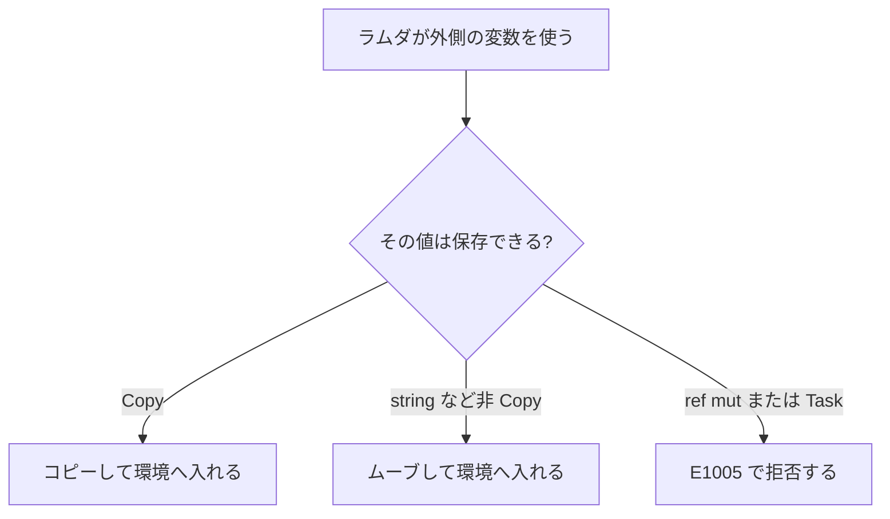

# ラムダ式

ラムダ式は名前を持たない匿名関数です。その場で高階関数へ変換処理を渡したい場合や、外側の変数を捕捉して利用したい場合に使用します。本体コードはラムダ式を定義した瞬間ではなく、実際に呼び出された時点で評価されます。

名前付き関数の宣言、カリー化、再帰関数の詳細は[関数 / 高階関数 / 再帰関数](./functions.md)で扱います。このページでは、ラムダ式の引数の記述方法と、外側の値を捕捉（キャプチャ）するセマンティクスを中心に解説します。

## この記事のポイント

- 基本形は `\引数 -> 本体` です。複数引数は空白で並べても、ネストしても同じカリー化です。
- `\(left, right) ->` はタプル 1 つの分解で、2 引数関数ではありません。
- `()` は `unit` を 1 つ受け取るパターンです。引数なし関数の `f()` とは違います。
- Copy の値はコピーされ、`string` などの非 Copy は関数値へムーブされます。
- `ref mut` と `Task` は、後から何度も呼ぶ関数値へ保存できません。

## 基本の書き方

```text
\引数 引数 -> 本体
\引数 ->
    インデントした本体
```

```tsuzuri run=42
let total = \left right -> left + right
total 20 22
```

実行結果:

```text
42
```

`\left right ->` は `\left -> \right ->` と同じです。引数が揃うまで本体は評価されません。

```tsuzuri run=42
let add = \x -> \y -> \z -> x + y + z
add 10 20 12
```

実行結果:

```text
42
```

`add 10` は残りの 2 引数を待つ関数、`add 10 20` は残りの 1 引数を待つ関数です。型の `->` も右結合なので、`i64 -> i64 -> i64` は `i64 -> (i64 -> i64)` と同じです。

本体を複数行にするときは、`->` の次の行を深くインデントします。波括弧のブロックも使えます。

```tsuzuri run=positive
def describe :: i64 -> string = \value ->
    let label = if value > 0 then "positive" else "other"
    label

describe 3
```

実行結果:

```text
positive
```

最初の引数を受けた時点で途中の束縛を評価し、残りの関数を返したいときは、ネストしたラムダを返します。

```tsuzuri run=42
def scaled :: i64 -> i64 -> i64 = \factor ->
    let base = factor * 2
    \amount -> base + amount

scaled 10 22
```

実行結果:

```text
42
```

`base` の初期化は `scaled 10` の時点で行われ、返った関数が `22` を受け取ります。

## 型注釈とパターン引数

引数の型は、呼び出し、束縛側の注釈、本体から推論されます。明示するときは引数を括弧で囲みます。

```text
\(value: i64) -> value + 1
\(transform: i64 -> i64) amount -> transform amount
let shift: i64 -> i64 = \value -> value + 1
```

```tsuzuri run=42
let add = \(left: i64) right -> left + right
add 20 22
```

実行結果:

```text
42
```

`\(left, right) ->` はタプルを 1 つ受けて分解します。カリー化された 2 引数関数ではないので、呼び出しは `total (20, 22)` です。

```tsuzuri run=42
let total = \(left, right) -> left + right
total (20, 22)
```

実行結果:

```text
42
```

`\() -> 42` は `unit` パターンです。呼び出しは `answer ()` で、引数なしの `answer()` ではありません。

```tsuzuri run=42
let answer = \() -> 42
answer ()
```

実行結果:

```text
42
```

引数パターンの網羅性は、`match` と違ってコンパイル時には検査されません。適用時に一致しなければ実行時トラップです。定数だけのパターンを引数に書くときは、その値以外が来ないことを呼び出し側で保証してください。

## when ガード

引数の直後に `when` 条件を書くと、条件が false の適用もパターン不一致としてトラップします。

```text
\value when value > 0 -> value / 2
```

```tsuzuri run=42
let half = \value when value > 0 -> value / 2
half 84
```

実行結果:

```text
42
```

> [!WARNING]
> `half 0` や `half (-1)` は、型エラーではなく実行時トラップです。失敗を値で返したいときは `Maybe` や `Result` を返す関数にするか、[関数ガード](./functions.md)の `otherwise` で受けてください。

関数ガードの `|` 節は、名前付き関数の本体向けの書き方です。ラムダの `when` は、その引数 1 つに対する追加条件です。

## 捕捉

ラムダを作るとき、本体が使う外側の変数は環境へ取り込まれます。Copy の値はコピーされます。`string` のように Copy でない値は、関数値へムーブされます。

```tsuzuri run=42
let offset = 2
let increment = \value -> value + offset
increment 20 + increment 18
```

実行結果:

```text
42
```

`offset` は `i64` なのでコピーです。元の `offset` もそのまま使えます。`string` を捕捉すると元の変数はムーブ済みになり、その後の使用は `E1012` です。

```text
let label = "answer"
let show = \() -> label
let again = label
```

この `again` は `E1012`（use of moved or partially moved value）になります。

関数値自体は Copy です。環境ごと複製されるので、捕捉した文字列を返す関数でも二度呼べます。呼び出しのときも環境のコピーを取り出すためです。大きな配列や文字列の複製が無料になるわけではありません。関数値がスコープを出ると環境は解放され、GC は使いません。

捕捉の無い関数値は環境を確保しません。ポインタ幅に収まるスカラーを一つだけ捕捉した場合は、ヒープ確保を省く実装上の最適化があります。意味は、独立したコピーのままです。



外側の `let mut` を捕捉しても、ラムダの中からその変数へ代入し直すことはできません。環境の中では不変です。代入したいローカルは、引数を `\mut value ->` で受けるか、ラムダの内側で `let mut` します。

## 共有借用の寿命

`ref` を捕捉した関数値は、参照先の所有者より長く生きられません。コピー、関数の引数、レコードのフィールドを経由しても、この依存は追跡されます。

```tsuzuri run=6
let text = "answer"
let borrowed = ref text
let measure = \() -> borrowed.length
measure ()
```

実行結果:

```text
6
```

`measure` は `text` が生きている間だけ使えます。所有者のブロックを出る関数値として返そうとすると、`E1013`（borrowed value does not live long enough to leave this block）になります。

```text
def leak :: unit -> unit -> i64 = \() ->
    let text = "answer"
    let borrowed = ref text
    \() -> borrowed.length
```

共有借用を閉じ込めた関数は、その借用が有効な範囲でその場で呼んでください。

## 保存できない値

排他借用 `ref mut T` と、一度だけ実行する `Task<T>` は、再利用できる関数値の環境へ保存できません。`Capture` 制約で拒否され、`E1005` になります。

```text
let mut text = "answer"
let borrowed = ref mut text
let later = \() -> borrowed
```

```text
let pending = task { return 1 }
let later = \() -> pending
```

どちらも `cannot capture ... in a reusable function` です。排他借用は、その場で完全に適用します。タスクは `task` ブロックの中で一度消費します。後で呼ぶ関数値にはしないでください。

`Rc<T>` と `Rc.Weak<T>`、それを持つ値も捕捉できません（`E1005`）。関数値はどのタスクへも渡せるので、atomic でない計数がタスクをまたぐのを防ぐためです。`Arc<T>` は、`T` が `Rc`、extern ハンドル（`extern type`）、Copy でない `dyn` 値、`Owned.Function` を持たなければ捕捉でき、関数値を複製すると `Arc.share` と同じく所有者が増えます（[Rc と Arc](../built-in-types-and-modules/rc.md)）。

`Drop` を実装した型も、複製すると解放が二重になるため `Capture` を満たしません。そのような値を関数として扱う方法は [Drop](../ownership-and-memory/drop.md) と [Owned](../built-in-types-and-modules/owned.md) を参照してください。

引数の型が `ref T` であることと、関数値が `ref` を捕捉していることは別の検査です。`String.length` のような関数値自体は、呼び出しのあいだだけ借用します。

## 型検査の順序

実引数として渡したラムダは、同じ呼び出しのほかの引数より後に型検査されます。`texts |> Array.map_ref (\text -> text.length)` のように、左の値から要素型が決まれば、ラムダの引数注釈は要りません。これは型検査の順序であり、実行時に引数を右から評価する規則ではありません。

束縛側に型を書く方法もあります。

```text
let shift: i64 -> i64 = \value -> value + 1
```

再帰する関数をラムダだけで書くことはできません。`def rec` を使います。ローカルな `let` は非再帰かつ単相です。

## 他の言語との比較

| | Tsuzuri | F# | Rust |
| --- | --- | --- | --- |
| 構文 | `\x -> x + 1` | `fun x -> x + 1` | `\|x\| x + 1` |
| 複数引数 | カリー化。タプル分解は別 | カリー化 | クロージャの引数リスト |
| 捕捉 | Copy はコピー、他はムーブ | 参照の捕捉が中心 | `move` で所有権を取る |
| 可変な外側 | 捕捉後は代入できない | 可変セルを捕捉できる | `Fn` / `FnMut` / `FnOnce` で分かれる |

## 注意点

- `\()` は `unit` 型の値を受け取る引数パターンです。引数なし関数の呼び出し `f()` とは明確に区別されます。
- `\(left, right)` はタプル 1 つを受け取って分解するパターンであり、カリー化された 2 引数関数ではありません。
- `when` 条件が false になった場合は実行時トラップが発生します。失敗を値として処理したい場合は `Maybe` や `Result` を使用してください。
- 非 Copy の値を捕捉するとムーブされます。元の変数はそれ以降使用できません。
- 共有借用を捕捉した関数値は、参照先の所有者スコープより外側へ返却できません。

## まとめ

- ラムダは `\引数 -> 本体` で、複数引数もネストも同じカリー化です。
- 型注釈、タプル分解、`unit` パターン、`when` を引数位置に書けます。
- Copy はコピー、非 Copy はムーブです。関数値の複製は環境の独立したコピーです。
- 共有借用の捕捉は、所有者の寿命に束縛されます。
- `ref mut` と `Task` は再利用可能なラムダへ保存できません。

## 関連項目

- [関数 / 高階関数 / 再帰関数](./functions.md)
- [ジェネリック関数と型パラメータ制約](./generics-functions.md)
- [制約 と 属性](../types-and-type-inference/constraints.md)
- [所有権とムーブ](../ownership-and-memory/ownership.md)
- [借用と参照](../ownership-and-memory/borrowing.md)
- [Task 式](../async-tasks-and-lazy/task.md)
- [匿名関数と捕捉](../../../docs/language.md#匿名関数と捕捉)
- [言語リファレンスの目次](../index.md)

