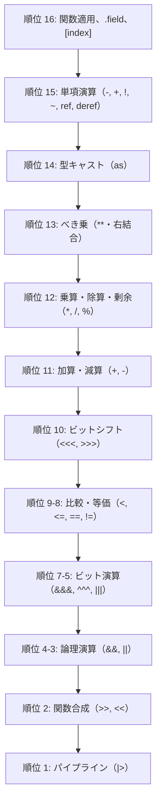

# 演算子と式

Tsuzuri は、算術も条件分岐もパイプラインも値を返す式指向の言語です。優先順位と評価順序は固定で、最適化によって入れ替わりません。

このページでは、演算子の優先順位、算術とビット演算、整数の折り返しと `@checked`、浮動小数点、短絡評価、評価順序を説明します。

## この記事のポイント

- 演算子の優先順位は 1（最も弱い `|>`）から 16（最も強い呼び出し・添字）までの 16 段階です。
- べき乗 `**` だけが右結合であり、その他の二項演算子はすべて左結合です。
- 式は書いた順に、左から右へ正格評価されます。
- 論理演算子 `&&` と `||` は短絡評価します。`not a && b` は `(not a) && b` です。
- 整数の算術演算は既定でビット幅に応じて折り返します。`@checked` を指定するとオーバーフロー時に `OverflowException` を送出します。
- ゼロ除算や最小符号付き整数の `-1` による除算は言語トラップを引き起こします。
- `if` 式や `match` 式、波括弧ブロック `{ ... }` もすべて値を返す式です。

## 演算子の優先順位と結合性

結合強度が低い順（順位 1 が最も弱く、順位 16 が最も強い）に示します。



| 順位 | 演算子 | 結合性 | 意味・操作 | 例 |
| --- | --- | --- | --- | --- |
| 1 | `\|>` | 左結合 | パイプライン（左辺の値を右辺の関数へ渡す） | `x \|> f` |
| 2 | `>>`, `<<` | 左結合 | 関数合成（`>>` は前方、`<<` は後方合成） | `f >> g` |
| 3 | `\|\|` | 左結合 | 論理和（短絡評価） | `ready \|\| retry` |
| 4 | `&&` | 左結合 | 論理積（短絡評価） | `valid && active` |
| 5 | `\|`, `\|\|\|` | 左結合 | ビット論理和（OR） | `flags \|\|\| 0x08` |
| 6 | `^`, `^^^` | 左結合 | ビット排他的論理和（XOR） | `mask ^^^ 0xFF` |
| 7 | `&`, `&&&` | 左結合 | ビット論理積（AND） | `bits &&& 0x0F` |
| 8 | `==`, `!=` | 左結合 | 等価比較・非等価比較 | `a == b`, `a != b` |
| 9 | `<`, `<=`, `>`, `>=` | 左結合 | 大小関係の順序比較 | `x < y`, `count >= 0` |
| 10 | `<<<`, `>>>` | 左結合 | ビットシフト（左シフト、右シフト） | `bits >>> 2` |
| 11 | `+`, `-` | 左結合 | 算術加算・減算 | `base + offset` |
| 12 | `*`, `/`, `%` | 左結合 | 乗算・除算・剰余 | `total * factor` |
| 13 | `**` | **右結合** | べき乗（指数演算） | `2 ** 3 ** 2`（$2^9$） |
| 14 | `as Type` | 左結合 | 数値型キャスト（整数の縮小は下位ビット） | `count as f64` |
| 15 | `-`, `+`, `!`, `~`, `~~~`<br/>`ref`, `ref mut`, `deref`<br/>`&`, `&mut`, `*` | 単項前置 | 単項負符号、正符号、論理否定、ビット反転<br/>共有借用、排他借用、参照外し | `-x`, `!flag`, `~mask`<br/>`ref text`, `deref r`<br/>`&val`, `*ptr` |
| 16 | 空白適用（`f x`）<br/>`.field`<br/>`[index]` | 左結合 | 関数呼び出し（部分適用）<br/>レコードフィールドアクセス<br/>配列・リストの要素アクセス | `add 10 20`<br/>`user.name`<br/>`items[0]` |

> [!NOTE]
> 代入 `=` は、どの二項演算子よりも弱く結合します。二項演算子の直後で改行するか、行頭に `|>`、`>>`、`<<`、`||`、`&&` を置くと、前の行の続きとして読まれます。

> [!WARNING]
> 比較は Python のようには連鎖しません。`1 < 2 < 3` は `(1 < 2) < 3` と読まれ、`bool` と `i32` の比較になるため `E1003` です。範囲を調べるときは `1 < 2 && 2 < 3` と書きます。

## 算術演算子と数値仕様

### 基本的な算術演算

```tsuzuri run=a%3D512%20b%3D4%20c%3D10%20d%3D4
let a = 2 ** 3 ** 2
let b = -2 ** 2
let c = (6 &&& 3) ||| 8
let d = 16 >>> 2

$"a={a} b={b} c={c} d={d}"
```

実行結果:

```text
a=512 b=4 c=10 d=4
```

- **単項演算子とべき乗**: 単項 `-` は `**` より強く結合します。`-2 ** 2` は `(-2) ** 2` で、結果は `4` です。
- **右結合のべき乗**: `2 ** 3 ** 2` は `2 ** (3 ** 2)`、つまり $2^9 = 512$ です。底と指数は同じ型です。使えるのは整数、`f32`、`f64`、`bigint` です。`f16` と `f128` には `Pow` のインスタンスがなく、`E1005` になります。
- **整数の除算と剰余**: `/` はゼロ方向へ切り捨てます。`%` は被除数（左辺）と同じ符号です。`-7 / 2` は `-3`、`-7 % 2` は `-1` です。

### 整数オーバーフローと @checked

通常の整数演算（`+`、`-`、`*`、`**`、単項 `-`）は、型の幅で折り返します。未定義動作にはなりません。

折り返したくない式には `@checked` を付けます。注釈が付いた式や文が直接評価する演算子だけを検査し、溢れると `OverflowException` になります。呼び出した関数の中までは検査しません。注釈の中に書いたラムダの演算子は検査されますが、その例外はラムダの外の `try` には届きません。

```tsuzuri run=wrapped%3D-2147483648%20msg%3DArithmetic%20operation%20resulted%20in%20an%20overflow.
def safe_add :: i32 -> i32 -> Result<i32, Exception> = \x y ->
    try
        @checked (x + y)
    with
    | e is OverflowException -> e

let wrapped: i32 = 2147483647 + 1
let msg = match safe_add 2147483647 1 with
| Ok _ -> "ok"
| Error e -> e.msg

$"wrapped={wrapped} msg={msg}"
```

実行結果:

```text
wrapped=-2147483648 msg=Arithmetic operation resulted in an overflow.
```

### 整数の言語トラップ

次の操作は `@checked` の有無にかかわらず言語トラップです。`try` でも捕捉できず、プログラムは異常終了します。

1. **ゼロ除算**: `x / 0` または `x % 0`。
2. **最小値のオーバーフロー除算**: 符号付き整数の最小値を `-1` で除算または剰余計算した場合（例: `(-2147483648) / -1`）。結果が正の最大値を超過するためトラップします。
3. **負の指数**: 整数に対するべき乗 `**` で負の指数を指定した場合。

### 浮動小数点数

2 進浮動小数点（`f16`、`f32`、`f64`、`f128`）は、IEEE 754 の `NaN`、無限大、符号付きゼロ、非正規化数を保持し、最近接偶数丸めです。`NaN` のペイロード、例外フラグ、丸めモードの変更は公開していません。`f16` と `f128` の演算はソフトウェア実装で、`**` は使えません。decimal（`d32`、`d64`、`d128`）は別の仕様です。

```tsuzuri run=nan_eq%3Dfalse%20nan_neq%3Dtrue%20inf_gt%3Dtrue%20ninf_lt%3Dtrue%20zero_eq%3Dtrue
let nan = 0.0 / 0.0
let inf = 1.0 / 0.0
let ninf = -1.0 / 0.0
let zero = 0.0
let neg_zero = -0.0

$"nan_eq={nan == nan} nan_neq={nan != nan} inf_gt={inf > 1e300} ninf_lt={ninf < -1e300} zero_eq={zero == neg_zero}"
```

実行結果:

```text
nan_eq=false nan_neq=true inf_gt=true ninf_lt=true zero_eq=true
```

- 非数（`NaN`）との比較は、`==` や大小比較がすべて `false`、`!=` だけが `true` を返します。
- 浮動小数点のゼロ除算はトラップせず、`+inf`、`-inf`、または `NaN` になります。
- 符号付きゼロ（`+0.0` と `-0.0`）を区別して保持しますが、等価比較 `==` では等しいとみなされます。

## 比較演算子と論理演算子

### 等値性と順序比較

- 組み込みの `==` と `!=` は、同じスカラー型、`unit`、`string` に使えます。`Eq` のインスタンスがあるレコードやリストにも使えます。
- `<`、`<=`、`>`、`>=` は同じ数値型同士に使えます。連鎖はしません。
- 異なる型の比較に暗黙の変換はありません。必要なら `as` で変換します。

### 短絡評価（論理演算）

`&&` と `||` は短絡評価します。

```tsuzuri run=true%20true
let safe_and = false && (1 / 0 == 0)
let safe_or = true || (1 / 0 == 0)

$"{not safe_and} {safe_or}"
```

実行結果:

```text
true true
```

左辺が `false` の場合、`&&` の右辺にあるゼロ除算は評価されず、トラップは発生しません。同様に左辺が `true` の場合、`||` の右辺は評価されません。

組み込み関数 `not :: bool -> bool` は単項の論理否定 `!` と同じ動作をし、パイプライン構文（例: `value |> not`）で便利に利用できます。

## ビット演算子とシフト演算子

Tsuzuri は F# 互換の記法（`&&&`, `|||`, `^^^`, `~~~`）をサポートし、C 言語風の別名（`&`, `|`, `^`, `~`）も等価に受理します。

```tsuzuri run=and%3D2%20or%3D7%20xor%3D5%20not%3D-11%20shl%3D16%20shr%3D-2
let a = 0b0110
let b = 0b0011

let bit_and = a &&& b
let bit_or = a ||| b
let bit_xor = a ^^^ b
let bit_not = ~~~10
let shl = 2 <<< 3
let shr = -8 >>> 2

$"and={bit_and} or={bit_or} xor={bit_xor} not={bit_not} shl={shl} shr={shr}"
```

実行結果:

```text
and=2 or=7 xor=5 not=-11 shl=16 shr=-2
```

- `<<<` は論理左シフトです。
- `>>>` は符号付き整数では算術右シフト（符号ビットを維持）、符号なし整数では論理右シフト（上位に 0 を補う）です。符号付きの論理右シフトは `Bits.ushr` です。
- シフト量はビット幅でマスクされます（32 bit 型なら `count & 31`）。

## パイプラインと関数合成

パイプライン演算子 `|>` は、左辺の値を右辺の関数の引数として渡します。関数合成演算子 `>>` と `<<` は複数の関数を合成して新しい関数値を作ります。

```tsuzuri run=piped%3D12%20fwd%3D12%20bwd%3D12
def inc :: i64 -> i64 = \x -> x + 1
def dbl :: i64 -> i64 = \x -> x * 2

let piped = 5 |> inc |> dbl
let composed_fwd = (inc >> dbl) 5
let composed_bwd = (dbl << inc) 5

$"piped={piped} fwd={composed_fwd} bwd={composed_bwd}"
```

実行結果:

```text
piped=12 fwd=12 bwd=12
```

- `f >> g`（前方合成）: `\x -> g (f x)` です。`f` の結果を `g` に渡します。
- `f << g`（後方合成）: `\x -> f (g x)` です。`g` の結果を `f` に渡します。
- `a |> f >> g` は、合成の方が強いので `a |> (f >> g)` です。

どちらも左から右へ合成オペランドを評価して新しいクロージャを生成します。

## メモリとその他の演算子

| 演算子 | 構文 | 説明 |
| --- | --- | --- |
| `as` | `x as i64` | 数値の明示変換。整数の縮小は下位ビット、浮動小数点から整数はゼロ方向の切り捨てと飽和 |
| `ref` / `&` | `ref x` または `&x` | 共有借用参照を作成します |
| `ref mut` / `&mut` | `ref mut x` または `&mut x` | 排他借用参照を作成します |
| `deref` / `*` | `deref r` または `*r` | 参照を外して値を取り出します |
| `::` | `head :: tail` | パターンマッチでのリスト分解（コンス） |
| `..` | `ref values[1..4]` | 配列スライスの半開区間。リストには使えない |

整数の縮小は飽和ではありません。`255 as i8` は `-1` です。浮動小数点から整数への変換だけが、ゼロ方向の切り捨て、範囲外の飽和、`NaN` から `0` です。詳しくは [型キャスト](../types-and-type-inference/cast.md) を参照してください。

`ref`、`ref mut`、`deref`、および引数位置の `&` と `*` は、オペランドを 1 つだけ取ります。後ろに別の引数が続くときは `f (ref mut value) 1` のように括弧で囲みます。二項の `&` や `*` は、両側に空白を置くか、空白なしで密着させます（`a * b` または `a*b`）。

## 評価順序

式は、書いた順に左から右へ正格評価されます。最適化で順序を入れ替えたり、トラップする式を消したりはしません。

| 構造 | 評価の順序 |
| --- | --- |
| 二項演算 `a + b` | `a` を評価した後に `b` を評価 |
| 関数呼び出し `f a b` | 呼び出し先 `f` を評価し、引数 `a`、引数 `b` を順に評価 |
| パイプライン `x \|> f` | `x` を評価し、`f` を評価し、適用 |
| 配列・リスト `[a, b, c]` | `a`、`b`、`c` の記述順に 1 回ずつ評価 |
| レコード初期化 | フィールドをソースコードに記述した順（宣言順ではない） |
| レコード更新 `{ p with x = a, y = b }` | 元値 `p`、更新値 `a`、`b` を順に評価 |
| 代入 `target = expr` | 右辺 `expr`、そのあと代入先 |
| スライス `ref values[start..end]` | 配列、開始、終了 |

最適化によって評価順序が入れ替わったり、言語トラップを伴う式が勝手に除去されたりすることはありません。

## 式指向の構文

Tsuzuri では制御構文もすべて値を返します。

```tsuzuri run=grade%3DA
let score = 85
let grade =
    if score >= 90 then "S"
    elif score >= 80 then "A"
    else "B"

$"grade={grade}"
```

実行結果:

```text
grade=A
```

`if` 式の全分岐は同じ型を返す必要があります。波括弧ブロック `{ ... }` も最後の式を戻り値として評価します。

## まとめ

- Tsuzuri の演算子優先順位は 1（`|>`）から 16（関数適用・添字）までの 16 段階です。
- べき乗 `**` のみ右結合で、他の二項演算子は左結合です。
- 整数の算術は既定でビット幅に応じて折り返します。検査が必要な箇所には `@checked` を指定します。
- ゼロ除算や `MIN_VALUE / -1` は言語トラップを引き起こします。
- 2 進浮動小数点は `NaN`、無限大、符号付きゼロを保持します。`NaN` のペイロードと丸めモードの変更は公開していません。
- `&&` と `||` は短絡評価します。比較は連鎖しません。
- 式は書いた順に、左から右へ正格評価されます。

## 関連項目

- [値](./values.md)
- [キーワード](./keywords.md)
- [ステートメント](./statements.md)
- [属性](./attributes.md)
- [関数 / 高階関数 / 再帰関数](./functions.md)
- [言語仕様: 演算子](../../../docs/language.md#演算子)
- [言語リファレンスの目次](../index.md)

