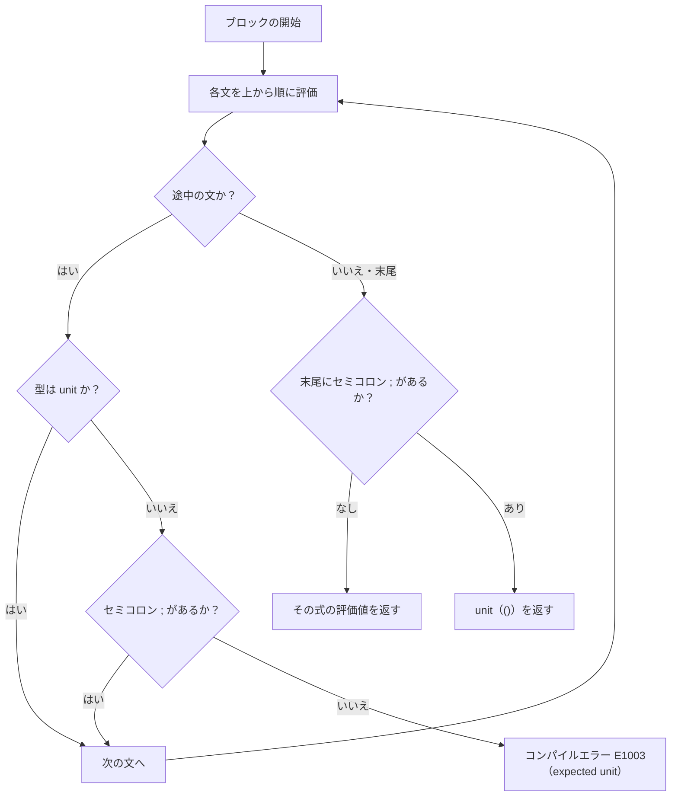

# ステートメント

Tsuzuri は「すべての構成要素が式である」という式指向（expression-oriented）の言語ですが、一連の計算や状態変更、リソース管理を順序立てて行うために「文（statement）」の仕組みを備えています。

このページでは、ブロック内での文の逐次実行、インデント構文と波括弧構文の使い分け、ブロック途中の式に対する `unit` 型の強制ルール、改行をまたぐ関数適用の制限、コンピュテーション文（`let!` / `do!`）、および構文ネスト深度の上限を解説します。

## この記事のポイント

- ブロック内の式は上から順に評価され、最後の式の値がブロック全体の戻り値になります。
- ブロックの途中に置く式は `unit`（`()`）型でなければなりません。値を破棄するには末尾セミコロン `;` や `ignore` を使います。
- ブロックの表現には「インデント構文」と「波括弧 `{ ... }` 構文」の 2 種類があります。
- 空白による関数適用は改行をまたぎません。行をまたぐ場合は括弧、末尾演算子、または行頭継続演算子（`|>` など）を使います。
- `task` やコンピュテーション式内では、モナド計算を展開する `let!` や `do!` 文が利用できます。
- 式や構文のネスト深度は最大 128、ソースファイルのサイズは最大 1 MiB に制限されています。

## 式指向における文の評価フロー

ブロック内の式がどのように評価され、最終的な値になるかの流れを示します。



## インデントによるレイアウトブロック

関数本体、`then` / `else` 節、`do` ループ本体などでは、インデント（通常 4 スペース）による複数行ブロックを自然に記述できます。

```tsuzuri run=42
def calculate :: i64 -> i64 = \base ->
    let step1 = base + 2
    let step2 = step1 * 2
    step2

calculate 19
```

実行結果:

```text
42
```

`=`、`then`、`else`、`do`、`->` の直後で改行すると、次の行のインデントの深さがそのブロックの基準列になります。その列より浅いインデントが現れるとブロックは終了します。

### ブロック途中の式は unit が必須

ブロックの途中に置かれた式が値を返す場合、その型は `unit`（`()`）でなければなりません。値を消費せずに放置するバグを防ぐためです。

```text
// コンパイルエラー E1003: expected unit, found i64
def broken :: i64 -> i64 = \x ->
    x + 10
    x * 2
```

上の例では、1 行目の `x + 10` の計算結果が何にも使われずに捨てられています。コンパイラは `error[E1003]: expected unit, found i64` を報告します。

途中の計算結果を意図して破棄したい場合は、以下のいずれかの方法をとります。

1. **末尾にセミコロン `;` を付ける**: 式の値を破棄して次の文へ進みます。
2. **`let _ = ...` で捨てる**: アンダースコア束縛で明示的に破棄します。
3. **`|> ignore` を使う**: 組み込み関数 `ignore :: 'a -> unit` を呼び出します。

```tsuzuri run=40
def compute :: i64 -> i64 = \x ->
    x + 10;
    let _ = x + 20
    (x + 30) |> ignore
    x * 2

compute 20
```

実行結果:

```text
40
```

## 波括弧による明示ブロック ({ ... })

インデントに頼らず、波括弧 `{ ... }` で式を囲む明示的なブロックも記述できます。

```tsuzuri run=42
let answer = {
    let base = 40;
    let step = 2;
    base + step
}

answer
```

実行結果:

```text
42
```

波括弧ブロックの中では、各文をセミコロン `;` で区切ります。

- **戻り値**: 末尾の式（セミコロンを付けない式）の値がブロック全体の戻り値になります。
- **末尾セミコロンの効果**: 末尾の式に `;` を付けると、その値は捨てられてブロック全体は `unit`（`()`）を返します。
- **空ブロック**: 空の波括弧 `{}` は `unit` 値（`()`）を返します。

```tsuzuri run=true
let u: unit = {
    let a = 1;
    let b = 2;
    a + b;
}

u == ()
```

実行結果:

```text
true
```

## 変数束縛文 (let と use)

ブロック内では新しい変数を導入する文を配置できます。

- **`let 名前 = 式`**: 不変のローカル変数を導入します。同一スコープでのシャドーイングも可能です。
- **`let mut 名前 = 式`**: 後から `=` で再代入できるローカル変数を導入します。
- **`use 名前 = 式`**: スコープを抜けるときに `Drop` で解放する束縛です。`use mut` は `E0002` です。可変にしたい値は `let mut` で束縛します。

変数宣言の詳細については [値](./values.md) および [use キーワード](../exception-handling/use.md) を参照してください。

## コンピュテーション文 (let! と do!)

`task { ... }` ブロックやカスタムコンピュテーション式の内部では、モナド的な計算を展開するための特別な文構文が利用できます。

- **`let! 名前 = 計算式`**: 非同期タスクや計算の中身の値をアンラップして変数に束縛します。
- **`do! 計算式`**: `unit` を返す計算を実行します。
- **`return 式`**: 計算ブロック全体の結果値を返却します。

```tsuzuri run=42
let t = task {
    do! task { () }
    let! a = task { return 20 }
    let! b = task { return 22 }
    return (a + b)
}

Task.run t
```

実行結果:

```text
42
```

コンピュテーション式の仕組みと独自のビルダー構築については、[コンピュテーション式](../computation-expressions/computation-expressions.md) および [Task 式](../async-tasks-and-lazy/task.md) を参照してください。

## 改行をまたぐ関数適用の不可

Tsuzuri では、空白（並置）による関数適用が**改行をまたぐことはできません**。

```text
// 意図しない挙動の例
let result = add 10
    20
```

もし改行をまたぐ適用を許可すると、以下の 2 つの独立した文を書いたときに問題が起きます。

```text
reset_counter ()
update_display ()
```

改行をまたぐ適用を許すと、上の 2 行が `(reset_counter ()) (update_display ())` と読まれてしまいます。そのため、改行が入った時点で空白適用は終わります。次の行が独立した式になり、その型が `unit` でなければ `E1003` です。

### 長い引数列を複数行に分ける方法

引数が長くなった場合は、以下のいずれかの方法で記述します。

1. **括弧で引数を囲む**: 括弧の内部では改行が許可されます。
2. **行頭継続演算子を使う**: `|>`, `>>`, `<<`, `||`, `&&` が行頭にある場合、前の行から続く式としてパースされます。
3. **二項演算子の直後で改行する**: `+` や `*` などの直後で改行すると、次の行に式が継続します。

```tsuzuri run=r1%3D30%20r2%3D30%20r3%3D30
def add :: i64 -> i64 -> i64 = \x y -> x + y

// 1. 括弧で改行
let r1 = add 10 (
    20
)

// 2. 行頭のパイプライン演算子
let r2 = 10
    |> add 20

// 3. 末尾の演算子
let r3 = 10 +
    20

$"r1={r1} r2={r2} r3={r3}"
```

実行結果:

```text
r1=30 r2=30 r3=30
```

## ネスト深度と入力の制限

コンパイラの健全性とスタックオーバーフロー防止のため、以下の静的上限が設けられています。

| 制限項目 | 上限値 | 超過時のエラー |
| --- | --- | --- |
| 構文と式のネスト深度 | 最大 128 | `E0002` |
| 1 ファイルあたりのソース長 | 最大 1 MiB（1,048,576 バイト） | `E0003` |
| 名前空間パスのセグメント数 | 最大 16 | `E1017` |

極端にネストした深い式（`f (g (h (i ...)))`）を書くとネスト制限に達することがあります。その場合はローカルな `let` 文に分割して段階的に計算するか、パイプライン演算子 `|>` を使って平坦に記述してください。

## まとめ

- ブロック内の文は上から順に評価され、末尾の式の値がブロック全体の戻り値になります。
- インデント構文と波括弧構文 `{ ... }` の両方に対応しています。
- ブロック途中の式は `unit`（`()`）でなければならず、値を捨てるには `;`、`let _ = ...`、または `ignore` を使います。
- 波括弧ブロックの末尾にセミコロンを付けると `unit` が返ります。
- 空白による関数適用は改行をまたぎません。複数行にするには括弧や行頭の `|>` を使います。
- `task` やコンピュテーション式内では `let!` や `do!` によるモナド実行が行えます。
- 式のネスト深度は 128（`E0002`）、ファイルサイズは 1 MiB（`E0003`）までです。

## 関連項目

- [値](./values.md)
- [キーワード](./keywords.md)
- [演算子と式](./op-and-expressions.md)
- [特殊文字](./tokens.md)
- [関数 / 高階関数 / 再帰関数](./functions.md)
- [コンピュテーション式](../computation-expressions/computation-expressions.md)
- [言語仕様: 式と評価順序](../../../docs/language.md#式と評価順序)
- [言語リファレンスの目次](../index.md)

