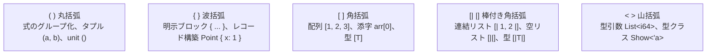

# 特殊文字

Tsuzuri では、区切り文字、括弧、矢印記号、演算子、コメント記号など、多様な特殊文字（記号トークン）が正確に役割を分担しています。

このページでは、言語内で使われる全記号の一覧表、括弧類の使い分け（配列とリストの違いなど）、コロンとダブルコロンの文脈、矢印記号の種類、コメント記号と入れ子仕様、そしてアンダースコア `_` の多面的な役割を詳しく解説します。

## この記事のポイント

- 配列は `[ ]`（型: `[T]`）、連結リストは `[| |]`（型: `[|T|]`、空リスト: `[||]`）で区別されます。
- 関数の型宣言はダブルコロン `def name :: 型` を使います。単一の `:` は変数束縛やレコードの型注釈用です。
- 細い矢印 `->` は関数型・ラムダ式・match アームで使い、太い矢印 `=>` は型クラス制約の区切りに使います。
- パイプライン `|>` やラムダ導入 `\`、リストのコンスパターン `::` など、関数型言語特有の記号を備えています。
- ブロックコメント `/* ... */` は安全に入れ子（ネスト）が可能です。
- アンダースコア `_` はワイルドカード、数値の桁区切り、未使用変数の抑制に使われます。

## 記号・特殊文字の一覧表

| 記号 | 主な用途・文脈 | コード例 | 関連ページ |
| --- | --- | --- | --- |
| `::` | 関数の型宣言区切り、リストのコンスパターン、名前空間パス | `def add :: i64 -> i64`<br/>`head :: tail`<br/>`MyApp::Domain` | [関数 / 高階関数 / 再帰関数](./functions.md)<br/>[パターンマッチング](../pattern-matching/pattern-matching.md) |
| `->` | 関数型、ラムダ式の本体導入、match アーム | `i64 -> i64`<br/>`\x -> x + 1`<br/>`\| 0 -> "zero"` | [関数 / 高階関数 / 再帰関数](./functions.md)<br/>[ラムダ式](./lambda-expressions.md) |
| `=>` | シグネチャにおける型クラス制約の区切り | `Ord<'a> => 'a -> bool` | [ジェネリック関数と型パラメータ制約](./generics-functions.md) |
| `\` | ラムダ式（無名関数）の引数リスト開始 | `\x y -> x + y` | [ラムダ式](./lambda-expressions.md) |
| `=` | 束縛、再代入、レコード更新、フィールドパターン | `let x = 10`<br/>`{ p with x = 1 }` | [値](./values.md) |
| `==` / `!=` | 等価比較 / 非等価比較演算子 | `a == b`, `a != b` | [演算子と式](./op-and-expressions.md) |
| `:` | 型注釈、レコードの構築とフィールド型、制約行、書式指定 | `Point { x: 1 }`<br/>`let x: i64 = 1` | [値](./values.md)<br/>[Record](../built-in-types-and-modules/record.md) |
| `;` | 波括弧ブロック内の文の区切り、空文 | `{ a; b }` | [ステートメント](./statements.md) |
| `,` | タプル、配列、引数列、型パラメータの要素区切り | `(1, 2)`, `[1, 2, 3]` | [リテラル](../literals-and-strings/literals.md) |
| `.` | レコードやモジュールのメンバー参照、小数点 | `user.name`, `Array.map` | [演算子と式](./op-and-expressions.md) |
| `..` | 配列スライスの半開区間。必ず `ref` か `ref mut` と組む | `ref values[1..4]` | [演算子と式](./op-and-expressions.md) |
| `\|` | match アームの区切り、union ケース区切り、ビット OR | `\| Case ->`<br/>`\| Circle of f64` | [パターンマッチング](../pattern-matching/pattern-matching.md)<br/>[Union](../built-in-types-and-modules/union.md) |
| `\|>` | パイプライン演算子（値を関数の引数へ渡す） | `data \|> process` | [演算子と式](./op-and-expressions.md) |
| `'a` | ジェネリック型変数（小文字で始まる識別子） | `'a`, `'key`, `'value` | [ジェネリック関数と型パラメータ制約](./generics-functions.md) |
| `'c'` | `char`（UTF-16 文字）リテラル | `'A'`, `'\n'` | [リテラル](../literals-and-strings/literals.md) |
| `'c'B` | 1 バイト値（`byte`）リテラル | `'A'B`（65） | [リテラル](../literals-and-strings/literals.md) |
| `" "` | `string`（UTF-16 文字列）リテラル | `"hello\n"` | [文字列](../literals-and-strings/strings.md) |
| `$" "` | 補間文字列リテラル（波括弧 `{expr}` で値を埋め込む） | `$"total={total}"` | [補間文字列](../literals-and-strings/interpolated-strings.md) |
| `u8" "` | `utf8string`（UTF-8 文字列）リテラル | `u8"日本語"` | [文字列](../literals-and-strings/strings.md) |
| `" "B` | ASCII バイト配列リテラル（`[byte]`） | `"GET /"B` | [リテラル](../literals-and-strings/literals.md) |
| `@` | コンパイラ属性（`@literal`, `@checked`, `@cpu`, `@json`, `@alias`）、制約行 | `@checked x + y`<br/>`@alias async`<br/>`@'a : Show` | [属性](./attributes.md) |
| `#` | 制約行の関数制約 | `@'a : #hash` | [制約 と 属性](../types-and-type-inference/constraints.md) |
| `!` | 論理否定演算子、コンピュテーション式文 | `!flag`<br/>`let! x = task` | [演算子と式](./op-and-expressions.md)<br/>[ステートメント](./statements.md) |
| `_` | ワイルドカード、数値区切り、未使用変数の接頭辞 | `\| _ -> 0`, `1_000` | [パターンマッチング](../pattern-matching/pattern-matching.md) |
| `//` | 単一行コメント（行末まで） | `// 注記` | [特殊文字](./tokens.md) |
| `/* */` | 複数行ブロックコメント（入れ子可能） | `/* コメント */` | [特殊文字](./tokens.md) |
| `///` | Markdown 形式のドキュメントコメント | `/// 関数の説明` | [ドキュメント コメント](../organizing-tsuzuri/documentation-comment.md) |
| `#!` | ファイル先頭の shebang 行（行コメントと同じく読み飛ばす） | `#!/usr/bin/env -S tsuzuri script` | [特殊文字](./tokens.md) |

## 括弧の使い分け

括弧の形ごとに、使える場所が決まっています。



### 配列 `[ ]` とリスト `[| |]` の決定的な違い

Tsuzuri の標準コレクションには連続メモリ領域を使う配列（`Array`）と、単方向連結リスト（`List`）の 2 つがあります。

- **配列（Array）**: 角括弧 `[1, 2, 3]` を使います。型は `[i64]` です。長さも型に含める固定長配列は `[i64; 3]` です。添字は `arr[0]` です。
- **連結リスト（List）**: 棒付き角括弧 `[| 1, 2, 3 |]` を使います。空リストは `[||]` です。型は `[|i64|]` です。先頭と残りを分解するパターンマッチ `head :: tail` が利用できます。

```tsuzuri run=first%3D42%20second%3D-1%20arr_len%3D3
// 1. 単一行コメント
/* 2. ブロックコメント /* 入れ子 */ も安全 */
/// 関数のドキュメント
def process_data :: Ord<'a> => 'a -> [|'a|] -> 'a = \fallback items ->
    match items with
    | head :: _ -> head
    | [||] -> fallback

let empty_list: [|i64|] = [||]
let sample_list = [| 42, 100 |]
let array_val = [ 10, 20, 30 ]
let first = process_data 0 sample_list
let second = process_data (-1) empty_list
let arr_len = array_val.length

$"first={first} second={second} arr_len={arr_len}"
```

実行結果:

```text
first=42 second=-1 arr_len=3
```

> [!WARNING]
> `head :: tail` パターンは連結リスト `[|T|]` 専用です。配列 `[T]` に書くと型不一致の `E1003` になります。コンスパターンは右結合です。`x :: y :: zs` は `x :: (y :: zs)` です。

> [!WARNING]
> レコードの構築は `Point { x: 1 }` です。`Point { x = 1 }` は `E0002` になります。`=` を使うのは更新 `{ p with x = 1 }` と、フィールドパターン `Point { x = n }` です。パターンでは `Point { x: n }` も書けます。

```tsuzuri run=10
record Point { x: i64, y: i64 }
let origin = Point { x: 1, y: 2 }
let moved = { origin with x = 10 }

moved.x
```

実行結果:

```text
10
```

配列のスライスは終了位置を含まない半開区間で、`ref values[1..4]` または `ref mut values[1..4]` と書きます。裸の `values[1..4]` と、両端を省略した `ref values[..]` は `E0002` です。リストや文字列にはこの構文はなく、`E1005` になります。

## コロン (:) とダブルコロン (::) の使い分け

コロンの個数は意味を明確に分けるための重要な構文要素です。

- **単一のコロン `:`**:
  - `let` や `const` の型注釈: `let total: i64 = 0`
  - レコードのフィールド型と構築: `record User { id: i64 }`、`User { id: 1, name: "ana" }`
  - 制約行: `@'a : Ord, Show`
  - 文字列補間の書式: `$"hex={value:04x}"`
- **ダブルコロン `::`**:
  - 関数宣言の名前と型: `def add :: i64 -> i64 -> i64`
  - リストのコンスパターン: `head :: tail`
  - 名前空間の区切り: `Sample::Features::Shape.area`

空白を挟まない `::` は、列の最後が大文字で始まるとき、または行頭の `namespace` / `using` の中にあるとき、名前空間の区切りになります。`def name::i64` と `x::xs` は、型の区切りとリストのままです。空白や改行を挟んだ `Sample :: Shape` も名前空間にはなりません。

型引数の `>` が隣接した `>>`、`>>>`、`>=` は、型の中では閉じ括弧 1 つとして読まれます。`Maybe<Maybe<i64>>` のように書けます。

> [!WARNING]
> 関数のシグネチャ宣言で `def add : i64 -> i64` のように単一の `:` を使うと、構文エラー `E0002` になります。`def` の後は必ず `::` を記述します。

## 矢印記号の使い分け

Tsuzuri には細い矢印 `->` と太い矢印 `=>` があります。

- **`->`（ハイフン矢印）**:
  - 関数型の引数と戻り値の区切り: `i64 -> string`
  - ラムダ式の引数と本体の区切り: `\x -> x * 2`
  - match 式のアームと処理の区切り: `| pattern -> result`
- **`=>`（イコール矢印）**:
  - 関数のシグネチャにおける型クラス制約の区切り: `Ord<'a> => 'a -> 'a -> 'a`

## コメントの構文と入れ子

Tsuzuri は 3 種類のコメントをサポートしています。ファイルの先頭の shebang 行も、コメントとして読み飛ばされます。

### 単一行コメント (`//`)

`//` からその行の末尾（改行）までがコメントとして扱われます。

### 複数行ブロックコメント (`/* ... */`)

`/*` から `*/` までがコメントです。ブロックコメントは入れ子にできます。内側に `/* ... */` があっても、外側でもう一段囲んでコメントアウトできます。

```text
/*
  外側のコメントアウト
  /* 内側のコメント */
  ここもコメントのまま
*/
```

### ドキュメントコメント (`///`)

Markdown 形式で記述するドキュメンテーション用のコメントです。直後に配置された宣言に結び付けられます。

- 付けられる対象: `def`（`export`、`private`、`extern`、型クラスのメソッド、`@literal def` を含む）、`record`、`union`、`type`、`const`、`class`
- 付けられない対象: `fn` や `let` の実装、`instance`、フィールド定義、ローカル束縛、`test`、エントリーコード。いずれも `E0002` です

### shebang 行 (`#!`)

ファイルの先頭（1 文字目）が `#!` のとき、その行は `//` の行コメントと同じく読み飛ばされます。[`tsuzuri script`](../compiler/usage.md#script) で実行するファイルに、実行するプログラムを書くための行です。

```tsuzuri
#!/usr/bin/env -S tsuzuri script
def main :: Array<string> -> i32 = \args ->
    do! IO.write_line (String.join (ref " ") (ref args))
    0
```

`.tz`・`.tt`・`.tc` のどのファイルでも同じです。診断の行と列は、shebang 行を 1 行目として数えます。`tsuzuri fmt` は shebang 行をそのまま残します。2 行目以降や BOM の後の `#!` は shebang 行ではなく、構文エラーです。

## アンダースコア (_) の役割

アンダースコア `_` は文脈に応じて以下の 3 つの役割を果たします。

1. **パターンのワイルドカード**: match 式やタプル分解で任意の値にマッチし、値を読み捨てます。
2. **未使用変数の警告抑制**: `_unused` のように先頭に `_` を付けた変数名は、コンパイラの未使用警告（`W1001`）を抑制します。
3. **数値リテラルの桁区切り**: `1_000_000` や `0xFF_AA_00` のように、数字の間に入れます。区切りは数字と数字の間だけです。それ以外は `E0001` です。

匿名の型変数 `'_` はありません。型変数は `'a` のように、アポストロフィと ASCII の英字で始めます。それ以外は `E0001` です。

## まとめ

- `[ ]` は配列（`Array`）、`[| |]` は連結リスト（`List`）を表します。
- レコードの構築は `Point { x: 1 }`、更新は `{ p with x = 1 }` です。
- `def` の型には `::` を使い、`let` の型注釈には `:` を使います。
- 関数型やラムダ式には `->` を使い、型クラス制約には `=>` を使います。
- ブロックコメント `/* ... */` は入れ子（ネスト）が可能です。
- アンダースコア `_` はワイルドカード、数値の区切り、未使用変数の抑制に使われます。

## 関連項目

- [値](./values.md)
- [キーワード](./keywords.md)
- [演算子と式](./op-and-expressions.md)
- [ステートメント](./statements.md)
- [関数 / 高階関数 / 再帰関数](./functions.md)
- [リテラル](../literals-and-strings/literals.md)
- [言語仕様: ドキュメントコメント](../../../docs/language.md#ドキュメントコメント)
- [言語リファレンスの目次](../index.md)

