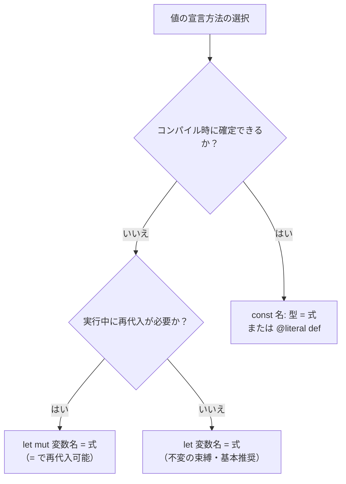

# 値

Tsuzuri は式指向の静的型付き言語であり、計算の基本単位は「値」です。値への名前付けには不変の `let`、再代入可能なローカル状態には `let mut`、コンパイル時に確定する値には `const` を使います。

このページでは、変数の束縛、再代入、シャドーイング、コンパイル時定数、値と式の関係、Copy とムーブの基礎、そしてトップレベル `let` の配置規則を解説します。

## この記事のポイント

- 変数束縛の既定は不変（immutable）です。値の書き換えには明示的に `let mut` を使います。
- 再代入には `=` を使い、等値比較には `==` を使います。代入式自体の評価結果は `unit` です。
- 同一スコープ内でのシャドーイング（同名での再束縛）が可能です。型を変えることもできます。
- `const` はコンパイル時に計算される定数です。同一ファイル内の前方参照や他モジュールからの参照が可能です。
- Tsuzuri は式指向であり、ブロック `{ ... }` や制御構文を含めたすべてが値を返します。
- プリミティブ型は自動でコピー（Copy）され、文字列などは所有権が移動（ムーブ）します。
- トップレベルの実行式を書けるのは `Main.tz` だけです。他モジュールの `let` は、先行する `def` の関数実装に限られます。

## 宣言の選び方

値がいつ決まり、あとから置き換える必要があるかで、宣言を選びます。



## 不変の束縛 (let)

ローカルな値の定義には `let` を使います。Tsuzuri の変数は既定で不変です。一度束縛した変数に別の値を再代入することはできません。

```text
let 名前 [: 型] = 式
```

型注釈を省略した場合、右辺の式や周囲の文脈から型が推論されます。型を明示するときはコロン `:` の後に型を書きます。

```tsuzuri run=1320
let price: i64 = 1200
let tax_rate = 10
let tax = price * tax_rate / 100
let total = price + tax

total
```

実行結果:

```text
1320
```

`let` は単に「束縛を後から書き換えられない」ことを意味します。コンパイル時定数だけを受け付けるという意味ではないため、実行時の計算結果、関数呼び出しの戻り値、ヒープに確保した配列なども自由に束縛できます。

## 可変な束縛と再代入 (let mut)

ループ内での累積計算や状態の更新など、ローカルで値を変更したい場合は `let mut` を使います。

```tsuzuri run=60
let mut sum: i64 = 0
for x in [10, 20, 30] do
    sum = sum + x

sum
```

実行結果:

```text
60
```

再代入は `=`、等値比較は `==` です。F# の `<-` ではなく、Rust と同じ `=` を使います。

> [!NOTE]
> 代入式 `sum = sum + x` の評価結果は `unit`（`()`）です。代入によって束縛の型自体を変更することはできません。

`mut` が許可するのは「ローカルな束縛が保持する所有値全体の置き換え」です。配列の要素やレコードのフィールドを直接書き換える機能ではありません。参照先を書き換えるには排他借用（`ref mut`）を使用します。

また、ラムダ式（クロージャ）の外側にある可変束縛を捕捉しても、共有された可変状態は作られません。捕捉時点の値のスナップショットとして扱われます。

## シャドーイング

Tsuzuri では、同一スコープ内であっても既存の変数と同じ名前で新しい `let` 束縛を宣言できます。これをシャドーイング（隠蔽）と呼びます。

```tsuzuri run=25
let count = 10
let double = count * 2
let count = double + 5

count
```

実行結果:

```text
25
```

新しい束縛は古い束縛を隠します。右辺の式は新しい束縛が導入される前に評価されるため、2 つ目の `count` の右辺で参照している `double`（元の `count` から計算された値）は正常に読まれます。

シャドーイングでは、以前の変数と異なる型で再束縛することも可能です。

```tsuzuri run=5
let input = "hello"
let input: i64 = String.length ref input

input
```

実行結果:

```text
5
```

シャドーイングはメモリ上の値を破壊的に上書きする操作ではありません。新しいスコープや新しい名前空間に同じ識別子を割り当て直す操作です。

## コンパイル時定数 (const と @literal)

コンパイル時に値が確定する定数は `const` で宣言します。実行時ではなくコンパイル時に評価が行われます。

```text
const 名前: 型 = 式
```

定数は明示的な具体型の指定が必須です（型推論は行われません）。

```tsuzuri run=42
const Answer: i64 = Base + 2
const Base: i64 = 40

Answer
```

実行結果:

```text
42
```

`const` には次の特徴があります。

1. **前方参照ができる**: 同じファイル内で、あとから宣言した定数も参照できます（上の例の `Base`）。
2. **モジュール越しに参照できる**: 公開定数は `モジュール名.定数名` で参照します。
3. **使っていなくても検査する**: 一度も参照されない定数も、コンパイル時に型検査と評価をします。
4. **関数と同じ名前空間**: 同名の関数や定数を重ねると `E1001` です。
5. **置けるファイル**: `.tz` と `.tc` に置けます。型クラス用の `.tt` に書くと `E1018` です。

`@literal def 名前 :: 型 = 式` と記述しても、`const` とまったく同じコンパイル時定数として扱われます。

```tsuzuri run=12.56
@literal
def PI :: f64 = 3.14

let radius: f64 = 2
PI * radius ** 2
```

実行結果:

```text
12.56
```

### モジュールをまたぐ定数の参照

定数は既定で公開されます。モジュール外から利用する場合は `モジュール名.定数名` でアクセスします。宣言モジュール内だけで非公開にしたい場合は `private const` を指定します。

```tsuzuri project=ConstMod file=Config.tz
const MaxRetries: i64 = 3
const TimeoutMs: i64 = 5000
```

```tsuzuri run=15000 project=ConstMod file=Main.tz
Config.MaxRetries * Config.TimeoutMs
```

実行結果:

```text
15000
```

### 定数式に使える式と使えない式

定数の右辺にはコンパイル時に副作用なく計算できる式だけを記述できます。

| 分類 | 使えるもの | 使えないもの |
| --- | --- | --- |
| データ | 数値、真偽値、文字、文字列、配列、タプル、レコード、他の定数 | リスト（`[\| \|]`）、ヒープ確保（`new`）、外部ハンドル |
| 演算 | 算術、比較、論理、ビット演算、べき乗、`as` | インデックス、フィールド参照、代入、結果を借用のまま残すこと |
| 制御 | `if`、短絡評価（`&&`、`\|\|`） | ループ（`for`、`while`）、`match`、例外（`try`） |
| 関数 | 借用を返さない完全適用の引数だけ | 通常の呼び出し、部分適用、ラムダ式、型クラスメソッド |

`if` の両分岐は型検査しますが、評価するのは選ばれた側だけです。`&&` と `||` も同じです。整数演算は型の幅で折り返し、シフト量はビット幅でマスクします。ゼロ除算や、符号付き最小値を `-1` で割る操作はコンパイルエラー `E1026` です。

2 進浮動小数点は、その型の最近接偶数丸めで計算します。`NaN`、符号付きゼロ、非正規化数も残します。浮動小数点から整数への `as` は、実行時と同じ切り捨てと飽和です。

decimal（`d32`、`d64`、`d128`）の定数は、リテラル、符号の反転、同じ型への `as` だけです。四則演算や比較を書くと `E1026` になります。

定数そのものを借用として保存することはできません。例外は、戻り値に借用を含まない関数へ、その場で完全適用する引数です。

```tsuzuri run=5
const Greeting: string = "hello"

String.length ref Greeting
```

実行結果:

```text
5
```

定数を変数へ束縛したあとは、通常のムーブと借用の規則です。定数に静的な寿命はなく、参照のたびに評価済みの値が展開されます。

> [!WARNING]
> 定数の依存関係は深さ 128、探索で 1,024 定数、評価展開は最大 1,048,576 ノードに制限されています。制限を超過すると `E1026` になります。

## 値は式である

Tsuzuri は「すべてが式（expression）である」という思想で設計されています。文（statement）と式が明確に分離されている命令型言語とは異なり、ブロックや制御構文も値を返します。

```tsuzuri run=20
let threshold = 50
let status_code = if threshold > 100 { 1 } else { 20 }

status_code
```

実行結果:

```text
20
```

波括弧 `{ ... }` で囲まれた明示ブロックも式です。ブロックの末尾にある式の評価値がブロック全体の戻り値になります。

```tsuzuri run=42
let result = {
    let a = 20;
    let b = 22;
    a + b
}

result
```

実行結果:

```text
42
```

末尾にセミコロン `;` を付けると、その式の値は捨てられて `unit`（`()`）が返ります。空のブロック `{}` も `unit` を返します。

## Copy とムーブの基本

Tsuzuri では、型の性質によって値の代入や引数渡しの挙動が「コピー」か「所有権の移動（ムーブ）」かに分かれます。

- **Copy 型**: 整数、浮動小数点、真偽値（`bool`）、文字（`char`、`utf8char`）、および Copy 型だけで構成されたタプルやレコード。変数に代入しても元の変数は有効なまま残ります。
- **非 Copy 型**: 文字列（`string`、`utf8string`）、可変長配列（`Vec`）、リソースハンドルなど。別の変数に束縛すると所有権がムーブし、元の変数は以降アクセスできなくなります。

```tsuzuri run=84
let original: i64 = 42
let copied = original

original + copied
```

実行結果:

```text
84
```

整数型 `i64` は Copy 型であるため、`copied` に代入した後も `original` をそのまま利用できます。非 Copy な値を消費せずに中身を読みたい場合は、共有借用（`ref`）を使用します。

所有権、借用、ライフタイムの詳細については、[所有権とムーブ](../ownership-and-memory/ownership.md) および [借用と参照](../ownership-and-memory/borrowing.md) を参照してください。

## トップレベルの let の規則

ファイルの役割で、トップレベルに書けるものが分かれます。

- **`Main.tz`**: 実行式や通常の `let` を直接書けます。ファイルの先頭から末尾へ実行されます。`def main` とトップレベルの実行式を同じファイルに置くと `E2004` です。
- **その他のモジュール**: 型宣言、`const`、関数宣言（`def` / `fn`）を置きます。実行式や、実装ではない `let` は `E2004` です。
- **関数実装の `let`**: 先行する `def` に対応する `let 名前 = \引数 -> 本体` は、エントリーポイントの束縛ではなく関数の実装です。他のモジュールにも書けます。値だけの `def name :: i64` を、ラムダではない `let` で実装することはできません。

```text
// Other.tz に直接書くとエラー E2004
let x = 42
```

```tsuzuri project=LibLet file=Calc.tz
def add :: i64 -> i64
let add = \x -> x + 1
```

```tsuzuri run=3 project=LibLet file=Main.tz
Calc.add 2
```

実行結果:

```text
3
```

## まとめ

- `let` は不変のローカル変数束縛、`let mut` は再代入可能な可変束縛です。
- 再代入は `=`、等値比較は `==` です。代入結果は `unit` になります。
- 同一スコープ内でのシャドーイングが可能で、型を変更することもできます。
- `const` はコンパイル時定数で、明示的な型注釈が必要です。前方参照やモジュール越しの参照ができます。
- ブロック `{ ... }` や `if` 式も値を返します。
- プリミティブ型はコピーされ、文字列などの非 Copy 型はムーブします。
- トップレベルの実行式は `Main.tz` だけです。他モジュールの `let` は、先行する `def` の関数実装に限られます。

## 関連項目

- [関数 / 高階関数 / 再帰関数](./functions.md)
- [キーワード](./keywords.md)
- [ステートメント](./statements.md)
- [所有権とムーブ](../ownership-and-memory/ownership.md)
- [借用と参照](../ownership-and-memory/borrowing.md)
- [言語仕様: コンパイル時定数](../../../docs/language.md#コンパイル時定数)
- [言語リファレンスの目次](../index.md)

