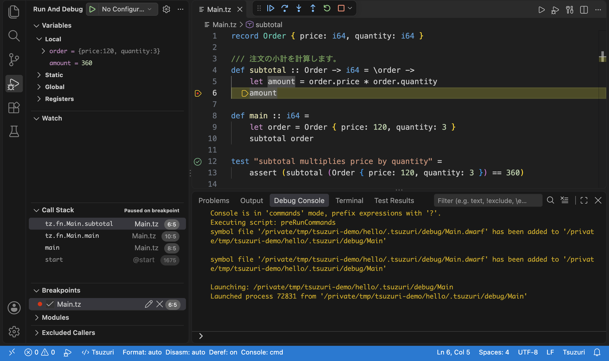
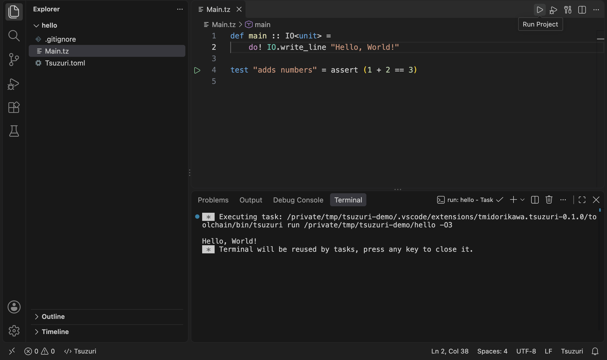
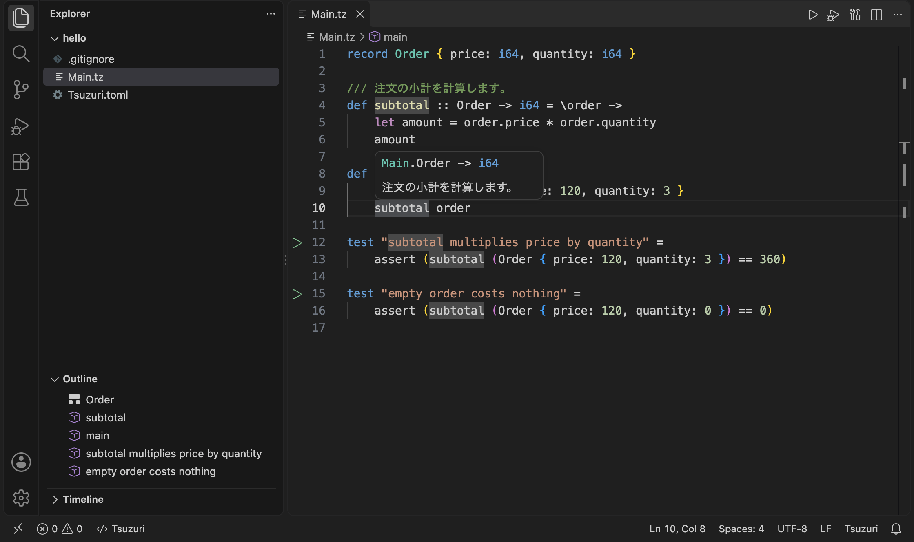
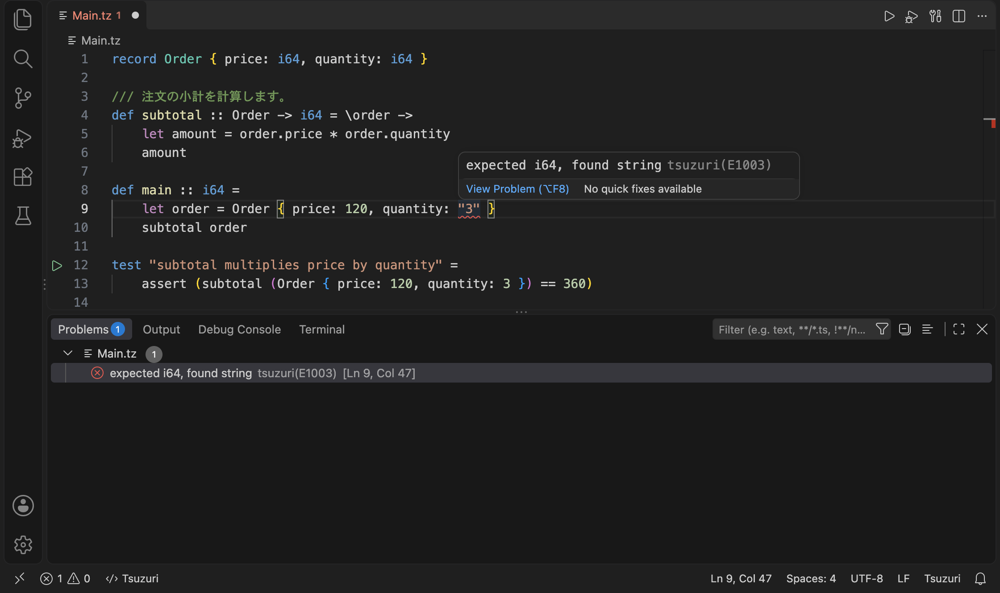
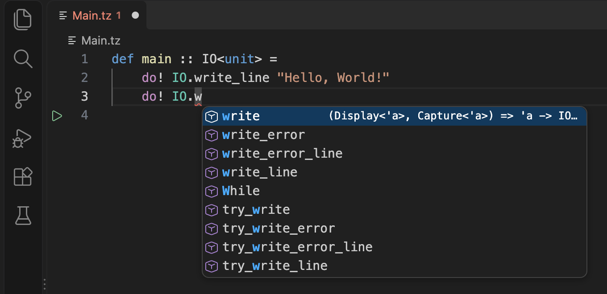
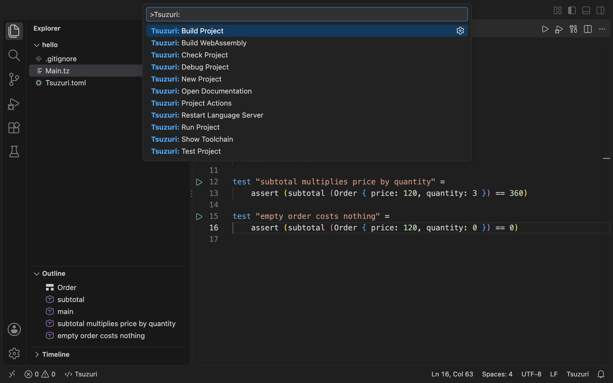
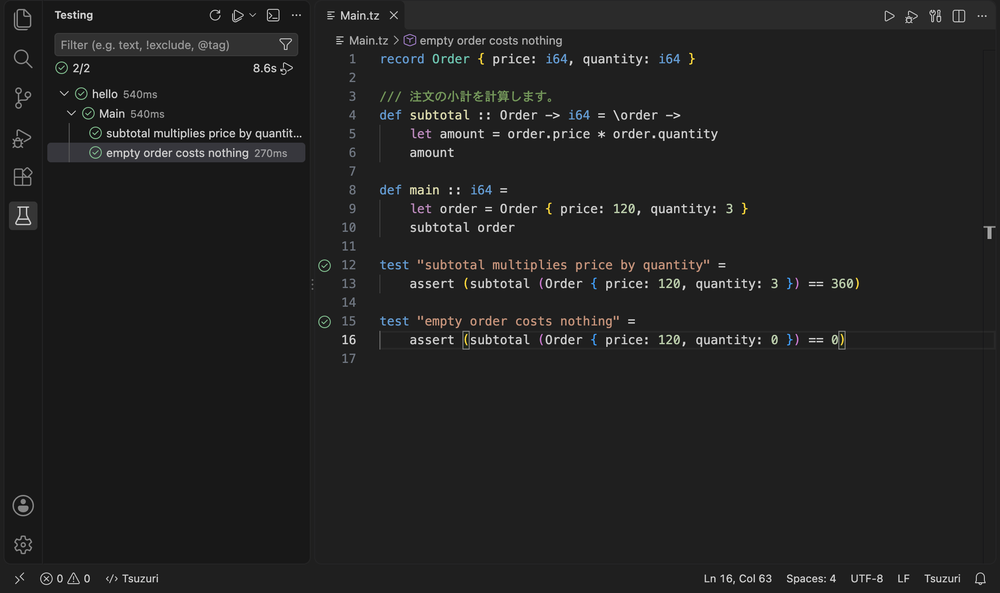

# Tsuzuri for Visual Studio Code

[Tsuzuri](https://github.com/tatsuya-midorikawa/Tsuzuri) は、関数型の式と所有権モデルを備え、LLVM でネイティブコードと WebAssembly を生成するプログラミング言語です。
この拡張機能をインストールするだけで、VS Code で Tsuzuri のコーディング / 実行 / テスト / デバッグ ができます。



## 特長

- **追加のインストールが不要**: コンパイラ、LLVM、リンカー、C ランタイム、デバッガーを同梱していますので、追加のランタイム インストールなどは不要です。
- **書きながら確認**: 保存前からエラーと警告を表示し、ホバーで型とドキュメントを確認できます。
- **ボタンひとつで実行**: エディター右上のボタンでビルド、実行、デバッグができます。tasks.json や launch.json は不要です。
- **テスト**: `test` 宣言を Test Explorer に表示し、まとめて、または 1 件ずつ実行できます。
- **デバッグ**: ブレークポイント、ステップ実行、呼び出し履歴、ローカル変数を利用できます。
- **オフラインのドキュメント**: 日本語の言語ハンドブックを同梱しています。

## はじめに

### 1. インストール

拡張機能ビュー（Windows / Linux は `Ctrl+Shift+X`、macOS は `Cmd+Shift+X`）で **Tsuzuri** を検索し、**Install** を選びます。
OS と CPU に合ったパッケージが自動で選ばれます。対応している OS と CPU は、後述の「対応環境」を参照してください。

### 2. プロジェクトを作る

1. コマンドパレット（Windows / Linux は `Ctrl+Shift+P`、macOS は `Cmd+Shift+P`）で **Tsuzuri: New Project** を実行します。
2. 空のフォルダーを選びます。
3. プロジェクトの名前空間（例: `Acme::MyApp`）を入力します。入れ子の名前空間は `::` でつなぎます。既定値はフォルダー名を PascalCase にしたものです。次のファイルが作られ、そのフォルダーが新しいウィンドウで開きます。

| ファイル | 内容 |
| --- | --- |
| Main.tz | 名前空間の宣言、プログラムの入口、テストの例 |
| Tsuzuri.toml | パッケージ名、バージョン、既定の名前空間（`namespace`） |
| .gitignore | ビルド結果を置く `.tsuzuri/` を Git の管理から除外 |

ファイルは同梱のコンパイラの `tsuzuri new` が作ります。

フォルダーを信頼するかどうか確認されたら、信頼を選びます。信頼していないフォルダーでは、コンパイラやプログラムを起動しません。
既存のフォルダーでも、Main.tz か Tsuzuri.toml があれば Tsuzuri のプロジェクトとして扱います。

### 3. Hello, World を表示する

Main.tz を開き、次の内容にします。

```tsuzuri
namespace MyApp

def main :: IO<unit> =
    do! IO.writeln "Hello, World!"

test "adds numbers" = assert (1 + 2 == 3)
```

- `namespace MyApp` は、このファイル（モジュール）が属する名前空間です。ファイルの最初に書きます。作成した Main.tz には、入力した名前空間が入っています。
- `def main :: IO<unit>` はプログラムの入口です。`IO<unit>` は、入出力を行い、値を返さない処理を表します。
- `do! IO.writeln "..."` は、文字列と改行を標準出力へ書き込みます。字下げした行が `main` の本体です。
- `test "名前" = assert (条件)` はテストです。通常のビルドには含まれません。

エディター右上の ▷（**Run Project**）を押します。ファイルを保存してビルドし、ターミナルに `Hello, World!` を表示します。



## 使い方

### コードを書く

- 構文の色分け、括弧の補完、コメントの切り替え、折りたたみ。
- 入力中の構文・型・所有権のエラーと警告。保存していない変更も検査します。
- 型とドキュメントコメント（`///`）のホバー表示、定義への移動、アウトライン、パンくずリスト。
- Format Document（Windows / Linux は `Shift+Alt+F`、macOS は `Shift+Option+F`）による公式フォーマッターでの整形。
- キーワード、型、標準ライブラリの関数の補完。言語サーバーによるローカル変数・レコードのフィールド・モジュールのメンバー（`.` の後）・名前空間のモジュール（`Sample::` の後）の補完。`namespace` と `using` も考慮します。
- 参照の検索と強調表示、名前の変更（`F2`。意味が変わる変更は拒否）、ワークスペースのシンボル検索、シグネチャヘルプ、意味に基づく色分け。
- 未使用のローカル変数に `_` を付けるクイックフィックス。
- `def`、`main`、`namespace`、`using`、`test`、`record`、`union`、`match`、`try`、`class`、`doc` などのスニペット。



エラーは波線と問題パネルに表示します。



`IO.` のようにモジュール名に続けて入力すると、標準ライブラリの関数を補完します。



### 実行とビルド

エディター右上のボタン、コマンドパレット、ステータスバー左下の **Tsuzuri** から操作します。
実行前には未保存のファイルを保存します。

| 操作 | 方法 | 結果 |
| --- | --- | --- |
| 実行 | ▷ ボタン、**Tsuzuri: Run Project** | ビルドしてターミナルで実行。`IO.read_line` による入力も可能 |
| ビルド | **Tsuzuri: Build Project**、**Tasks: Run Build Task** | `.tsuzuri/bin/Main`（Windows は `Main.exe`）を作成 |
| 検査 | **Tsuzuri: Check Project** | 実行ファイルを作らずにエラーだけを確認 |
| WebAssembly | **Tsuzuri: Build WebAssembly** | `.tsuzuri/bin/Main.wasm` を作成 |

ビルドと実行は既定で `-O3` の最適化を行います。設定の `tsuzuri.optimization` で変更できます。
WebAssembly を動かすブラウザーや Node.js などのホストは、別に用意してください。



### テスト

テストは `test "名前" = assert (条件)` と書きます。次の例では、`main` の返した値 `360` が実行時に表示されます。

```tsuzuri
record Order { price: i64, quantity: i64 }

/// 注文の小計を計算します。
def subtotal :: Order -> i64 = \order ->
    let amount = order.price * order.quantity
    amount

def main :: i64 =
    let order = Order { price: 120, quantity: 3 }
    subtotal order

test "subtotal multiplies price by quantity" =
    assert (subtotal (Order { price: 120, quantity: 3 }) == 360)

test "empty order costs nothing" =
    assert (subtotal (Order { price: 120, quantity: 0 }) == 0)
```

アクティビティバーの Testing ビューに、プロジェクト内のテストが自動で表示されます。
すべてのテストをまとめて実行するほか、行番号の横の ▷ から 1 件ずつ実行できます。
結果には成否と所要時間が表示され、失敗したテストはその位置にメッセージを表示します。
既定では `-O0` でビルドします。Testing ビューの実行ボタンの横にあるメニューで `Native (O3)` のプロファイルを選ぶと、最適化したコードでテストできます。



### デバッグ

1. 行番号の左をクリックして、ブレークポイントを置きます。
2. `F5` を押すか、エディター右上のデバッグボタン（**Debug Project**）を押します。

デバッグ情報付きでビルドし、ブレークポイントで停止します。変数、ウォッチ式、呼び出し履歴、ステップ実行を利用できます。
冒頭の画面は、上の例で `subtotal` の中に止め、引数 `order` とローカル変数 `amount` を表示したものです。

初回のデバッグでは、同梱しているデバッガー拡張機能 [CodeLLDB](https://marketplace.visualstudio.com/items?itemName=vadimcn.vscode-lldb) を自動でインストールします。インターネット接続は不要です。
既に CodeLLDB をインストールしている場合は、それを使います。

通常は launch.json を作る必要はありません。プログラムに引数や環境変数を渡す場合は、次のように指定します。

```json
{
    "version": "0.2.0",
    "configurations": [
        {
            "type": "tsuzuri",
            "request": "launch",
            "name": "Debug Tsuzuri",
            "args": ["input.txt"],
            "env": { "LOG_LEVEL": "debug" }
        }
    ]
}
```

`project` でプロジェクトのフォルダー、`stopOnEntry` で開始直後の停止も指定できます。

### ドキュメントを読む

**Tsuzuri: Open Documentation** で、入門、言語リファレンス、標準ライブラリを含む日本語ハンドブックを VS Code の中に開きます。
同じ内容は [GitHub](../_docs/README.md) でも読めます。

## コマンド

| コマンド | 内容 |
| --- | --- |
| Tsuzuri: New Project | 空のフォルダーに新しいプロジェクトを作る |
| Tsuzuri: Run Project | ビルドしてターミナルで実行する |
| Tsuzuri: Debug Project | デバッグ用にビルドしてデバッガーを起動する |
| Tsuzuri: Build Project | 実行ファイルを `.tsuzuri/bin/` に作る |
| Tsuzuri: Check Project | ビルドせずにエラーを検査する |
| Tsuzuri: Test Project | プロジェクトのすべてのテストを実行する |
| Tsuzuri: Build WebAssembly | WebAssembly を `.tsuzuri/bin/` に作る |
| Tsuzuri: Open Documentation | 同梱のハンドブックを開く |
| Tsuzuri: Project Actions | 主な操作を一覧から選ぶ。ステータスバーの **Tsuzuri** と同じ |
| Tsuzuri: Show Toolchain | 使用中のコンパイラとツールチェーンを出力パネルに表示する |
| Tsuzuri: Restart Language Server | 言語サーバーを再起動する |

## 設定

| 設定 | 既定値 | 内容 |
| --- | --- | --- |
| `tsuzuri.optimization` | `3` | ビルドと実行の最適化レベル（0〜3）。デバッグは常に 0 |
| `tsuzuri.denyWarnings` | `false` | 警告があれば検査、ビルド、実行を失敗させる |
| `tsuzuri.projectPath` | 空 | プロジェクトのフォルダー。空なら、開いたファイルから最も近い Main.tz か Tsuzuri.toml を探す |
| `tsuzuri.compilerPath` | 空 | 開発用。同梱以外のコンパイラを使う場合の絶対パス |
| `tsuzuri.toolchainPath` | 空 | 開発用。同梱以外のツールチェーンを使う場合の絶対パス |

1 つのフォルダーに複数のプロジェクトを入れる場合は、プロジェクトごとにワークスペースフォルダーを分けるか、`tsuzuri.projectPath` を指定してください。

## 対応環境

VS Code 1.103 以降が必要です。

| OS | CPU | 編集・実行・テスト | デバッグ |
| --- | --- | --- | --- |
| macOS | x64、Apple シリコン（ARM64） | 対応 | 対応 |
| Linux（glibc） | x64、ARM64 | 対応 | 対応 |
| Windows | x64 | 対応 | 対応 |
| Windows | ARM64 | 対応 | 未対応 |

- 32-bit x86、Alpine Linux など musl ベースの環境で動く VS Code、Web 版 VS Code は対象外です。
- Remote - SSH、WSL、Dev Containers では、リモート側に拡張機能をインストールしてください。
- Linux で作る実行ファイルは、同梱の musl を使います。
- VS Code を使わない環境（CI、サーバー、ほかのエディター）では、同じツールチェーンを CLI の配布物（`tsuzuri-<version>-<host>.tar.gz`）として使えます。導入手順は[はじめに](../_docs/get-started.md#配布物を使う)を参照してください。

## 現在の制限

- 型に基づく補完の順位付け、推論型や借用の inlay hint（配列・リストの暗黙の複製の inlay hint だけを表示します）、`W1001` 以外のクイックフィックスには未対応です。型別名・class・method・`export` した関数の名前の変更は拒否します。
- デバッガーの変数表示は DWARF に基づく低水準の表示です。Tsuzuri の式の評価には対応していません。
- テストを 1 件だけデバッグする機能には未対応です。
- 既知の問題: macOS では、`IO` を使うプログラム（New Project で作る例を含む）のブレークポイントで停止しません。`IO` を使わないプログラムでは停止します。

## セキュリティとプライバシー

- 信頼していないワークスペースでは、コード、コンパイラ、設定に由来するプログラムを起動しません。
- この拡張機能は利用状況のデータ（テレメトリ）を送信しません。

## リンク

- [Tsuzuri のリポジトリ](https://github.com/tatsuya-midorikawa/Tsuzuri)
- [日本語ドキュメント](../_docs/README.md)
- [問題の報告](https://github.com/tatsuya-midorikawa/Tsuzuri/issues)
- [拡張機能の開発者向け情報](https://github.com/tatsuya-midorikawa/Tsuzuri/blob/main/vsc/Development.md)

## ライセンス

Apache License 2.0 です。同梱している LLVM、Zig、CodeLLDB などは、それぞれのライセンスに従います。各ライセンスはパッケージに含まれています。
